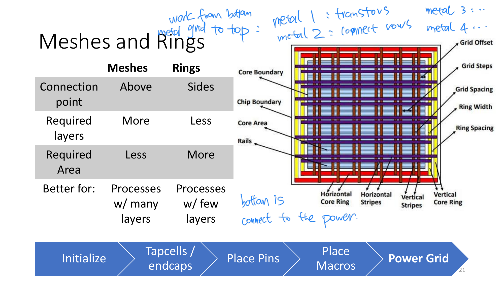
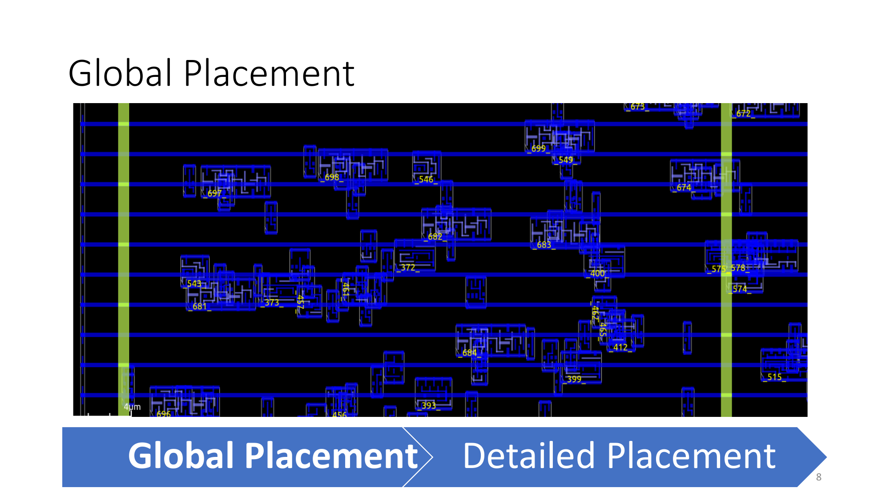
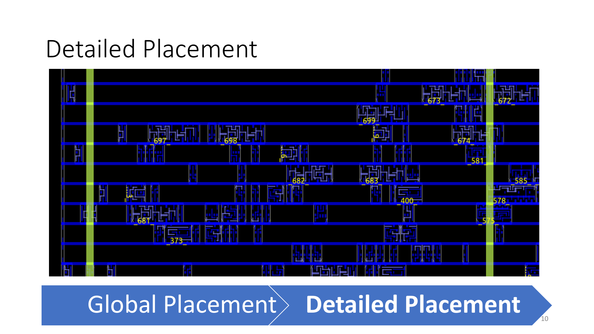

# PD Workflow

This is a living walkthrough of the `soc_design` physical design flow.

Goal:
- document the flow from clean RTL through synthesis, PNR, and signoff
- explain each stage in plain language
- record the exact commands we typed while learning the flow interactively

Scope of this walkthrough:
- this walkthrough is meant to cover the full path to the earlier clean milestone
- that means:
  - RTL / simulation-ready design
  - DC synthesis
  - Innovus implementation
  - signoff export / merge / fill flow
  - Calibre DRC
  - Calibre LVS
- the intent is not to stop at a mapped netlist
- the intent is to understand how the project reached full clean signoff from RTL to final signoff database

Current status:
- synthesis walkthrough is complete through non-topo `compile_ultra`
- fresh Innovus bring-up is complete
- current learning checkpoint:
  - floorplan created
  - top-level signal pins placed on the top edge
  - SRAM macro placed and fixed
  - SRAM route blockage added around the macro
  - `cutRow` applied after macro placement
  - endcaps and well taps now insert cleanly in the fresh walkthrough flow
  - current early-floorplan reports:
    - `verify_endcap.rpt` -> no problem
    - `verify_welltap.rpt` -> `0` violations

Checkpoint policy for this study flow:
- do not delete the canonical clean milestone artifacts
- do not delete useful implementation/signoff checkpoints while we are still walking the flow
- old disposable scratch artifacts can be cleaned later, but only after:
  - the important lessons are documented
  - the canonical clean package is preserved
  - the walkthrough no longer depends on those checkpoints

Canonical clean milestone to preserve:
- `signoff/calibre_axi_uartcordic_currentrtl_v48clean_20260416`

## 1. Synthesis (DC)

### 1.1 Starting Point

Assumption:
- RTL is written
- RTL simulation in VCS has already passed

Next objective:
- generate a mapped gate-level netlist that uses real library cells and macros

Why synthesis is needed:
- VCS proves RTL functionality
- Innovus cannot place-and-route abstract RTL directly
- DC must convert RTL into a technology-mapped netlist first

Main synthesis inputs:
- design RTL files
- standard-cell timing library (`.db`)
- SRAM timing library (`.db`)
- timing constraints such as target clock period

Main synthesis outputs:
- mapped gate-level netlist
- SDC constraints for downstream tools
- timing / area / QoR reports

### 1.2 DC Interactive Walkthrough

Tool launch:

```bash
cd /home/fy2243/soc_design
dcnxt_shell -topo -gui
```

Notes:
- `-topo` means topographical mode
- DC runs in physically-aware synthesis mode
- this gives better wireload / placement estimation than purely logic-only synthesis

#### Step 1: Set Project Root

Command:

```tcl
set proj_root [file normalize [pwd]]
```

What it means:
- `pwd` gets the current working directory
- `file normalize` converts it to a clean absolute path
- `proj_root` becomes the project root used by later file paths

Observed output:

```tcl
/home/fy2243/soc_design
```

#### Step 2: Set Top Module

Command:

```tcl
set top_module "soc_top"
```

What it means:
- tells our flow which RTL module should later be used as the design root
- this only stores the name in a variable
- DC does not use it until `elaborate $top_module`

Why `soc_top`:
- the chip-level RTL root in this project is `soc_top`

#### Step 3: Set Target Clock Period

Command:

```tcl
set clock_period 10.0
```

What it means:
- stores the intended clock period in nanoseconds
- this will later be used in `create_clock`

#### Step 4: Define RTL File List

Command:

```tcl
set rtl_files [list \
    "$proj_root/rtl/soc_top.sv" \
    "$proj_root/rtl/mem_router_native.sv" \
    "$proj_root/rtl/native_periph_bridge.sv" \
    "$proj_root/rtl/axil_interconnect_1x2.sv" \
    "$proj_root/rtl/axil_uart.sv" \
    "$proj_root/rtl/axil_cordic_accel.sv" \
    "$proj_root/rtl/cordic_accel_ctrl.sv" \
    "$proj_root/rtl/sram.sv" \
    "$proj_root/rtl/cordic_core_atan2.sv" \
    "$proj_root/rtl/cordic_core_sincos.sv" \
    "$proj_root/third_party/picorv32/picorv32.v" \
]
```

What it means:
- tells DC which synthesizable design files belong to the chip
- this is the synthesis file list, not the simulation file list
- testbench files are not included here

Tcl notes:
- `list` builds one Tcl list
- `\` continues the command onto the next line
- `$proj_root` expands to `/home/fy2243/soc_design`

Observed result:
- DC echoed the resolved file paths back as one list

### 1.3 Library Concepts Clarified

#### Standard-cell `.db`

Example path from the synthesis script:

```tcl
/ip/tsmc/tsmc16adfp/.../N16ADFP_StdCelltt0p8v25c.db
```

Meaning:
- Synopsys compiled timing library for TSMC standard cells
- provided by the technology / library collateral
- used by DC for mapping logic into real gates

#### SRAM `.db`

Example path from the synthesis script:

```tcl
/ip/tsmc/tsmc16adfp/.../N16ADFP_SRAM_tt0p8v0p8v25c_100a.db
```

Meaning:
- Synopsys compiled timing library for SRAM macros
- provided by the SRAM IP / memory collateral
- used by DC so explicit SRAM macro instances can link to real macro cells

#### What `.db` Means

In this flow, a `.db` file is:
- a Synopsys compiled technology library
- the tool-readable form of timing / library data

The Tcl script does not create these libraries.
It only points DC at the installed library files.

### 1.4 SRAM Naming Clarification

Example SRAM macro ref name:

```tcl
TS1N16ADFPCLLLVTA512X45M4SWSHOD
```

Meaning:
- library cell name of the hard SRAM macro
- not invented by DC
- comes from the vendor SRAM library naming
- explicitly instantiated in the RTL synthesis wrapper

Where it appears:
- wrapper instantiation in [sram.sv](/home/fy2243/soc_design/rtl/sram.sv#L77)

Example hierarchy path:

```tcl
u_sram/u_sram_macro
```

Meaning:
- `u_sram` is the wrapper instance in `soc_top`
- `u_sram_macro` is the hard macro instance inside the wrapper
- together they form the hierarchical design path

Where it comes from:
- top-level wrapper instance in [soc_top.sv](/home/fy2243/soc_design/rtl/soc_top.sv#L202)
- hard macro instance in [sram.sv](/home/fy2243/soc_design/rtl/sram.sv#L77)

Important distinction:
- `u_sram/u_sram_macro` = design instance path
- `TS1N16ADFPCLLLVTA512X45M4SWSHOD` = library ref / cell type

### 1.5 DC Library Setup and Bring-Up

Next interactive step in DC:
- define the standard-cell library path
- then define the SRAM library path
- then set `target_library` and `link_library`

#### Why more than one `.db`?

In this flow we do not use only one `.db` file.
We use at least:
- one standard-cell `.db`
- one SRAM macro `.db`

Reason:
- standard-cell `.db` provides the regular logic cells DC can map RTL logic into
- SRAM `.db` provides the hard memory macro cells that already exist as fixed library macros

So the sequence is:

```tcl
set std_db  "..."
set sram_db "..."
```

Then later:

```tcl
set_app_var target_library [list $std_db $sram_db]
set_app_var link_library   [concat "* " $std_db $sram_db $synthetic_library]
```

#### What is a `.db` file?

A Synopsys `.db` file is a compiled library database.

Practical meaning:
- it contains library cells known to DC
- each cell has names, pins, timing arcs, drive/load data, and other attributes
- DC uses it to understand what real implementation cells exist

For example:
- the standard-cell `.db` contains cells like buffers, inverters, NANDs, flip-flops
- the SRAM `.db` contains macro cells like `TS1N16ADFPCLLLVTA512X45M4SWSHOD`

So after RTL is read, DC does not invent cells on its own.
It must map the design onto cells that exist in the loaded `.db` libraries.

#### Step 5: Set Standard-Cell Library Path

Command:

```tcl
set std_db "/ip/tsmc/tsmc16adfp/source/DAFP0203001_2_X/Executable_Package/Collaterals/IP/stdcell/N16ADFP_StdCell/NLDM/N16ADFP_StdCelltt0p8v25c.db"
```

What it means:
- stores the filesystem path of the standard-cell Synopsys `.db`
- this is the library DC will later use for normal logic mapping

Observed result:
- DC echoed the same path back

#### Step 6: Set SRAM Library Path

Command:

```tcl
set sram_db "/ip/tsmc/tsmc16adfp/source/DAFP0203001_2_X/Executable_Package/Collaterals/IP/sram/N16ADFP_SRAM/NLDM/N16ADFP_SRAM_tt0p8v0p8v25c_100a.db"
```

What it means:
- stores the filesystem path of the SRAM macro Synopsys `.db`
- this library contains the hard SRAM macro cells used by the design

#### Step 7: Set `target_library`

Command:

```tcl
set_app_var target_library [list $std_db $sram_db]
```

What it means:
- `set_app_var` sets a DC application variable, not just a normal Tcl variable
- `target_library` is a built-in DC setting
- this tells DC which real implementation libraries it may map the RTL into

Practical effect:
- standard logic may map into cells from `std_db`
- hard SRAM references may remain bound to cells from `sram_db`

Observed result:
- DC echoed the resolved library list back

Important distinction:
- `proj_root` is just our own Tcl variable
- `target_library` is a DC-recognized synthesis control setting

#### Step 8: Set `synthetic_library`

Command:

```tcl
set_app_var synthetic_library "dw_foundation.sldb"
```

What it means:
- tells DC to use the standard Synopsys DesignWare synthetic library
- this provides higher-level synthesis-time building blocks that DC understands

Useful mental model:
- not a hard macro like SRAM
- not the final physical implementation library
- more like a synthesis helper library for arithmetic / structured logic

Observed result:
- DC echoed `dw_foundation.sldb`

#### Step 9: Set `link_library`

Command:

```tcl
set_app_var link_library [concat "* " $std_db $sram_db $synthetic_library]
```

What it means:
- tells DC where it may search when resolving references during elaboration and link
- includes:
  - `*` for the current in-memory design / WORK area
  - the standard-cell library
  - the SRAM macro library
  - the DesignWare synthetic library

Useful distinction:
- `target_library` = what DC may map into
- `link_library` = where DC may look things up

Tcl note:
- `concat` joins those items into the form DC expects

Observed result:
- DC echoed the expanded list; the GUI console may wrap long paths across lines

#### Step 10: Set `search_path`

Command:

```tcl
set_app_var search_path [list $proj_root/rtl $proj_root/third_party/picorv32]
```

What it means:
- tells DC which directories it may search when resolving file references by name
- this is supportive environment setup
- in this flow, `rtl_files` already uses full paths, so `search_path` is not the primary file-selection mechanism

Useful distinction:
- `rtl_files` = exact file list to read
- `search_path` = fallback directories DC may search if needed

Observed result:
- DC echoed the two resolved directories

#### Step 11: Define DC Work Library

Command:

```tcl
define_design_lib WORK -path ./WORK
```

What it means:
- creates the Synopsys WORK design library for this session
- gives DC a place to store analyzed design data

Observed result:
- DC returned `1`, meaning the command succeeded

#### Step 12: Analyze RTL

Command:

```tcl
analyze -format sverilog -define SYNTHESIS $rtl_files
```

What it means:
- reads and compiles the RTL source files into the DC WORK library
- `-format sverilog` tells DC these are SystemVerilog / Verilog sources
- `-define SYNTHESIS` enables the `SYNTHESIS` preprocessor branch in the RTL

Important effect in this design:
- in `sram.sv`, the `SYNTHESIS` branch instantiates the hard TSMC SRAM macro instead of the behavioral simulation memory

Observed result:
- PRESTO compiled all listed source files successfully
- DC then loaded the standard-cell `.db`, SRAM `.db`, and DesignWare synthetic library
- command returned `1`

#### Step 13: Elaborate the Top Design

Command:

```tcl
elaborate $top_module
```

What it means:
- builds the actual instantiated design hierarchy rooted at `soc_top`
- this is where DC turns analyzed module definitions into one concrete design tree
- parameterized modules are specialized during this step

Observed result:
- DC elaborated `soc_top` successfully
- the current design became `soc_top`
- parameterized child modules were built, including:
  - `picorv32`
  - `mem_router_native`
  - `sram`
  - `axil_interconnect_1x2`
  - `axil_uart`
  - `axil_cordic_accel`
  - `cordic_accel_ctrl`
  - `cordic_core_atan2`
  - `cordic_core_sincos`

Important warning interpretation from this step:
- many warnings came from third-party `picorv32.v`
- the common categories seen here are usually non-fatal for synthesis:
  - `VER-318` signed/unsigned conversion or assignment
  - `VER-61` unreachable statements after parameter pruning / constant propagation
  - `VER-281` initial blocks ignored in synthesis
  - `ELAB-985` empty always block after optimization

What would be more serious:
- unresolved module/cell references
- missing libraries
- elaboration failure
- unexpected multiply-driven nets or major latch inference in our own RTL

Bottom line for this run:
- elaboration succeeded
- no blocking warning was observed in the posted log

#### Step 14: Set the Current Design

Command:

```tcl
current_design $top_module
```

What it means:
- explicitly selects `soc_top` as the active design context in DC
- does not rebuild the hierarchy
- mainly confirms which design later commands should operate on

Observed result:
- DC reported `Current design is 'soc_top'.`

#### Step 15: Link the Design

Command:

```tcl
link
```

What it means:
- resolves and binds references in the current design using `link_library`
- this is where DC confirms that referenced modules/cells/macros can be found in:
  - the in-memory WORK design set
  - the standard-cell library
  - the SRAM library
  - the DesignWare synthetic library

Observed result:
- DC linked `soc_top` successfully
- it showed the exact designs and libraries used for the link
- command returned `1`

Why this matters:
- after `analyze` and `elaborate`, the design hierarchy exists
- after `link`, DC has validated that the needed references are resolvable in the configured search space

#### Step 16: Report Hierarchy

Command:

```tcl
report_hierarchy
```

What it means:
- prints the instantiated design tree currently known to DC
- useful sanity check before applying timing constraints and starting synthesis

Key observations from this run:
- top design is `soc_top`
- expected major blocks are present:
  - `picorv32`
  - `mem_router_native`
  - `native_periph_bridge`
  - `axil_interconnect_1x2`
  - `axil_uart`
  - `axil_cordic_accel`
  - `sram`
- the SRAM macro is already visible as:
  - `TS1N16ADFPCLLLVTA512X45M4SWSHOD`

Why `gtech` appears:
- `GTECH_*` cells are Synopsys generic technology-independent primitives
- at this point the design is still unmapped
- generic logic has not yet been converted into real standard cells

Meaning of:

```tcl
Information: This design contains unmapped logic. (RPT-7)
```

- expected at this stage
- not an error
- this will change after `compile_ultra`, when generic logic maps into real library cells

### 1.6 DC Constraints and Checks

#### Step 17: Create the Primary Clock

Command:

```tcl
create_clock -name clk -period $clock_period [get_ports clk]
```

What it means:
- creates the main timing clock on top-level port `clk`
- tells DC the design is expected to run with a `10.0 ns` period in this walkthrough

Why this is required:
- without a clock, DC cannot do meaningful sequential timing optimization
- this is the reference point for later input/output timing constraints

Observed result:
- DC returned `1`

#### Step 18: Set Input Delay

Command:

```tcl
set_input_delay [expr $clock_period * 0.2] -clock clk [remove_from_collection [all_inputs] [get_ports clk]]
```

What it means:
- applies an arrival-time assumption to all non-clock input ports
- in this flow, the assumption is `20%` of the cycle after the `clk` reference edge

Why this exists:
- top-level inputs do not arrive magically at time zero
- synthesis needs an external timing assumption for how late inputs can show up relative to the chip clock
- without this, timing optimization can become unrealistically optimistic

Important note:
- the `20%` number here is a simple heuristic for this tutorial flow
- in a production block or chip, these values normally come from an interface spec or top-level timing budget

Observed result:
- DC returned `1`

#### Step 19: Set Output Delay

Command:

```tcl
set_output_delay [expr $clock_period * 0.2] -clock clk [all_outputs]
```

What it means:
- applies a simple output timing budget to all top-level outputs
- reserves `20%` of the cycle for downstream usage after signals leave this block

Practical timing intuition:
- `set_input_delay` models time consumed before data reaches this block
- `set_output_delay` models time that must remain after data leaves this block

Observed result:
- DC returned `1`

#### Step 20: Set Output Load

Command:

```tcl
set_load 0.01 [all_outputs]
```

What it means:
- applies a simple capacitive load assumption to all top-level outputs
- in practice this is a blanket estimate of the downstream load each output must drive

Observed result:
- DC returned `1`

#### Step 21: Set Driving Cell for Inputs

Command:

```tcl
set_driving_cell -lib_cell BUFFD1BWP16P90LVT [all_inputs]
```

What it means:
- tells DC to assume top-level inputs are driven by the library cell `BUFFD1BWP16P90LVT`
- this gives DC an external driver model for input slew / transition estimation

Observed result:
- DC returned `1`
- warnings were reported on `clk`, `rst_n`, and `uart_rx`:

```tcl
Warning: Design rule attributes from the driving cell will be set on the port '...'. (UID-401)
```

Warning interpretation:
- not fatal
- DC is simply warning that the selected driving cell's electrical/design-rule attributes are being copied onto those input ports
- this happened because the command was applied to `[all_inputs]`

Practical note:
- in more careful flows, clocks and sometimes resets are often handled separately instead of being included in the blanket `set_driving_cell [all_inputs]`
- for this tutorial flow, the warning does not block progress

#### Step 22: Run `check_timing`

Command:

```tcl
check_timing
```

What it means:
- performs a timing-environment sanity check before synthesis
- verifies that the design has a usable timing setup before `compile_ultra`

Observed result:
- DC checked out the `DesignWare` license and instantiated internal DW components for timing analysis
- command returned `1`

Notable messages from this run:

```tcl
Warning: Design 'soc_top' contains 11 high-fanout nets. A fanout number of 1000 will be used for delay calculations involving these nets. (TIM-134)
Warning: There are 100 end-points which are not constrained for maximum delay.
```

Interpretation:
- high-fanout warning:
  - common before optimization
  - not a blocker by itself
  - DC is using a simplified fanout assumption for delay estimation on those nets

- unconstrained-endpoints warning:
  - important to notice, but not fatal for this tutorial run
  - it means the current SDC is still simple and does not fully constrain every endpoint in the design
  - this is common in minimal top-level tutorial flows
  - in a production flow, this warning would usually be investigated and reduced

Bottom line:
- `check_timing` succeeded
- the timing environment is good enough to continue with the simple walkthrough
- but the warning reminds us this is not yet a fully polished signoff-grade constraint set

#### Step 23: Run `check_design`

Command:

```tcl
check_design
```

What it means:
- performs a structural / lint-style sanity check on the elaborated and constrained design
- this is broader than `check_timing`
- it looks for suspicious structural patterns before synthesis

Observed result:
- command returned `1`
- no fatal structural error was reported

Main warning categories seen in this run:

#### `LINT-29` input port connected directly to output port

Meaning:
- a module input is passed straight through to one or more module outputs
- common in adapters, interconnects, and simple routing glue logic

Examples from this design:
- `axil_interconnect_1x2`
- `picorv32_axi_adapter`

Interpretation:
- not automatically a bug
- expected in pass-through interface logic

#### `LINT-31` output port connected directly to output port

Meaning:
- multiple output ports are driven from the same internal source or constant relationship
- often shows up in bridge / routing logic with duplicated outputs

Interpretation:
- not automatically wrong
- common in simple steering / replication logic

#### `LINT-32` submodule pin tied to constant 0 or 1

Meaning:
- a submodule pin is intentionally tied off

Examples from this design:
- many optional `picorv32` ports such as `pcpi_*` and `irq[*]`

Interpretation:
- expected in this top-level integration
- not a blocker

#### `LINT-33` same net connected to many pins on one submodule

Meaning:
- one constant net is reused to tie off many pins

Interpretation:
- expected if many unused inputs are all tied to logic 0
- not a synthesis blocker

#### `LINT-52` output port tied directly to constant

Meaning:
- a module output is constant in this configuration

Interpretation:
- usually benign
- often caused by disabled features or fixed protocol fields

Bottom line for this run:
- `check_design` passed in the practical sense
- warnings are lint-style and mostly reflect:
  - interface pass-through logic
  - optional feature tie-offs
  - constant protocol fields
- nothing in the posted output suggests a structural issue severe enough to stop the tutorial flow

#### Step 24: Save Pre-Compile Checkpoint

Command:

```tcl
write -format ddc -hierarchy -output precompile.ddc
```

What it means:
- saves a Synopsys DDC checkpoint before synthesis optimization
- useful recovery point if the GUI session dies or if we want to restart from the elaborated/constrained design state

Observed result:
- DC wrote `precompile.ddc`
- command returned `1`

Why this is useful:
- preserves the setup work already done:
  - analyzed RTL
  - elaborated hierarchy
  - linked design
  - applied constraints
- avoids having to replay all setup commands after a disconnect

### 1.7 DC Compile, Topo Notes, and Recovery

#### Step 25: Attempt `compile_ultra`

Command:

```tcl
compile_ultra -no_autoungroup
```

Expected intent:
- perform the main synthesis optimization
- convert generic logic into a technology-mapped gate implementation
- preserve hierarchy more than the default `compile_ultra` flow by disabling auto-ungroup

Observed result in this walkthrough:

```tcl
Error: DC-Topographical Failed to link physical library. (OPT-1428)
```

Interpretation:
- the failure is not caused by the earlier lint warnings
- the failure is caused by running DC in `-topo` mode without the required physical-library setup

Important project note:
- this repository already documents the issue in [README.md](/home/fy2243/soc_design/README.md#L127)
- summary:
  - topo mode will halt unless the required physical RC / physical-view collateral is configured
  - for this project walkthrough, non-topo synthesis is the practical recovery path unless full topographical setup is added

Practical lesson:
- logical synthesis setup is not enough for topographical synthesis
- topographical mode needs additional physical tech/view collateral beyond the logical `.db` libraries

#### Constraint Scope in This Tutorial Flow

So far the walkthrough has introduced the basic timing constraints:
- `create_clock`
- `set_input_delay`
- `set_output_delay`

The full synthesis script also adds simple electrical-environment constraints:
- `set_load 0.01 [all_outputs]`
- `set_driving_cell -lib_cell BUFFD1BWP16P90LVT [all_inputs]`

What these mean:
- `set_load`
  - tells DC what output capacitance to assume on top-level outputs
- `set_driving_cell`
  - tells DC what kind of external driver is assumed to be driving top-level inputs

What this flow leaves at default:
- operating condition is left to the tool/library default
- max fanout / max capacitance / max transition are not manually overridden here
- no false-path, multicycle, generated-clock, or clock-group constraints are added in this simple tutorial setup

So this flow is intentionally simple:
- enough constraints to make synthesis meaningful
- not a full production-quality SDC for every interface and exception case

#### Topographical Mode: What We Actually Verified

Question:
- Do we really have any `-topo` collateral on this machine?
- If we skip `-topo`, does that make the earlier clean DRC/LVS result untrustworthy?

Verified repo guidance:
- [README.md](/home/fy2243/soc_design/README.md#L89) says the project currently relies on non-topo synthesis because the delivered flow lacks complete topo collateral hookup.
- [run_currentrtl_pd.sh](/home/fy2243/soc_design/run_currentrtl_pd.sh#L26) defaults synthesis to plain `dcnxt_shell`, not `dcnxt_shell -topo`.
- [soc_top.sdc](/home/fy2243/soc_design/mapped_with_tech/soc_top.sdc#L1) is the active synthesized SDC handed to Innovus.

Verified installed collateral:
- Standard-cell physical NDM exists:
  - `/ip/tsmc/tsmc16adfp/source/DAFP0203001_2_X/Executable_Package/Collaterals/IP/stdcell/N16ADFP_StdCell/NDM/N16ADFP_StdCell_physicalonly.ndm`
- RC collateral exists:
  - `/ip/tsmc/tsmc16adfp/tech/RC/N16ADFP_STARRC/N16ADFP_STARRC_worst.nxtgrd`
  - `/ip/tsmc/tsmc16adfp/tech/RC/N16ADFP_STARRC/N16ADFP_STARRC_best.nxtgrd`
  - QRC tech files also exist under `N16ADFP_QRC`
- SRAM logical `.db` exists, and SRAM LEF/GDS exist
- But no SRAM `.ndm` was found in the installed SRAM collateral tree

Verified repo topo setup:
- [common_setup.tcl](/home/fy2243/soc_design/tcl_scripts/rm_setup/common_setup.tcl#L19) only names the standard-cell NDM as the reference physical library
- [dc_setup.tcl](/home/fy2243/soc_design/tcl_scripts/rm_setup/dc_setup.tcl#L27) leaves `set_tlu_plus_files` commented out

Controlled topo probe result:
- A throwaway batch run was executed in `dcnxt_shell -topo`
- It successfully entered NDM/topo mode and linked:
  - `N16ADFP_StdCell_physicalonly.ndm`
- `compile_ultra -no_autoungroup` then failed with:
  - missing SRAM physical matches:
    - `TS1N16ADFPCLLLVTA512X45M4SWSHOD` and other SRAM macros were marked `dont_use`
    - warning: no corresponding physical cell description
  - missing RC layer attributes:
    - `Warning: No TLUPlus file identified. (DCT-034)`
    - `Error: Layer 'M1' is missing the 'resistance' attribute. (PSYN-100)`
    - `Error: Layer 'M1' is missing the 'capacitance' attribute. (PSYN-100)`
    - similar errors repeated for all routing layers
    - final failure:
      - `Error: Routing layers sanity check failed. (OPT-1430)`

Conclusion:
- Yes, some topo collateral exists on this machine
- No, the current project setup is not sufficient to support a clean topographical `compile_ultra`
- The blockers are:
  - no usable SRAM physical match in the current topo library stack
  - no active TLU+/RC hookup in the current setup

Practical wording:
- We are hard-blocked from using `-topo` **in the current project setup**
- We are not necessarily hard-blocked forever by physics or by DC itself
- To unblock topo, we would need additional collateral hookup/integration work:
  - valid RC/TLU+ hookup in DC topo setup
  - usable physical representation for the SRAM macros in the topo flow
  - likely extra tech/library integration work beyond the current repository scripts

Important trustworthiness point:
- Using non-topo DC synthesis does **not** make the earlier zero-DRC / clean-LVS result untrustworthy
- The clean signoff result is trusted because:
  - DC produced a logical mapped netlist
  - Innovus performed the actual physical implementation
  - Calibre verified final DRC and LVS on the real implemented layout
- So final signoff trust comes from the Innovus + Calibre stages, not from whether DC used topo mode

### 1.8 Archived STA and Hold Investigation

#### STA Status of the Earlier Clean Milestone

Question:
- Did we actually run STA for the earlier clean design, or only DRC/LVS?

What is directly verified:
- The archived clean signoff package
  - `/home/fy2243/soc_design/signoff/calibre_axi_uartcordic_currentrtl_v48clean_20260416`
  contains:
  - DRC outputs
  - LVS outputs
  - no timing reports
- The clean package therefore proves:
  - DRC clean
  - LVS clean
- It does **not by itself** prove:
  - archived signoff STA closure

What the flow scripts support:
- DC synthesis script writes a synthesis timing report:
  - [syn_complete_with_tech.tcl](/home/fy2243/soc_design/syn_complete_with_tech.tcl#L149)
- Innovus example flow runs internal timing analysis during implementation:
  - [innovus_flow.tcl](/home/fy2243/soc_design/tcl_scripts/innovus_flow.tcl#L16)
  - [innovus_flow.tcl](/home/fy2243/soc_design/tcl_scripts/innovus_flow.tcl#L24)
  - [innovus_flow.tcl](/home/fy2243/soc_design/tcl_scripts/innovus_flow.tcl#L32)
- An older full-flow script also contains an explicit post-route STA section:
  - [complete_flow_cordic_drc_clean.tcl](/home/fy2243/soc_design/tcl_scripts/complete_flow_cordic_drc_clean.tcl#L315)

What I could not verify from the archived currentrtl artifacts:
- I did not find preserved timing report files for the clean `currentrtl` signoff package
- I did not find evidence of a separate signoff STA tool run such as PrimeTime or Tempus reports archived alongside the clean DRC/LVS package

Practical conclusion:
- For the earlier `v48clean` milestone, what is concretely proven and archived is:
  - DRC clean
  - LVS clean
- STA may have been evaluated during implementation experiments, but I cannot honestly claim the clean milestone package includes archived signoff STA closure evidence unless we generate or locate those reports explicitly

#### STA Tool Readiness and Runtime

Question:
- Do we have the tools needed to run STA now?
- How long should STA take?

What is confirmed installed:
- PrimeTime shell exists:
  - `/eda/synopsys/prime/T-2022.03-SP5-1/bin/pt_shell`
- Innovus exists:
  - `/eda/cadence/INNOVUS211/bin/innovus`

What the project already has for STA:
- MMMC/QRC setup file:
  - [innovus_mmmc.tcl](/home/fy2243/soc_design/tcl_scripts/innovus_mmmc.tcl#L1)
- QRC tech file wired there:
  - `/ip/tsmc/tsmc16adfp/tech/RC/N16ADFP_QRC/worst/qrcTechFile`
- Final `currentrtl` Innovus checkpoints already contain:
  - MMMC views
  - SDC snapshot
  - extracted RC data inside the checkpoint database
  - example:
    - `/home/fy2243/soc_design/pd/innovus_axi_uartcordic_currentrtl_20260416_r1/with_sram_postdrc.enc.dat/viewDefinition.tcl`
    - `/home/fy2243/soc_design/pd/innovus_axi_uartcordic_currentrtl_20260416_r1/with_sram_cts.enc.dat/extraction/extractionUnitRCData_rc_typ.gz`

Practical readiness answer:
- For **implementation STA inside Innovus**:
  - yes, we have what we need right now
  - this is the fastest path to get setup/hold numbers
- For **standalone signoff STA in PrimeTime**:
  - the tool exists
  - timing libs and constraints exist
  - but we would still need the usual export handoff from Innovus (for example parasitics/netlist in a PT-friendly form) if not already generated

Runtime expectation on this design:
- Innovus post-route timing update from the final checkpoint:
  - typically about **2 to 10 minutes**
- If RC extraction needs to be refreshed first:
  - typically about **5 to 15 minutes**
- PrimeTime standalone run after export:
  - typically about **10 to 30 minutes**

Important caution:
- “Having the tools to run STA” is not the same as “the design will pass STA”
- The tools are available to measure closure
- Whether we actually clear setup/hold still depends on the design’s final slack numbers

Recommended run order:
- Run **Innovus post-route STA first**
  - fastest way to get setup/hold numbers from the existing final checkpoint
  - uses the implementation database directly
- Then run **PrimeTime**
  - better as a stricter standalone signoff-style timing check after the implementation result is understood
  - useful to confirm timing with an external STA engine rather than relying only on Innovus internal timing

#### Actual STA Run Results on the Archived `currentrtl` Checkpoint

Run date:
- 2026-04-17

Implementation database used:
- `/home/fy2243/soc_design/pd/innovus_axi_uartcordic_currentrtl_20260416_r1/with_sram_postdrc.enc.dat`

Generated Innovus STA artifacts:
- `/home/fy2243/soc_design/sta/currentrtl_20260416_r1/innovus/summary.txt`
- `/home/fy2243/soc_design/sta/currentrtl_20260416_r1/innovus/timeDesign_setup/soc_top_postRoute.summary.gz`
- `/home/fy2243/soc_design/sta/currentrtl_20260416_r1/innovus/timeDesign_hold/soc_top_postRoute_hold.summary.gz`
- `/home/fy2243/soc_design/sta/currentrtl_20260416_r1/innovus/setup_worst20.rpt`
- `/home/fy2243/soc_design/sta/currentrtl_20260416_r1/innovus/hold_worst20.rpt`
- `/home/fy2243/soc_design/sta/currentrtl_20260416_r1/innovus/soc_top_postroute.v`
- `/home/fy2243/soc_design/sta/currentrtl_20260416_r1/innovus/soc_top_postroute.spef`
- `/home/fy2243/soc_design/sta/currentrtl_20260416_r1/innovus/soc_top_postroute.sdf`

Innovus post-route timing result:
- Setup WNS = `7.444 ns`
- Setup TNS = `0.000 ns`
- Hold WNS = `-0.044 ns`
- Hold TNS = `-1.893 ns`

Innovus interpretation:
- setup is clean with large positive slack at the archived 10 ns clock
- hold is **not** clean
- the worst hold paths are short CPU-to-SRAM interface paths into `u_sram/u_sram_macro`

Example worst Innovus hold path:
- beginpoint: `u_cpu/mem_addr_reg_10_/Q`
- endpoint: `u_sram/u_sram_macro/A[8]`
- slack: `-0.044 ns`

Generated PrimeTime STA artifacts:
- `/home/fy2243/soc_design/sta/currentrtl_20260416_r1/primetime/summary.txt`
- `/home/fy2243/soc_design/sta/currentrtl_20260416_r1/primetime/global_timing.rpt`
- `/home/fy2243/soc_design/sta/currentrtl_20260416_r1/primetime/check_timing.rpt`
- `/home/fy2243/soc_design/sta/currentrtl_20260416_r1/primetime/setup_worst20.rpt`
- `/home/fy2243/soc_design/sta/currentrtl_20260416_r1/primetime/hold_worst20.rpt`

PrimeTime timing result on the exported post-route netlist + SPEF:
- Setup WNS = `7.359498 ns`
- Setup TNS = `0.0 ns`
- Hold WNS = `-0.155249 ns`
- Hold TNS = `-205.026414 ns`
- Hold violating paths = `4996`

PrimeTime interpretation:
- setup is also clean in PrimeTime
- hold is significantly worse than the Innovus internal result
- the worst PrimeTime hold paths are again short CPU-to-SRAM paths

Example worst PrimeTime hold path:
- startpoint: `u_cpu/mem_wdata_reg_27_`
- endpoint: `u_sram/u_sram_macro/D[27]`
- slack: `-0.16 ns`

Important caveat on the PrimeTime run:
- `check_timing` reported:
  - `3` ports with parasitics but no driving cell
  - `68` endpoints unconstrained for max delay
  - `68` register clock pins with no clock
- So this PrimeTime run is a valid routed-netlist timing probe, but not yet a polished signoff-quality PT environment

Practical conclusion from the actual STA runs:
- The archived `currentrtl` implementation is:
  - **DRC clean**
  - **LVS clean**
  - **setup-clean at 10 ns**
  - **not hold-clean**
- Therefore the earlier clean physical signoff milestone should not be described as “timing closed” unless hold is repaired and re-verified

#### Hold Debug and Repair Work on 2026-04-18

Meaning of the common `x / x` STA summary format:
- first number = **WNS** = **Worst Negative Slack**
- second number = **TNS** = **Total Negative Slack**
- example:
  - `7.444 / 0.000` means the worst path still has `+7.444 ns` margin and there are no failing paths
  - `-0.044 / -1.893` means the worst path misses timing by `44 ps`, and the sum of all negative slacks is `-1.893 ns`

Root-cause debug result for the archived hold failure:
- the original dominant hold violations were on **very short CPU-to-SRAM interface paths**
- representative failing paths from the archived routed checkpoint:
  - `u_cpu/mem_addr_reg_10_/Q -> u_sram/u_sram_macro/A[8]`
  - `u_cpu/mem_wdata_reg_26_/Q -> u_sram/u_sram_macro/D[26]`
- this is classic minimum-delay failure:
  - launch flop too close to capture point
  - not enough wire/buffer delay between them

First routed hold-fix ECO:
- Innovus script:
  - `/home/fy2243/soc_design/tcl_scripts/postroute_holdfix_currentrtl_20260418.tcl`
- checkpoint in:
  - `/home/fy2243/soc_design/pd/innovus_axi_uartcordic_currentrtl_20260416_r1/with_sram_postdrc.enc.dat`
- checkpoint out:
  - `/home/fy2243/soc_design/pd/holdfix_currentrtl_20260418/with_sram_holdfix.enc.dat`
- Innovus post-route result after ECO:
  - setup WNS/TNS = `7.444 / 0.000`
  - hold WNS/TNS = `0.019 / 0.000`
- interpretation:
  - Innovus hold is fixed cleanly
  - setup margin is preserved

PrimeTime check on the first hold-fix handoff:
- PrimeTime script:
  - `/home/fy2243/soc_design/tcl_scripts/pt_sta_currentrtl_holdfix_20260418.tcl`
- exported routed handoff:
  - `/home/fy2243/soc_design/sta/currentrtl_20260418_holdfix/innovus/soc_top_postroute_holdfix.v`
  - `/home/fy2243/soc_design/sta/currentrtl_20260418_holdfix/innovus/soc_top_postroute_holdfix.spef`
- PrimeTime result:
  - setup WNS/TNS = `7.359329 / 0.0`
  - hold WNS/TNS = `-0.092342 / -201.556998`
  - hold violating paths = `4996`
- interpretation:
  - clear improvement in worst hold slack versus the archived PT run
  - but still not yet acceptable as a standalone PT result

Second routed hold-fix ECO:
- Innovus script:
  - `/home/fy2243/soc_design/tcl_scripts/postroute_holdfix_currentrtl_20260418_r2.tcl`
- checkpoint in:
  - `/home/fy2243/soc_design/pd/holdfix_currentrtl_20260418/with_sram_holdfix.enc.dat`
- checkpoint out:
  - `/home/fy2243/soc_design/pd/holdfix_currentrtl_20260418_r2/with_sram_holdfix_r2.enc.dat`
- Innovus post-route result after second ECO:
  - setup WNS/TNS = `7.414 / 0.000`
  - hold WNS/TNS = `0.039 / 0.000`
  - routed DRC violations = `0`
- interpretation:
  - still Innovus-clean for both setup and hold
  - slightly more hold margin than the first ECO

PrimeTime check on the second hold-fix handoff:
- PrimeTime script:
  - `/home/fy2243/soc_design/tcl_scripts/pt_sta_currentrtl_holdfix_20260418_r2.tcl`
- exported routed handoff:
  - `/home/fy2243/soc_design/sta/currentrtl_20260418_holdfix_r2/innovus/soc_top_postroute_holdfix_r2.v`
  - `/home/fy2243/soc_design/sta/currentrtl_20260418_holdfix_r2/innovus/soc_top_postroute_holdfix_r2.spef`
- PrimeTime result:
  - setup WNS/TNS = `7.332678 / 0.0`
  - hold WNS/TNS = `-0.074464 / -1.721699`
  - hold violating paths = `59`
- interpretation:
  - the dominant CPU-to-SRAM hold problem is effectively fixed
  - PrimeTime now only shows a small residual tail of local short reg-to-reg paths
  - worst residual paths moved into internal blocks like:
    - `u_cordic_accel/u_cordic_ctrl/u_core_atan2/v_pipe_reg_* -> v_pipe_reg_*`
    - `u_cordic_accel/u_cordic_ctrl/u_core_sincos/z_pipe_reg_* -> z_pipe_reg_*`
    - small local UART/CPU register-to-register paths

Engineering conclusion after the fix work:
- the original archived hold failure was real and was dominated by the CPU-to-SRAM interface
- a routed hold ECO repaired that dominant issue
- the best current repaired candidate is:
  - `/home/fy2243/soc_design/pd/holdfix_currentrtl_20260418_r2/with_sram_holdfix_r2.enc.dat`
- current best repaired timing evidence:
  - Innovus: **setup clean, hold clean**
  - PrimeTime: **setup clean, hold greatly improved but still short by about `74 ps` on `59` paths**
- therefore:
  - the hold problem is **debugged and materially repaired**
  - but the design is **not yet fully PrimeTime hold-closed**

Required re-signoff status for the repaired candidate:
- yes, **DRC must be rerun** on the `r2` implementation before calling it signoff-clean
- yes, **LVS must be rerun** on the `r2` implementation before calling it signoff-clean
- reason:
  - the routed database changed
  - old Calibre clean results only apply to the old implementation database, not automatically to the ECO-fixed one
- current confidence level:
  - Innovus internal routed DRC after `r2` reported `0` violations
  - that is a good sanity check, but it is **not** a substitute for final Calibre DRC/LVS

Third ECO attempt:
- script prepared:
  - `/home/fy2243/soc_design/tcl_scripts/postroute_holdfix_currentrtl_20260418_r3.tcl`
- goal:
  - push extra min-delay margin to try to eliminate the remaining PT tail
- status:
  - intentionally stopped during execution
- reason:
  - it was becoming much more invasive
  - routed density was already climbing above `43%`
  - this was no longer a clean minimal fix compared with the `r2` result

#### Non-topo DC compile restore and rerun

Problem encountered while restoring `precompile.ddc` in a fresh non-topo DC session:
- `read_ddc /home/fy2243/soc_design/precompile.ddc` initially reported missing library errors like:
  - `UID-131` for `N16ADFP_StdCelltt0p8v25c`
  - `DDB-81` for missing `driving_cell`
- root cause:
  - fresh DC session did not yet have the stdcell/SRAM libraries loaded

Correct restore rule:
- in a fresh DC session, set:
  - `target_library`
  - `synthetic_library`
  - `link_library`
- **before** calling `read_ddc`

After restoring the checkpoint cleanly in non-topo DC:
- `compile_ultra -no_autoungroup` completed successfully
- representative end-of-compile observations:
  - worst setup slack remained `0.00` in the compile summary table
  - one high-fanout warning:
    - `u_cordic_accel/u_cordic_ctrl/u_core_sincos/clk` with `5108` loads
  - power warning:
    - `PWR-428 Design has unannotated black box outputs`
- interpretation:
  - compile itself succeeded
  - hierarchy-preserving synthesis in non-topo mode is the correct path for this flow
  - warnings are worth noting but are not compile blockers

Standard post-compile report stage:
- after `compile_ultra`, the normal next step is:
  - `report_timing`
  - `report_area`
  - `report_power`
  - `report_qor`
  - `report_constraint -all_violators`
- purpose:
  - inspect what synthesis produced before handing the design to Innovus

How to read the reports, in recommended order:
- `qor.rpt`
  - fastest high-level summary
  - check:
    - setup WNS/TNS
    - hold WNS/TNS
    - violating path counts
    - total area and cell counts
- `constraints_violators.rpt`
  - direct list of what still fails
  - if anything is wrong, this usually tells you where to look first
- `timing.rpt`
  - detailed path-by-path timing report
  - use it to understand:
    - startpoint
    - endpoint
    - arrival time
    - required time
    - slack
- `area.rpt`
  - total area plus hierarchy contribution
  - use it to answer:
    - which block is largest
    - how much area is macro versus standard-cell logic
- `power.rpt`
  - rough pre-PNR power estimate
  - useful for trends, not final signoff

### 1.9 Reading the Synthesis Reports

#### Interactive reading of the synthesis reports from `mapped_with_tech`

Files examined:
- `/home/fy2243/soc_design/mapped_with_tech/qor.rpt`
- `/home/fy2243/soc_design/mapped_with_tech/constraints_violators.rpt`
- `/home/fy2243/soc_design/mapped_with_tech/area.rpt`
- `/home/fy2243/soc_design/mapped_with_tech/power.rpt`
- `/home/fy2243/soc_design/mapped_with_tech/timing.rpt`

What `qor` means:
- `qor` = **Quality of Results**
- it is the synthesis summary report:
  - timing
  - area
  - cell counts
  - design-rule status
  - compile runtime

Why `qor.rpt` is read first:
- it is the fastest triage report
- before reading detailed timing paths, it answers:
  - did setup pass?
  - did hold fail?
  - is area roughly reasonable?
  - are there design-rule violations?

Current `qor.rpt` interpretation for the non-topo `compile_ultra -no_autoungroup` run:
- setup summary:
  - `Critical Path Slack = 6.57`
  - `Total Negative Slack = 0.00`
  - `No. of Violating Paths = 0`
- hold summary:
  - `Worst Hold Violation = -0.05`
  - `Total Hold Violation = -2.33`
  - `No. of Hold Violations = 75`
- conclusion:
  - synthesis setup is clean
  - synthesis hold is not clean, but the violation is small and localized

Cell-count/area takeaways from `qor.rpt`:
- `Leaf Cell Count = 19868`
- `Combinational Cell Count = 14692`
- `Sequential Cell Count = 5176`
- `Macro Count = 1`
- `Design Area = 17062.601522`
- practical conclusion:
  - the design is fully mapped
  - there is one SRAM macro
  - total synthesized cell area is about `17062.6`

Setup versus hold takeaway discussed during review:
- setup checks the **maximum-delay** path
- hold checks the **minimum-delay** path
- more combinational depth usually hurts setup because:
  - longer logic chain -> larger data delay -> less margin before the next capture edge
- hold is often fixed later in physical design because it depends strongly on:
  - real routing delay
  - CTS/skew
  - inserted delay cells/buffers
- therefore:
  - setup should already look good after synthesis
  - small localized hold violations at synthesis can often be fixed later in PNR

Implication of large positive setup slack:
- large positive setup slack means the current clock period has timing headroom
- in principle, that means a shorter period / higher frequency may be possible
- but this is only a synthesis-stage estimate
- final frequency claims must still be validated after PNR and post-route STA

What `constraints_violators.rpt` is:
- this is the **action list** of currently failing constraints
- unlike `qor.rpt`, which summarizes, `constraints_violators.rpt` lists the actual failing endpoints

How to read `constraints_violators.rpt`:
- report section:
  - `min_delay/hold ('clk' group)`
- columns:
  - `Endpoint`
    - where the failing timed path ends
  - `Required Path Delay`
    - minimum delay required for hold to pass
  - `Actual Path Delay`
    - delay currently seen by synthesis
  - `Slack`
    - negative means hold failure

Example interpretation:
- line:
  - `u_sram/u_sram_macro/A[6]     0.09     0.04 r     -0.05`
- meaning:
  - this SRAM address-pin endpoint needs at least `0.09 ns`
  - the synthesized path currently has only `0.04 ns`
  - hold misses by `0.05 ns`

Current `constraints_violators.rpt` pattern:
- almost all violating endpoints are on the SRAM macro interface:
  - `u_sram/u_sram_macro/A[*]`
  - `u_sram/u_sram_macro/D[*]`
  - `u_sram/u_sram_macro/BWEB[*]`
  - `WEB`
  - `CEB`
- practical conclusion:
  - the synthesis hold problem is not random
  - it is concentrated on the CPU-to-SRAM boundary

Why this mattered later:
- this synthesis-stage pattern correctly predicted the post-route hold issue
- later routed hold ECO work confirmed that the dominant hold problem was the CPU-to-SRAM interface

How `timing.rpt` should be interpreted in this stage:
- the generated `timing.rpt` was a **setup/max-delay** report
- use it to learn the path format:
  - startpoint
  - endpoint
  - arrival time
  - required time
  - slack
- if detailed hold paths are needed from DC, generate a dedicated min-delay report, for example:
  - `report_timing -delay_type min -max_paths 10 -transition_time -nets -attributes -nosplit > mapped_with_tech/hold_timing.rpt`

Skim-level takeaways for the other synthesis reports:
- `area.rpt`
  - use to see which hierarchy blocks dominate area
  - in earlier mapped runs, `u_cordic_accel`, `u_cpu`, and the SRAM block were the largest contributors
- `power.rpt`
  - use only as a rough pre-PNR estimate
  - useful for trend comparison, not final signoff power

## 2. Innovus Implementation

### 2.1 Innovus Bring-Up

Fresh start / Innovus setup:
- `WORK/` is only DC scratch (`*.syn`, `*.pvl`, `*.mr`); it is not the Innovus handoff
- the synthesis handoff lives in `mapped_with_tech/`
- required logical handoff to Innovus:
  - `mapped_with_tech/soc_top.v`
  - `mapped_with_tech/soc_top.sdc`
- optional DC-only checkpoint:
  - `mapped_with_tech/soc_top.ddc`
- synthesis reports (`qor.rpt`, `timing.rpt`, `area.rpt`, `power.rpt`, `constraints_violators.rpt`) are for review only; Innovus does not read them

Fresh-start cleanup performed on April 18, 2026:
- old default working areas were archived to:
  - `/home/fy2243/soc_design/obsolete_20260418_fresh_walkthrough`
- archived defaults:
  - `WORK/`
  - `mapped_with_tech/`
  - `precompile.ddc`
  - `pd/innovus/`
- fresh empty directories were recreated at:
  - `WORK/`
  - `mapped_with_tech/`
  - `pd/innovus/`
- stale active file removed:
  - `tcl_scripts/soc_top.sdc`
- old default PNR checkpoints removed from the archive:
  - `*.enc`
  - `*.enc.dat`

Current active setup after cleanup:
- fresh synthesis handoff was regenerated in `mapped_with_tech/`
- active MMMC file now consumes:
  - `mapped_with_tech/soc_top.sdc`
- active SRAM-aware PNR script:
  - `/home/fy2243/soc_design/tcl_scripts/complete_flow_with_qrc_with_sram.tcl`
- new pedagogical walkthrough script:
  - `/home/fy2243/soc_design/tcl_scripts/complete_flow.tcl`
  - this is the walkthrough script we build deliberately
  - current scope: setup/import only
  - it now does:
    - path setup
    - `init_design`
    - global net connections
    - save initial import checkpoint

MMMC path pitfall encountered during fresh Innovus bring-up:
- Innovus processes the MMMC file from a temporary location during `init_design`
- therefore `info script` inside the MMMC file resolved under `/tmp`, which incorrectly pointed the SDC path to `/tmp/mapped_with_tech/soc_top.sdc`
- fix:
  - in `innovus_mmmc.tcl`, anchor the SDC to `[pwd]/mapped_with_tech/soc_top.sdc`
  - launch Innovus from `/home/fy2243/soc_design`

Required non-project collateral still comes from the PDK:
- tech/stdcell/SRAM LEF
- stdcell/SRAM timing `.lib`
- QRC tech file

Launch command:
- `cd /home/fy2243/soc_design`
- for the step-by-step walkthrough:
  - `/eda/cadence/INNOVUS211/bin/innovus -overwrite -files tcl_scripts/complete_flow.tcl`
- for the established full SRAM-aware flow:
  - `/eda/cadence/INNOVUS211/bin/innovus -overwrite -files tcl_scripts/complete_flow_with_qrc_with_sram.tcl`

### 2.2 Workflow Method

Walkthrough policy:
- goal is both:
  - learn the physical-design flow step by step
  - understand how the known-good run reached clean signoff
- therefore, for each major step we should do three things:
  - explain the generic purpose of the step
  - compare the current interactive choice to the known-good flow
  - decide whether the simplification is harmless or whether we should align to the known-good setting now
- if a choice is likely to affect downstream DRC/LVS/timing behavior, prefer the known-good setting and log why
- if a choice is only pedagogical and low-risk, it is acceptable to use a simpler version first

Failure-driven learning rule:
- for each major stage, do not just record the nominal command sequence
- also record:
  - what could go wrong at this stage
  - what symptom/error would reveal it
  - how to debug it
  - how the known-good run avoided or fixed it
- practical format to follow for each step:
  - purpose
  - common failure modes
  - what happened in this project
  - fix or mitigation

Examples already encountered in this project:
- DC topo compile:
  - failure: missing physical/topo setup
  - symptom: `OPT-1428` / physical library link failure
  - resolution: use non-topo synthesis for the proven clean flow
- DC checkpoint restore:
  - failure: reading DDC before restoring libraries
  - symptom: missing library / driving cell warnings
  - resolution: set `target_library` / `link_library` before `read_ddc`
- Innovus MMMC import:
  - failure: SDC path resolved under `/tmp`
  - symptom: cannot open SDC during `init_design`
  - resolution: anchor the MMMC SDC path to `[pwd]/mapped_with_tech/soc_top.sdc`
- macro placement:
  - risk: macro location and halo differ from the known-good run
  - likely downstream effect: congestion / PDN / DRC behavior changes
  - resolution: compare current placement strategy against the known-good flow before power planning

Iterative workflow principle for this project:
- do not treat the flow as a one-pass checklist
- for each stage, choose an initial strategy intentionally
- if later stages fail, come back to the earlier decision, diagnose whether it contributed, and revise it
- use the known-good run as the control/reference so we can answer:
  - what changed
  - what failure appeared
  - what adjustment actually fixed it
- this is the main value of the walkthrough: not just repeating steps, but understanding cause-and-effect across stages

How to use this at the macro-placement stage:
- generic purpose:
  - pick a macro location that leaves enough room for routing, PDN, and standard-cell placement
- common strategies:
  - lower-left or edge-anchored placement
  - center-ish placement
  - placement near the logic that talks to the macro most
  - conservative placement with extra spacing from boundaries
- common failure modes if the choice is poor:
  - local congestion near macro edges
  - difficult power-ring / stripe access
  - DRC hotspots around macro corners or near boundary interactions
  - long detours or routing blockage pressure for connected logic
- project-specific guidance:
  - because we already have a known-good run, macro placement should be compared against that reference before we lock in PDN assumptions
  - if later DRC/LVS/timing problems cluster around the SRAM region, macro placement becomes a primary suspect to revisit

Same rule for later stages:
- power planning:
  - if shorts, opens, or PG-access hotspots show up later, revisit ring/stripe choices
- placement:
  - if congestion or timing clustering appears, revisit utilization / macro halo / placement constraints
- CTS:
  - if hold explodes or clock quality is poor, revisit CTS strategy and earlier placement assumptions
- routing / DRC:
  - if violations localize to a region, revisit the upstream physical decisions that created that geometry

### 2.3 Early-Stage Innovus Decisions

Early-stage decisions and common practice:

#### 2.3.1 Global VDD/VSS Connection
- purpose:
  - make the logical netlist and the physical library agree on which nets are power, ground, tie-high, and tie-low
- common practice:
  - connect `VDD` / `VSS` globally first
  - also connect macro-specific PG pins such as `VDDM`, `VPP`, `VBB` when the macro/library requires them
  - connect `tiehi` / `tielo` globally as well
- what can go wrong:
  - macro PG pins left floating
  - tie cells logically disconnected
  - later LVS/PG-connectivity confusion
- choice in this project:
  - use explicit global connections for `VDD`, `VSS`, `VDDM`, `VPP`, `VBB`, `tiehi`, `tielo`
  - this is closer to the known-good flow than a minimal `VDD/VSS`-only hookup
  - known-good reference commands:
    - `globalNetConnect VDD -type pgpin -pin VDD -all -override`
    - `globalNetConnect VDD -type pgpin -pin VDDM -all -override`
    - `globalNetConnect VDD -type pgpin -pin VPP -all -override`
    - `globalNetConnect VSS -type pgpin -pin VSS -all -override`
    - `globalNetConnect VSS -type pgpin -pin VBB -all -override`
    - `globalNetConnect VDD -type tiehi -all -override`
    - `globalNetConnect VSS -type tielo -all -override`

#### 2.3.2 Floorplan
- purpose:
  - define the physical canvas for the SoC core area
  - set utilization, aspect ratio, and margins
- reference slide:
  - source:
    - `slides/ECE9433_lecture_7_floorplan_printed.pdf`
    - rendered from PDF page 4, which is slide number 6 in the deck
  - image:
    - 
- common practice:
  - start conservative if the design is small or DRC cleanliness matters
  - lower utilization leaves more routing room and lowers congestion risk
  - square-ish aspect ratio is a safe default when there is no strong package/block constraint
- what can go wrong:
  - too high utilization -> congestion, routing failure, DRC hotspots, weak timing flexibility
  - too little margin -> poor edge access for pins, PG, or macro routing
  - awkward aspect ratio -> long routes and imbalanced congestion
- choice in this project:
  - `floorPlan -site core -r 1.0 0.30 50 50 50 50`
  - this is intentionally conservative and matches the known-good baseline style
  - interpretation:
    - aspect ratio `1.0` keeps the core roughly square
    - utilization `0.30` is deliberately low to buy routing headroom
    - `50 50 50 50` margins leave room for edge access and later PDN work
  - utilization clarification:
    - the `30%` target applies to the gray core row area, not the whole die
    - practical intuition: about `30%` of the core row area is intended to be occupied by standard-cell area
    - the remaining `~70%` is not a painted reserved region; it is whitespace/headroom inside the same core area
    - that headroom is used for routing demand, inserted buffers, CTS cells, hold-fix cells, legalization, and congestion relief
    - the outer margin between core and die is mainly for boundary access, PDN structures, and routing escape, not the main replacement for low core utilization
  - nearby floorplan-stage tasks:
    - many flows also treat tapcells / endcaps and coarse pin planning as part of early floorplanning
    - the slide ordering is reasonable: initialize area, then boundary/support cells, then pin planning, then macros, then PDN
    - in this project, macro placement is still the next practical step because row cutting and macro-aware keepout need to happen before boundary-cell details become final
    - the known-good flow also adds top-level signal pins early, immediately after floorplan creation

#### 2.3.3 Pin Placement
- purpose:
  - assign physical locations to the top-level block IO ports
- what this is:
  - placement of the external interface pins of `soc_top`
  - examples in this project:
    - `clk`
    - `rst_n`
    - `trap`
    - `uart_rx`
    - `uart_tx`
- what this is not:
  - not placement of internal standard-cell pins
  - not placement of SRAM macro pins
  - not placement of every endpoint in the design
- common practice:
  - place top-level pins early enough that floorplan and macro decisions can respect boundary access
  - keep related pins grouped sensibly
  - choose a side/layer that is easy to route from the core
- what can go wrong:
  - poor boundary pin access
  - long detours from the core to the block edge
  - local congestion if many pins are stacked awkwardly on one side
- choice in this project:
  - the known-good flow places five top-level signal pins early, immediately after floorplan
  - interactive command sequence used:
    - `set signal_pins {clk rst_n trap uart_rx uart_tx}`
    - `setPinAssignMode -pinEditInBatch true`
    - `editPin -pin $signal_pins -side TOP -layer M8 -spreadType CENTER -spacing 40 -pinWidth 0.40 -pinDepth 0.40 -snap TRACK -fixedPin -fixOverlap`
    - `setPinAssignMode -pinEditInBatch false`
  - observed result:
    - Innovus reported `Successfully spread [5] pins.`
    - the pins appear as small boundary markers on the top edge
  - interpretation:
    - these are physical shapes for the top-level ports only
    - internal library pins still come from the imported cells/macros and are not manually placed with `editPin`

#### 2.3.4 Macro Placement
- purpose:
  - decide where the large SRAM sits before PDN and standard-cell placement
- common practice:
  - place hard macros early and fix them
  - keep them away from extreme edge/corner pressure unless there is a clear reason
  - leave routing room around pins and corners
  - consider proximity to the logic that talks to the macro most
- what can go wrong:
  - congestion near macro edges
  - PG routing difficulty
  - DRC hotspots at macro corners or near boundaries
  - longer-than-necessary interconnect to the connected logic
- choice in this project:
  - current interactive run uses a simple lower-left placement:
    - `placeInstance u_sram/u_sram_macro 50 50 R0`
    - `setInstancePlacementStatus -name u_sram/u_sram_macro -status fixed`
  - the known-good scripted flow uses lower-left anchoring with explicit inward margins (`12um` x/y), not pure edge hugging
  - known-good intent:
    - compute core bounds
    - enforce `macro_margin_x = 12.0`
    - enforce `macro_margin_y = 12.0`
    - place SRAM at `core_llx + 12`, `core_lly + 12`
  - if later issues cluster around the SRAM region, this placement choice should be revisited first
  - why SRAM macros still make routing hard:
    - a hard macro is not just a flat blocked rectangle; it has its own internal geometry, pin-access rules, and routing obstructions from the LEF
    - for this SRAM macro, representative LEF facts are:
      - signal pin access is on `M1/M2/M3`
      - power pin access is on `M4`
      - LEF `OBS` blocks:
        - `M1/M2/M3` across the full macro footprint
        - `M4` partially across many internal obstruction rectangles
    - important consequence:
      - upper layers are not automatically "free sky" above the macro
      - even if a signal flies over the macro on a higher layer, it still must legally come down to the macro edge on the macro's allowed pin-access layers
    - practical routing pain points:
      - boundary pin access congestion around the macro perimeter
      - via-stack landing pressure outside the macro body
      - PG straps and special routing competing with signal access near the macro
      - LEF obstructions and route blockages reducing effective routing capacity above/around the macro
    - clean mental model:
      - the macro is like a sealed building with exposed doors only at legal pin-access shapes
      - general routing goes around it or over allowed layers above it
      - termination into the macro happens only through those legal access regions, which is why macro edges become hotspots

#### 2.3.5 Halo / Keepout Around the Macro
- purpose:
  - reserve space around the macro so standard-cell placement and routing do not crowd the block edge
- important distinction:
  - a placement halo and a route blockage are not the same thing
  - placement halo:
    - keeps standard cells away from the macro edge
    - current interactive command:
      - `addHaloToBlock 10 10 10 10 u_sram/u_sram_macro`
  - route blockage:
    - blocks routing on selected metal layers near the macro
    - known-good command:
      - `createRouteBlk -name sram_sig_halo -layer {M5 M6} -box {...} -exceptpgnet`
  - they solve different problems:
    - halo -> cell-placement crowding
    - route blockage -> signal-routing crowding on chosen layers
- common practice:
  - at least some keepout is normal for SRAM-like macros
  - simple placement halos are common for early exploration
  - more mature flows often use route blockages on selected upper layers rather than only a generic placement halo
- what can go wrong:
  - no halo -> congestion, pin-access pain, DRC around macro boundaries
  - too large halo -> wastes area and may hurt placement density
  - wrong kind of blockage -> blocks useful PG routing or fails to block the layers that actually cause problems
- choice in this project:
  - current interactive run uses a generic `addHaloToBlock`
    - `addHaloToBlock 10 10 10 10 u_sram/u_sram_macro`
  - the known-good flow used a more targeted SRAM signal-route blockage on `M5/M6` with PG exempt, which is more specific than a generic halo
    - `createRouteBlk -name sram_sig_halo -layer {M5 M6} -box {...} -exceptpgnet`
  - practical conclusion:
    - we do not need to believe that "both are always mandatory"
    - but in this project the route blockage is the more important reference behavior, and should be added if we want to stay close to the clean flow
  - how to interpret the `M5/M6` blockage:
    - it is conservative, but not arbitrary
    - it is a flow-level routing-control choice added on top of the macro LEF
    - intent:
      - keep upper-layer signal through-routing from crowding the SRAM boundary
      - preserve cleaner edge access for real SRAM connections
      - still allow PG routing because of `-exceptpgnet`
    - so it is better understood as a targeted congestion/DRC guardrail, not just a generic "safety margin"
  - if later route/DRC issues appear around the SRAM, replacing the generic halo with the known-good blockage strategy is the first corrective move

#### 2.3.6 cutRow
- purpose:
  - split or remove standard-cell rows wherever the SRAM macro and its keepout now make placement illegal
- why it exists:
  - after floorplan, Innovus creates one regular row field
  - after macro placement and keepout creation, that row field is no longer physically valid everywhere
  - `cutRow` updates the row geometry so later endcaps, tapcells, and standard-cell placement operate on the real row fragments
- what can go wrong if skipped:
  - endcaps/tapcells may be inserted assuming rows continue through blocked regions
  - placement rows remain visually/legally inconsistent with the macro footprint
  - later physical-support-cell insertion and placement legalization become messy
- choice in this project:
  - the known-good SRAM-aware flow runs a plain:
    - `cutRow`
  - and it does so after SRAM blockage creation, before endcap/tapcell insertion
  - this matches the intended sequence for the current walkthrough

#### 2.3.7 Endcaps / Well Taps: Cause and Fix
- what failed in the earlier runs:
  - earlier `verifyWellTap` reports were not globally bad; they were concentrated row-edge misses after `cutRow`
  - the saved run history shows a progression of:
    - `6` violations -> `4` violations -> `2` violations -> `0` violations
  - representative failing report:
    - `pd/innovus_axi_uartcordic_currentrtl_20260416_r1/verify_welltap.rpt`
  - failure pattern:
    - missing well-tap coverage on the bottom/top boundary row fragments
    - especially on the right-side cut-row strips after the SRAM and floorplan geometry changed the legal row segments
- root cause:
  - after `cutRow`, the row geometry was fragmented correctly, but some specific boundary-row sites still ended up covered by filler/boundary-row pieces instead of real tap support
  - one additional regular tap slot near the bottom-right strip was also missing
  - result:
    - `verifyWellTap` reported "No tap found before reaching the row end or block edge"
    - this was a row-edge support-cell coverage problem, not a generic tap density problem across the whole core
- how the earlier violations were reduced:
  - `6 -> 4`:
    - partial boundary cleanup removed some missing-strip issues, but not the full row-edge pattern
  - `4 -> 2`:
    - targeted ECO scripts replaced selected boundary-row filler segments with explicit boundary tap cells
    - see:
      - `tcl_scripts/targeted_boundary_tap_eco.tcl`
      - `tcl_scripts/targeted_boundary_tap_eco_20p90.tcl`
  - `2 -> 0`:
    - the clean walkthrough flow baked the boundary-aware insertion strategy directly into the initial boundary-cell stage instead of relying on a later ECO
- exact solution that mattered:
  - use boundary-aware endcap setup:
    - `setEndCapMode ... -boundary_tap true`
  - tell Innovus the actual boundary tap masters and regular tap master:
    - `set_well_tap_mode -bottom_tap_cell ... -top_tap_cell ... -cell ...`
  - insert boundary support first:
    - `addEndCap`
  - then insert regular taps across the cut rows:
    - `addWellTap -checkerBoard`
  - before verification, restore the same boundary-aware tap mode used during insertion so `verifyWellTap` evaluates the correct support-cell interpretation
- what the targeted ECO did in plain language:
  - swapped a few specific boundary-row filler pieces for explicit boundary tap cells on the bottom and top rows
  - added one missing regular well tap in the bottom-right strip
  - reran PG connectivity and routing repair afterward
- current clean behavior in the walkthrough flow:
  - the fresh run under `pd/innovus/` now produces:
    - `verify_endcap.rpt` -> no problem
    - `verify_welltap.rpt` -> `Found 0 violations in total`
- rerun hygiene lesson:
  - early-flow scripts that contain `init_design` should be rerun from a fresh Innovus session
  - stale GUI/editor tabs can show old report contents even after the corresponding file has been deleted or replaced
  - practical rule for this walkthrough:
    - restart Innovus for import / floorplan / boundary-cell changes
    - regenerate reports in a clean output directory before trusting any violation count

### 2.4 Power Planning

What we established before adding PG commands:
- power planning belongs to floorplanning, not only to later routing
- the goal is low-resistance power delivery so IR drop stays under control
- too sparse a PG network risks voltage drop and failures
- too dense a PG network burns routing resources and can create congestion

Reference slide:
- source:
  - `slides/ECE9433_lecture_7_floorplan_printed.pdf`
  - printed PDF page 19, which is slide number 20 in the deck
- image:
  - 

#### 2.4.1 Power Ring
- what it is:
  - a wide `VDD/VSS` loop around the core boundary
  - it is the perimeter PG backbone, not the full internal PG solution
- important clarification:
  - the ring is not usually "VDD on top/bottom, VSS on left/right"
  - each side normally carries both `VDD` and `VSS` as parallel conductors
- in this walkthrough:
  - the first PG command we used was:

```tcl
addRing -nets {VDD VSS} \
  -type core_rings \
  -layer {top M10 bottom M10 left M9 right M9} \
  -width 4.0 -spacing 3.5 \
  -offset {top 15.0 bottom 15.0 left 15.0 right 15.0}
```

- interpretation:
  - top and bottom ring segments are on `M10`
  - left and right ring segments are on `M9`
  - both `VDD` and `VSS` exist on all four sides
  - `-spacing` is the gap between the `VDD` and `VSS` ring conductors
- why `M9/M10` is a reasonable first-pass choice:
  - this process uses an `11M` tech stack
  - upper metals are better for long-distance PG because they support wider, lower-resistance routing
  - using adjacent upper layers in alternating preferred directions gives a clean ring geometry
  - it also leaves lower layers more available for local routing and pin access

#### 2.4.2 Stripes and Meshes
- what stripes are:
  - repeated PG lines through the inside of the core
  - they distribute power from the ring into the interior of the block
- what a mesh is:
  - horizontal and vertical PG stripes together, forming an internal grid
- ring vs mesh:
  - not an either/or choice
  - common practice is:
    - core ring first
    - then internal stripes / mesh
    - then PG stitching with `sroute`
- why `addStripe` takes more parameters than `addRing`:
  - a ring is one perimeter structure
  - stripes define a repeated pattern across the core
  - the tool needs:
    - width
    - spacing
    - direction
    - pitch (`-set_to_set_distance`)
    - starting position (`-start_offset`)
    - number of stripe sets
- staged stripe pattern used for learning:
  - vertical PG stripes on `M9`
  - horizontal PG stripes on `M8`
  - that gives a simple coarse internal mesh under the `M10/M9` ring

#### 2.4.3 PG Layers and Lower-Layer Connection
- important clarification:
  - using `M10/M9/M8` for ring and stripes does not mean PG exists only on those layers
  - those layers are the global PG backbone
  - lower layers still carry local PG through cell rails, macro PG access, and special-route drop-downs
- practical PG path:
  - ring on upper metals
  - internal stripes on upper metals
  - `sroute` down through allowed layers to:
    - standard-cell power rails/pins
    - SRAM macro power pins
- routing-direction rule:
  - each metal layer has a preferred direction
  - long PG structures and long signal routes generally follow that preferred direction
  - this is a preferred-direction rule, not an absolute prohibition against all exceptions

#### 2.4.4 Stripe-to-Ring Alignment
- what we checked visually:
  - vertical stripes should pass into the top and bottom ring corridor
  - horizontal stripes should extend into the left and right ring corridor
- what "align" means here:
  - geometric overlap / intersection is present
  - the stripes do not stop short of the ring region
- what that does not prove yet:
  - visual alignment alone does not guarantee the whole PG network is electrically stitched
  - warnings during `addStripe` can still indicate that some candidate vias were rejected to avoid DRC
- practical rule:
  - ensure stripes reach the ring region geometrically
  - then use `sroute` to complete the actual PG connection work

#### 2.4.5 `sroute`
- role of `sroute` at this stage:
  - connect the ring and stripes to the real PG consumers in the design
- for this block that means:
  - standard-cell rails / core power pins
  - SRAM macro power pins
- interactive command discussed for the next step:

```tcl
sroute -nets {VDD VSS} -connect {corePin blockPin} \
  -layerChangeRange {M2 M10} \
  -allowLayerChange 1
```

- interpretation:
  - `corePin` targets the standard-cell/core PG side
  - `blockPin` targets macro PG pins such as the SRAM
  - `layerChangeRange {M2 M10}` lets special routing move between those layers while stitching the PG network

#### 2.4.6 First-Pass PG Heuristics
- without a trusted reference flow, a common conservative first pass is:
  - add one core ring for `VDD/VSS`
  - use two adjacent upper layers
  - put one dominant direction on each layer
  - keep width / spacing / offset legal and moderate
  - add a coarse stripe pattern after the ring
  - run `sroute`
  - inspect visually before tuning for IR drop or congestion
- the first goal is not an "optimal" PG network
- the first goal is:
  - legal
  - simple
  - connectable
  - easy to inspect and refine

### 2.5 Placement, CTS, and Routing

#### 2.5.1 Placement
- purpose:
  - place standard cells into legal rows after floorplan, macro placement, boundary cells, and early PG are in place
  - keep strongly-related logic in generally good neighborhoods
  - balance wirelength, congestion, and timing pressure
- important distinction:
  - placement here means standard-cell placement
  - the SRAM macro was already fixed earlier
  - top-level pins, endcaps, well taps, and early PG structures are already part of the physical canvas that placement must respect

##### Global Placement
- what it does:
  - decides the rough best region for each standard cell before exact legalization
  - minimizes estimated wiring cost, commonly with HPWL as a fast proxy
  - spreads cells away from congested regions
  - uses timing-driven and routability-driven feedback so placement is not just pure wirelength minimization
- clean mental model:
  - connected cells pull toward each other like springs
  - overcrowded regions push cells apart
  - the solver iterates until it finds a better compromise between wirelength and congestion
- reference slide:
  - source:
    - `slides/ECE9433_lecture_8_placement_printed.pdf`
    - page 6
  - image:
    - 
- important clarification:
  - global placement is not yet final legal site-by-site placement
  - it is a rough optimization stage that forms the logic cloud / cluster structure seen on the canvas

##### Detailed Placement
- what it does:
  - snap cells onto legal rows and sites
  - remove overlaps
  - clean up local ordering and legalization issues
- reference slide:
  - source:
    - `slides/ECE9433_lecture_8_placement_printed.pdf`
    - page 8
  - image:
    - 
- practical interpretation:
  - global placement decides the neighborhood
  - detailed placement decides the exact legal seat in the row
- common detailed-placement actions:
  - move a cell from an occupied site to a nearby legal empty site
  - swap neighboring cells or small groups if wirelength/legality improves
  - mirror cells when legal orientation changes improve local wirelength
- legalization note:
  - this is the stage that turns a mathematically good rough placement into a physically valid one on the real site grid
  - cells must land on legal rows, legal sites, and legal orientations while staying out of macros, blockages, and cut-row gaps
- common problem:
  - global placement may prefer a region that is not fully legal once row/blockage details are enforced
  - legalization can then move cells farther than expected, which may worsen local congestion or timing compared with the global-placement estimate

##### What `placeDesign` Did In This Walkthrough
- interactive command used:

```tcl
placeDesign
```

- high-level behavior:
  - the Innovus default placement flow ran both the rough/global placement work and the later legalization/detail work
  - the placement log showed early global-route / congestion-estimation activity before the flow finished
- visual interpretation:
  - the main logic clustered around the lower-middle / SRAM-adjacent region
  - that is plausible for this block because the SRAM and local connectivity influence the placement cost
  - the design remained fairly sparse because the floorplan utilization target was intentionally conservative (`0.30`)

##### Placement Validation
- interactive check used:

```tcl
checkPlace
```

- observed result:
  - `Placed = 23174`
  - `Fixed = 3378`
  - `Unplaced = 0`
  - `Placement Density: 24.28%`
  - `Placement Density (including fixed std cells): 25.48%`
  - return value `0`
- interpretation:
  - placement legality is clean
  - there are no unplaced cells
  - density is still comfortably low, which is consistent with the conservative floorplan

##### GUI Interpretation Notes
- white shapes on the canvas are not automatically errors
- in this run, those white jagged features are more likely normal displayed objects such as low-layer PG/followpin connections or pin/access geometry
- the reliable placement check is the report/command result, not the color alone
- for this stage, `checkPlace = 0` is the important signal, not whether some geometry looks white

##### Common Practice / What To Look For
- use the real timing constraints from the start, but keep the physical setup conservative early
- let the tool perform placement first, then inspect whether the result is structurally sane
- common early placement questions:
  - are all cells placed legally?
  - is congestion obviously concentrating in thin macro channels?
  - are cells staying out of macros and blockages?
  - does the logic clustering look plausible relative to macros and pins?
  - is there still whitespace left for CTS, hold fixing, and routing?
- for this walkthrough, the first placement pass is behaving as expected:
  - no placement-legality errors
  - no unplaced cells
  - no obvious collapse into the SRAM blockage

#### 2.5.2 CTS and Routing

##### CTS
- purpose:
  - build the real physical clock tree after placement
  - distribute the clock from the top-level `clk` pin to the sequential clock sinks
  - insert clock buffers/inverters as needed
  - control skew, insertion delay, transition, fanout, and clock-tree quality
- command used:

```tcl
ccopt_design -cts
```

- important concept:
  - before CTS, the clock is mostly ideal/abstract for timing purposes
  - after CTS, the clock network has real buffers, real wire, real latency, and real skew
- observed result in the walkthrough:
  - CTS completed successfully
  - no CTS constraint violations were reported
  - reported `clk` insertion delay was roughly `0.101ns` to `0.113ns`
  - reported skew was roughly `0.012ns` to `0.013ns`

##### Routing
- purpose:
  - build the actual physical signal wires and vias after placement and CTS
  - connect data/control/clock-related nets while respecting routing rules, macro obstructions, route blockages, PG metal, and pin access
- command used:

```tcl
routeDesign
```

- important concept:
  - route completion is not the same thing as final closure
  - a route can finish with `0` route failures while the design still has timing, DRC, antenna, or connectivity issues
- observed route result in the walkthrough:
  - `routeDesign` completed
  - reported `fails = 0`
  - warnings were present, but no routing failure was reported

##### Post-Route Decision Rule
- do not run timing optimization blindly just because routing finished
- first analyze the routed design:

```tcl
saveDesign /home/fy2243/soc_design/pd/innovus/route.enc

verify_drc -limit 10000 -report /home/fy2243/soc_design/pd/innovus/postroute_drc.rpt
verifyConnectivity -type regular -error 1000 -warning 100 -report /home/fy2243/soc_design/pd/innovus/postroute_conn_regular.rpt
verifyConnectivity -type special -noAntenna -error 1000 -warning 100 -report /home/fy2243/soc_design/pd/innovus/postroute_conn_special.rpt
catch {verifyProcessAntenna -report /home/fy2243/soc_design/pd/innovus/postroute_antenna.rpt}

setAnalysisMode -analysisType onChipVariation -cppr both -checkType setup
timeDesign -postRoute -expandedViews -pathreports -slackReports -outDir /home/fy2243/soc_design/pd/innovus/timeDesign_setup

setAnalysisMode -analysisType onChipVariation -cppr both -checkType hold
timeDesign -postRoute -hold -expandedViews -pathreports -slackReports -outDir /home/fy2243/soc_design/pd/innovus/timeDesign_hold
```

- then decide whether optimization is needed:
  - if setup is bad, consider `optDesign -postRoute`
  - if hold is bad, consider `optDesign -postRoute -hold`
  - if timing is already acceptable, do not optimize just to optimize
- practical rule:
  - route
  - save checkpoint
  - check DRC/connectivity/antenna
  - check post-route timing
  - optimize only based on the reports

##### Post-Route LVS / PG Connectivity Debug: VPP Opens
- why this section matters:
  - `routeDesign` can finish with `0` routing failures while PG/LVS-style connectivity is still wrong
  - the GUI violation markers are useful for location, but the reports are the source of truth
  - debug from the report first, then use the GUI/DB to explain the physical reason

Observed reports from this walkthrough:
- regular signal connectivity:

```text
postroute_conn_regular.rpt -> Found no problems or warnings.
```

- antenna:

```text
postroute_antenna.rpt -> 0 violations
```

- DRC:

```text
postroute_drc.rpt -> 2 M4 span-length-table violations on u_cpu/n3352
```

- special PG connectivity:

```text
postroute_conn_special.rpt -> 1000 Problem(s), error limit reached
Net VDD, Pin Pin: u_cpu/genblk1_pcpi_mul/U603/VPP; Direction: INOUT; Use: POWER;: has an unconnected terminal ...
```

Initial interpretation:
- the dominant issue is not regular signal routing
- it is special-net / PG connectivity
- the failing terminals are `VPP` pins reported under net `VDD`
- white `X` markers in the GUI correspond to report markers/locations, but the report text tells what kind of problem they represent

First check: is the logical PG mapping correct?

```tcl
dbGet [dbGet top.insts.name u_cpu/genblk1_pcpi_mul/U603 -p].cell.name
dbGet [dbGet top.insts.name u_cpu/genblk1_pcpi_mul/U603 -p].pgInstTerms.name
dbGet [dbGet top.insts.name u_cpu/genblk1_pcpi_mul/U603 -p].pgInstTerms.net.name
```

Observed result:

```text
cell = AOI21D1BWP20P90
pg terms = VSS VPP VDD VBB
mapped nets = VSS VDD VDD VSS
```

Conclusion:
- `VPP` is already mapped to `VDD`
- `VBB` is already mapped to `VSS`
- this is not a missing `globalNetConnect` mapping problem

Second check: what physical layer are the PG/body pins on?
- the first attempted query through `pgInstTerm.pgCellTerms` failed because that attribute is not valid for the placed `pgInstTerm` object in this Innovus DB
- the useful query is through the library master cell:

```tcl
dbGet [dbGet [dbGet head.libCells.name AOI21D1BWP20P90 -p].pgTerms.name VPP -p].pins.allShapes.layer.name
dbGet [dbGet [dbGet head.libCells.name AOI21D1BWP20P90 -p].pgTerms.name VBB -p].pins.allShapes.layer.name
```

Observed result:

```text
VPP -> NW
VBB -> PW
```

Conclusion:
- `VPP` is an n-well/body-bias connection, not an ordinary metal routing pin
- `VBB` is a p-well/substrate/body connection, not an ordinary metal routing pin
- trying to solve this only with normal signal routing or generic lower-layer `sroute` is the wrong mental model
- the real question is whether the tap/endcap/well-contact recipe matches the standard-cell library and the known-good reference flow

False leads tested:
- rerunning explicit PG mapping:

```tcl
globalNetConnect VDD -type pgpin -pin VPP -all -override
```

Result:
- the special connectivity report still hit the 1000-error limit
- this confirmed the mapping was already correct

- trying to route PG pins with signal-style routing:

```tcl
setNanoRouteMode -routeAllowPowerGroundPin true
catch {setPGPinUseSignalRoute TAPCELL*:VPP BOUNDARY_*TAP*:VPP}
catch {routePGPinUseSignalRoute -maxFanout 1}
```

Result:
- some unconnected-terminal count changed, but the database became noisier with VDD open fragments
- after restoring the route checkpoint, the regular/special open fragments disappeared, proving this was not the clean fix

- rerunning `sroute` with M1 included:

```tcl
setSrouteMode -viaConnectToShape {ring stripe}
sroute -nets {VDD VSS} -connect {corePin} \
  -corePinTarget {ring stripe} \
  -layerChangeRange {M1 M10} \
  -targetViaLayerRange {M1 M10} \
  -allowLayerChange 1 \
  -allowJogging 1
```

Result:
- Innovus routed additional core ports
- special connectivity still reported `1000 Problem(s)` on VDD/VPP terminals
- this reinforced that the failing object is a well/body pin (`NW`), not a missing ordinary M1 followpin route

Reference comparison:
- current fresh walkthrough database used these tap cells:

```text
BOUNDARY_NTAPBWP16P90LVT_VPP_VSS
BOUNDARY_PTAPBWP16P90LVT_VPP_VSS
TAPCELLBWP16P90LVT_VPP_VSS
```

- known-good reference flow used these non-LVT tap cells:

```text
BOUNDARY_NTAPBWP16P90_VPP_VSS
BOUNDARY_PTAPBWP16P90_VPP_VSS
TAPCELLBWP16P90_VPP_VSS
```

- the non-LVT reference cells exist in the loaded library:

```tcl
puts [dbGet head.libCells.name TAPCELLBWP16P90_VPP_VSS -e]
puts [dbGet head.libCells.name BOUNDARY_NTAPBWP16P90_VPP_VSS -e]
puts [dbGet head.libCells.name BOUNDARY_PTAPBWP16P90_VPP_VSS -e]
```

Observed result:

```text
TAPCELLBWP16P90_VPP_VSS
BOUNDARY_NTAPBWP16P90_VPP_VSS
BOUNDARY_PTAPBWP16P90_VPP_VSS
```

Working conclusion:
- the `VPP` opens are best treated as an early physical-cell recipe issue, not a late route ECO issue
- the fresh walkthrough deviated from the Calibre-clean reference by using `LVT` tap/endcap well-contact cells
- the next corrective experiment should be to switch the tap/endcap recipe back to the reference non-LVT cells and rerun from a clean Innovus start/checkpoint
- do not keep trying to patch the current post-route database until the early tap recipe matches the known-good reference

Debug lesson:
- distinguish mapping from physical connection:
  - mapping: `VPP -> VDD`, `VBB -> VSS`
  - physical connection: the well/substrate shapes must be contacted by the correct tap/endcap/well structure
- if mapping is correct but `verifyConnectivity -type special` still reports `VPP` terminals open, inspect:
  - the physical layer of the pin (`NW`/`PW` versus metal)
  - the tap/endcap master cells actually inserted
  - the known-good reference recipe
  - whether the issue belongs to early floorplan/tap insertion rather than post-route signal repair

##### Post-Route DRC Debug: M4 Span-Length Violation
- after the minimal PG + route walkthrough, Innovus `verify_drc` reported two real DRC violations
- the failing report was:

```text
/home/fy2243/soc_design/pd/innovus/postroute_drc_minpg.rpt
```

- the violations were both on the same signal net:

```text
Geometric: ( Span Length Table ) Regular Wire of Net u_cpu/genblk1_pcpi_mul/n1485  ( M4 )
Bounds : ( 184.016, 131.476 ) ( 184.096, 131.476 )

Geometric: ( Span Length Table ) Regular Wire of Net u_cpu/genblk1_pcpi_mul/n1485  ( M4 )
Bounds : ( 185.296, 131.476 ) ( 185.376, 131.476 )

Total Violations : 2 Viols.
```

Interpretation:
- this was a geometry DRC issue, not a logic connectivity issue
- `SLTbl` means a span-length-table rule violation
- the affected shapes were small M4 route pieces on regular signal net `u_cpu/genblk1_pcpi_mul/n1485`
- in the GUI, the white `X` marks identify the DRC marker locations
- the marker box is not the exact illegal polygon; it is the tool's marker/region around the problem
- because each reported bad span was only about `0.080um` long, the actual bad geometry appears as a tiny M4 jog/stub/edge near the marker, not as an obvious large shape

Useful viewing method:
- isolate or emphasize M4 in the layer panel
- select the failing net:

```tcl
deselectAll
selectNet u_cpu/genblk1_pcpi_mul/n1485
```

- zoom around the reported coordinate:

```tcl
zoomBox 183.8 131.1 185.6 131.9
```

- use the report text to identify the rule, then use the GUI to understand the physical context

Fix attempts:
- `routeDesign -incremental` was tried first, but this Innovus version does not support that option:

```text
ERROR: "-incremental" is not a legal option for command "routeDesign".
```

- `routeDesign -wireOpt` was tried next; this can spread and optimize existing post-route wires, but the saved `postroute_drc_minpg_wireopt1.rpt` still showed the two M4 `SLTbl` violations
- the clean fix was targeted rerouting of the selected failing net:

```tcl
deselectAll
selectNet u_cpu/genblk1_pcpi_mul/n1485
routeDesign -selected

verify_drc -limit 10000 \
  -report /home/fy2243/soc_design/pd/innovus/postroute_drc_minpg_selected1.rpt
```

Clean result:

```text
/home/fy2243/soc_design/pd/innovus/postroute_drc_minpg_selected1.rpt
No DRC violations were found
```

Checkpoint:
- after the DRC-clean reroute state was reached, the design was saved as:

```text
/home/fy2243/soc_design/pd/innovus/route.enc
```

Debug lesson:
- when DRC reports a specific net and layer, debug that concrete object first instead of changing the whole flow
- for local route-shape violations, a targeted selected-net reroute is often cleaner than manual editing or broad flow changes
- `routeDesign` success and `0 route failures` do not prove DRC clean; always rerun `verify_drc`
- DRC and special PG/LVS connectivity are separate problem classes:
  - this M4 `SLTbl` problem is now fixed by routing repair
  - the remaining `VPP` special-connectivity issue still needs separate classification against the Calibre LVS flow

##### Post-Route Checkpoint Before Calibre

After clearing the selected-net M4 route DRC, the walkthrough was reset to a clean post-route baseline before starting Calibre.

Current preserved Innovus checkpoint:

```text
/home/fy2243/soc_design/pd/innovus/route.enc
/home/fy2243/soc_design/pd/innovus/route.enc.dat/
```

Important checkpoint convention:
- `route.enc` is the Innovus restore handle / pointer file
- `route.enc.dat/` is the actual design database directory
- treat the pair as one checkpoint; do not delete either side
- this checkpoint is the clean routed database, not a Verilog netlist and not yet the final filler/Calibre-ready database

Fresh recheck reports were generated from the current routed state:

```tcl
verify_drc -limit 10000 \
  -report /home/fy2243/soc_design/pd/innovus/postroute_drc_recheck.rpt

verifyConnectivity -type regular -error 1000 -warning 100 \
  -report /home/fy2243/soc_design/pd/innovus/postroute_conn_regular_recheck.rpt

verifyConnectivity -type special -noAntenna -error 2000 -warning 100 \
  -report /home/fy2243/soc_design/pd/innovus/postroute_conn_special_recheck.rpt

verifyProcessAntenna \
  -report /home/fy2243/soc_design/pd/innovus/postroute_antenna_recheck.rpt
```

Recheck results:
- DRC is clean:

```text
pd/innovus/postroute_drc_recheck.rpt
No DRC violations were found
```

- regular connectivity is clean:

```text
pd/innovus/postroute_conn_regular_recheck.rpt
Found no problems or warnings.
```

- antenna is clean:

```text
pd/innovus/postroute_antenna_recheck.rpt
No Violations Found
```

- special connectivity is still not clean:

```text
pd/innovus/postroute_conn_special_recheck.rpt
1491 Problem(s) (IMPVFC-96): Terminal(s) are not connected.
1 Problem(s) (IMPVFC-200): Special Wires: Pieces of the net are not connected together.
508 Problem(s) (IMPVFC-92): Pieces of the net are not connected together.
2000 total info(s) created.
```

Interpretation before Calibre:
- the `IMPVFC-96` terminal errors are still the known `VDD` net / standard-cell `VPP` body-pin class
- those `VPP` errors may be an Innovus special-connectivity modeling/classification issue, so do not spend the walkthrough trying to manually patch every body pin before Calibre
- the `IMPVFC-200` and `IMPVFC-92` VDD open-like messages are more concerning by name, but they are still from `verifyConnectivity -type special`
- because DRC, regular connectivity, and antenna are clean, these special-connectivity markers should be treated as **needs Calibre classification**, not as proven real LVS failures yet
- if Calibre LVS later reports a real VDD/VPP mismatch, come back to this report and debug the matching coordinates/nets

Next stage after this checkpoint:
- insert filler/decap cells and metal fill as the finalization step
- rerun Innovus DRC/connectivity/antenna after finalization
- save a final Innovus checkpoint for Calibre export
- then run the Calibre export/DRC/LVS flow and compare against the known-good reference package

##### Filler / Decap Insertion

The next walkthrough step was standard-cell filler/decap insertion. This is separate from metal fill:
- filler/decap insertion adds standard-cell instances into empty row sites
- it closes nwell/implant/rail/diffusion-style row continuity and adds decap/filler physical structures
- metal fill later adds non-functional metal polygons on routing layers for density/manufacturing

Interactive filler list used:

```tcl
set filler_cells {
  DCAP64BWP20P90 DCAP64BWP16P90
  DCAP32BWP20P90 DCAP32BWP16P90
  DCAP16BWP20P90 DCAP16BWP16P90
  DCAP8BWP20P90  DCAP8BWP16P90
  DCAP4BWP20P90  DCAP4BWP16P90
  FILL64BWP20P90 FILL64BWP16P90
  FILL32BWP20P90 FILL32BWP16P90
  FILL16BWP20P90 FILL16BWP16P90
  FILL8BWP20P90  FILL8BWP16P90
  FILL4BWP20P90  FILL4BWP16P90
  FILL3BWP20P90  FILL3BWP16P90
  FILL2BWP20P90  FILL2BWP16P90
  FILL1BWP20P90  FILL1BWP16P90
}

setPlaceMode -place_detail_use_no_diffusion_one_site_filler true
setPlaceMode -place_detail_no_filler_without_implant true
setPlaceMode -place_detail_check_diffusion_forbidden_spacing true

setFillerMode -core $filler_cells -preserveUserOrder true -fitGap true \
  -corePrefix FILLER -add_fillers_with_drc false -check_signal_drc true

addFiller
checkFiller
checkPlace
```

Notes from Innovus:
- the loaded library view did not contain the `BWP16P90` filler/decap masters in this session, so Innovus warned that those cells were not found
- Innovus used the available `BWP20P90` filler/decap masters
- `addFiller` reported:

```text
Total 40498 filler insts added - prefix FILLER
```

Filler validation:

```text
checkFiller:
Total number of padded cell violations: 0
Total number of gaps found: 0

checkPlace:
Unplaced = 0
Placement Density: 100.00%
```

The post-route warning from `addFiller` was:

```text
addFiller command is running on a postRoute database.
It is recommended to be followed by ecoRoute -target command to make the DRC clean.
```

Interpretation:
- this warning is not itself a violation
- filler cells can introduce new physical shapes after routing, so Innovus warns that a routing cleanup may be needed
- the correct walkthrough response is to run `verify_drc` first, not blindly run `ecoRoute`

Post-fill reports:

```text
pd/innovus/postfill_drc.rpt
No DRC violations were found

pd/innovus/postfill_conn_regular.rpt
Found no problems or warnings.

pd/innovus/postfill_antenna.rpt
No Violations Found
```

Post-fill special connectivity remained in the same classification bucket:

```text
pd/innovus/postfill_conn_special.rpt
631 Problem(s) (IMPVFC-96): Terminal(s) are not connected.
2 Problem(s) (IMPVFC-200): Special Wires: Pieces of the net are not connected together.
599 Problem(s) (IMPVFC-92): Pieces of the net are not connected together.
```

Most visible terminal errors were now on `EC_TAP_*` / `WELLTAP_*` `VPP` pins. Since DRC, regular connectivity, and antenna stayed clean, these remain special PG/body/tap classification markers to classify against Calibre LVS.

##### Blanket Metal Fill Experiment

For learning, the walkthrough intentionally tried a simple blanket metal-fill experiment first, instead of immediately copying the known-good reference keepout strategy.

Reason:
- a normal designer might first try broad metal fill after filler insertion
- if this caused DRC, the failing report would explain why the reference had M4/M5/SRAM keepouts
- if Innovus DRC stayed clean, the keepouts might still be Calibre-driven or legacy, which must be distinguished later

Blanket fill command used:

```tcl
addMetalFill -layer {M1 M2 M3 M4 M5 M6} -timingAware sta
```

Why metal fill can create problems in general:
- it adds real dummy metal polygons, not logical wires
- dummy metal must still obey spacing, density, enclosure, and macro-boundary rules
- Innovus checks against abstract LEF views, while Calibre later sees merged standard-cell/SRAM GDS
- therefore an Innovus-clean fill can still need Calibre DRC classification

Post-blanket-fill reports:

```text
pd/innovus/postfill_metalfill_all_drc.rpt
No DRC violations were found

pd/innovus/postfill_metalfill_all_conn_regular.rpt
Found no problems or warnings.

pd/innovus/postfill_metalfill_all_antenna.rpt
No Violations Found
```

Special connectivity was unchanged from post-fill:

```text
pd/innovus/postfill_metalfill_all_conn_special.rpt
631 Problem(s) (IMPVFC-96): Terminal(s) are not connected.
2 Problem(s) (IMPVFC-200): Special Wires: Pieces of the net are not connected together.
599 Problem(s) (IMPVFC-92): Pieces of the net are not connected together.
```

Interpretation:
- blanket metal fill passed Innovus DRC, regular connectivity, and antenna
- it did not change the special-connectivity marker counts
- this does not prove the reference keepouts are unnecessary for signoff
- the keepouts may have been added for Calibre-only DRC after GDS/OASIS merge, not for Innovus `verify_drc`

Checkpoint to save after this experiment:

```tcl
saveDesign /home/fy2243/soc_design/pd/innovus/postfill_metalfill_all.enc
```

##### First Calibre DRC on Blanket-Filled Database

The blanket-filled Innovus checkpoint was saved:

```text
/home/fy2243/soc_design/pd/innovus/postfill_metalfill_all.enc
/home/fy2243/soc_design/pd/innovus/postfill_metalfill_all.enc.dat/
```

Calibre DRC was then run first, with LVS intentionally disabled:

```tcsh
cd /home/fy2243/soc_design

setenv FINAL_ENC /home/fy2243/soc_design/pd/innovus/postfill_metalfill_all.enc
setenv DATE_TAG postfill_metalfill_all_drc_20260421
setenv RUN_DRC 1
setenv RUN_LVS 0

./run_calibre_signoff.sh
```

Generated workspace:

```text
signoff/calibre_postfill_metalfill_all_drc_20260421/
```

Important output:

```text
signoff/calibre_postfill_metalfill_all_drc_20260421/05_drc/output/DRC.rep
```

Calibre DRC result:

```text
TOTAL DRC Results Generated: 15481 (15481)
```

The violations were concentrated in these rule checks:

```text
M1.S.1.T              77
M4.EN.31.4.T           2
VIA3.R.10              2
M4.S.25               14
AP.DN.1.T              1
DM1.S.2              524
DM2.S.2             2164
DM3.S.2             2101
DM4.S.2             5542
DM5.S.2             2872
DM6.S.2             2182
```

Comparison against the known-good reference:

```text
signoff/calibre_foundrytap_lightfinal_20260410/05_drc/output/DRC_dmmerge_macroedge_cut1plus.rep
TOTAL DRC Results Generated: 0 (0)
```

The same rule checks are all zero in the known-good reference package.

Interpretation:
- this Calibre run proves the simple blanket-fill experiment is not signoff-clean
- Innovus `verify_drc` did not catch these because Calibre checks the merged signoff layout with the foundry rule deck
- the dominant failure class is dummy-metal spacing (`DM*.S.2`), so this is mainly a fill/dummy-fill interaction problem, not the earlier VPP special-connectivity issue
- this explains why the reference flow had special finalization handling around fill and post-merge layout cleanup
- do not proceed to LVS from this database yet; first make Calibre DRC clean

The wrapper printed several messages like:

```text
sed: preserving permissions ... Operation not supported
```

Those are filesystem permission-preservation warnings from the script environment. They are not the DRC result. The actual DRC result is the `DRC.rep` summary above.

##### Calibre DRC Isolation: No Innovus Metal Fill

To separate blanket Innovus metal-fill issues from other Calibre signoff issues, Calibre DRC was rerun on the post-filler checkpoint before Innovus metal fill:

```tcsh
cd /home/fy2243/soc_design

setenv FINAL_ENC /home/fy2243/soc_design/pd/innovus/postfill.enc
setenv DATE_TAG postfill_no_metalfill_drc_20260421
setenv RUN_DRC 1
setenv RUN_LVS 0

./run_calibre_signoff.sh
```

Result:

```text
signoff/calibre_postfill_no_metalfill_drc_20260421/05_drc/output/DRC.rep
TOTAL DRC Results Generated: 96 (96)
```

Comparison:

```text
Rule        blanket fill   no Innovus metal fill
DM1.S.2       524              0
DM2.S.2      2164              0
DM3.S.2      2101              0
DM4.S.2      5542              0
DM5.S.2      2872              0
DM6.S.2      2182              0
```

Conclusion:
- the huge `DM*.S.2` dummy-metal spacing problem was caused by the blanket Innovus `addMetalFill -layer {M1 M2 M3 M4 M5 M6}` experiment
- the no-metal-fill run removes those dummy-metal spacing failures
- therefore the next debug target becomes the remaining 96 real Calibre DRC results, not the blanket-fill database

Remaining rule checks:

```text
M1.S.1.T       77
M4.EN.31.4.T    2
VIA3.R.10       2
M4.S.25        14
AP.DN.1.T       1
```

##### Debug: SRAM Edge / Boundary Cell M1 Spacing

The first remaining rule debug target was:

```text
RULECHECK M1.S.1.T  TOTAL Result Count = 77 (77)
```

The Calibre result database was used to extract coordinates:

```text
signoff/calibre_postfill_no_metalfill_drc_20260421/05_drc/output/DRC_RES.db
```

`M1.S.1.T` coordinate range:

```text
bbox = (105.039, 63.219) to (105.093, 164.038) um
```

Example markers:

```text
(105.065, 63.224) to (105.067, 63.309)
(105.065, 64.376) to (105.067, 64.461)
(105.065, 67.256) to (105.067, 67.341)
```

This showed a narrow vertical stripe around:

```text
x ~= 105.06 um
```

Innovus was restored to the post-filler database for visual/local query:

```tcl
restoreDesign /home/fy2243/soc_design/pd/innovus/postfill.enc.dat soc_top
zoomBox 105.060 63.200 105.075 63.330
```

The coordinate landed on the SRAM macro right edge:

```tcl
dbGet [dbGet top.insts.name u_sram/u_sram_macro -p].box
{62.04 62.016 105.065 167.568}
```

The nearby boundary cell example:

```tcl
dbGet [dbGet top.insts.name EC_209 -p].box
{105.12 84.576 105.48 85.152}

dbGet [dbGet top.insts.name EC_209 -p].cell.name
BOUNDARY_LEFTBWP16P90
```

Area query around the stripe:

```tcl
dbGet [dbQuery -area {104.9 63.0 105.3 164.5} -objType inst].name
```

showed the SRAM macro plus many `EC_*` instances. Sampling those instances showed they were `BOUNDARY_LEFTBWP16P90`:

```tcl
dbGet [dbGet top.insts.name EC_133 -p].cell.name
BOUNDARY_LEFTBWP16P90

dbGet [dbGet top.insts.name EC_501 -p].cell.name
BOUNDARY_LEFTBWP16P90

dbGet [dbGet top.insts.name EC_721 -p].cell.name
BOUNDARY_LEFTBWP16P90
```

Interpretation:
- `M1.S.1.T` is an SRAM macro-edge versus `BOUNDARY_LEFTBWP16P90` endcap/boundary-cell interaction
- the SRAM right edge is at `x = 105.065`
- the boundary cells sit immediately adjacent to/crossing that macro-edge neighborhood in merged signoff layout
- this is not a routing problem and should not be fixed by moving the SRAM or disturbing placement

Reference-clean solution class:

```text
signoff/calibre_foundrytap_lightfinal_20260410/04_dummyMerge/scr/edit_dmmerge_macroedge_cut1plus.cmd
```

The known-good flow fixes this class after layout merge by:
- cloning the affected boundary/decap layout cells
- deleting selected local M1 polygons from the cloned cells
- swapping only the refs near the SRAM macro edge
- writing a patched OASIS
- rerunning Calibre DRC on the patched OASIS

Therefore the walkthrough conclusion is:
- use the reference post-merge OASIS cleanup strategy for this SRAM-edge/endcap DRC class
- do not try to solve this by route repair
- do not proceed to LVS until Calibre DRC is clean

Patch test:

```text
signoff/calibre_postfill_no_metalfill_drc_20260421/04_dummyMerge/scr/edit_m1_boundary_cut.cmd
```

The patch cloned `BOUNDARY_LEFTBWP16P90`, deleted the same local M1 edge polygons used by the reference-clean approach, and swapped only SRAM-edge references. The first attempt matched zero refs because the OASIS bbox crossed the SRAM edge rather than starting to the right of it. The condition was corrected to match refs whose bbox crosses `macro_urx`.

Patch command:

```tcsh
cd /home/fy2243/soc_design/signoff/calibre_postfill_no_metalfill_drc_20260421/04_dummyMerge

/eda/mentor/Calibre/aok_cal_2024.2_29.16/bin/calibredrv -64 \
  ./scr/edit_m1_boundary_cut.cmd | tee log/edit_m1_boundary_cut.log
```

Patch output:

```text
Swapped 185 BOUNDARY_LEFTBWP16P90 refs near SRAM edge
```

Patched DRC run:

```tcsh
cd /home/fy2243/soc_design/signoff/calibre_postfill_no_metalfill_drc_20260421/05_drc

/eda/mentor/Calibre/aok_cal_2024.2_29.16/bin/calibre \
  -drc -hier -64 -turbo 8 -hyper ./scr/runset.m1boundarycut.cmd \
  | tee -i log/runset.m1boundarycut.log
```

Result:

```text
output/DRC_m1boundarycut.rep
TOTAL DRC Results Generated: 19 (19)
RULECHECK M1.S.1.T TOTAL Result Count = 0 (0)
```

Remaining rule checks after this patch:

```text
M4.EN.31.4.T    2
VIA3.R.10       2
M4.S.25        14
AP.DN.1.T       1
```

Conclusion:
- the endcap/SRAM-edge M1 spacing issue is resolved by the reference-style post-merge boundary-cell cut/swap
- total Calibre DRC count improved from 96 to 19
- next debug target is the remaining M4/VIA3/AP rule group

##### Debug: AP Density Marker

The next target was:

```text
AP.DN.1.T  1
```

The marker polygon in the Calibre result database covered the full design:

```text
(0.000, 0.000) to (338.850, 338.496) um
```

Interpretation:
- this is a global AP marker/density requirement
- it is not a local routing or macro-edge conflict
- the reference-clean flow fixed this by adding AP layer polygons on layer `74.0`

An AP-only patch was applied on top of the good `m1boundarycut` OASIS:

```text
signoff/calibre_postfill_no_metalfill_drc_20260421/04_dummyMerge/scr/edit_ap_only_on_m1boundarycut.cmd
```

Patch command:

```tcsh
cd /home/fy2243/soc_design/signoff/calibre_postfill_no_metalfill_drc_20260421/04_dummyMerge

/eda/mentor/Calibre/aok_cal_2024.2_29.16/bin/calibredrv -64 \
  ./scr/edit_ap_only_on_m1boundarycut.cmd | tee log/edit_ap_only_on_m1boundarycut.log
```

DRC result:

```text
output/DRC_m1boundarycut_ap.rep
TOTAL DRC Results Generated: 18 (18)
AP.DN.1.T 0 (0)
```

Remaining rule checks:

```text
M4.EN.31.4.T    2
VIA3.R.10       2
M4.S.25        14
```

Conclusion:
- AP-only patch is safe for this layout
- it improves total Calibre DRC count from 19 to 18
- next target is the M4/VIA3 group

##### Debug: VIA3.R.10 Local Via-Cut Markers

The next target was:

```text
VIA3.R.10  2
```

A via is a vertical inter-layer connection, not a horizontal wire. For `VIA3`, the structure connects metal 3 to metal 4 through a via-cut layer between them. In layout it appears as small cut shapes plus the surrounding M3/M4 enclosure geometry.

The Calibre result database showed two edge markers:

```text
(98.934, 206.240) to (98.934, 206.272) um
(201.382, 156.800) to (201.382, 156.832) um
```

The nearby OASIS references were:

```text
soc_top_NR_VIA3_1x2_VH_H_M3VIA3M4_2_2_1_4
  at 99000 206256
  net u_cordic_accel/u_cordic_ctrl/u_core_atan2/N1419

soc_top_NR_VIA3_1x2_VH_HW_M3VIA3M4_2_2_1_13
  at 201528 156816
  net u_cordic_accel/u_cordic_ctrl/u_core_sincos/N505
```

Interpretation:
- this was not a missing connection or an LVS issue
- two placed via-array references had a local left-edge via-cut geometry that Calibre rejected
- the fix should be local to those two via refs, not a route-wide ECO

Patch script:

```text
signoff/calibre_postfill_no_metalfill_drc_20260421/04_dummyMerge/scr/edit_via3_leftcut_on_m1boundarycut_ap.cmd
```

The script cloned the two VIA3 masters into `_FIXLEFT` versions, removed only the offending left-side via-cut polygon from each clone, and replaced only the two offending references.

Patch command:

```tcsh
cd /home/fy2243/soc_design/signoff/calibre_postfill_no_metalfill_drc_20260421/04_dummyMerge

/eda/mentor/Calibre/aok_cal_2024.2_29.16/bin/calibredrv -64 \
  ./scr/edit_via3_leftcut_on_m1boundarycut_ap.cmd \
  | tee log/edit_via3_leftcut_on_m1boundarycut_ap.log
```

Patched DRC run:

```tcsh
cd /home/fy2243/soc_design/signoff/calibre_postfill_no_metalfill_drc_20260421/05_drc

/eda/mentor/Calibre/aok_cal_2024.2_29.16/bin/calibre \
  -drc -hier -64 -turbo 8 -hyper ./scr/runset.m1boundarycut_ap_via3.cmd \
  | tee -i log/runset.m1boundarycut_ap_via3.log
```

Result:

```text
output/DRC_m1boundarycut_ap_via3.rep
TOTAL DRC Results Generated: 16 (16)
RULECHECK VIA3.R.10 TOTAL Result Count = 0 (0)
```

Remaining rule checks:

```text
M4.EN.31.4.T    2
M4.S.25        14
```

Conclusion:
- the two local VIA3 markers are resolved
- total Calibre DRC count improved from 18 to 16
- next debug target is the remaining M4 rule group

## 3. PrimeTime and Calibre Signoff

### 3.1 Reference Calibre Signoff Proof

Before switching to timing closure, the known-clean reference Calibre run was
rechecked so that it remains a valid compass for the walkthrough.

Reference DRC rerun:

```text
signoff/calibre_axi_uartcordic_currentrtl_v48clean_20260416/05_drc
scr/runset.rerun_20260422.cmd
output/DRC_rerun_20260422.rep
output/DRC_RES_rerun_20260422.db
```

Result:

```text
TOTAL RESULTS GENERATED = 0 (0)
```

Reference LVS rerun:

```text
signoff/calibre_axi_uartcordic_currentrtl_postdrc_20260412_r2/07_lvs
scr/runset.compare.physall_supplyalias_global.rerun_20260422.cmd
output/lvs.physall_supplyalias_global_rerun_20260422.rep
```

Result:

```text
LVS completed. CORRECT.
```

The reference therefore proves that the Calibre decks, library merge, supply
aliasing, and signoff wrapper can produce a DRC/LVS-clean result for this
technology/library setup.

### 3.2 PrimeTime Hold Closure

PrimeTime was run on the currentRTL post-route design using:

```text
/eda/synopsys/prime/T-2022.03-SP5-1/bin/pt_shell
```

The PrimeTime setup used:

- post-route Verilog from Innovus
- post-route SPEF from Innovus
- TSMC N16 ADFP standard-cell and SRAM NLDM `.db` libraries
- functional mode SDC from the reference Innovus checkpoint
- `set_case_analysis 1 [get_ports rst_n]` for normal reset-deasserted timing
- `set_driving_cell -lib_cell INVD1BWP16P90` on non-clock/non-reset inputs
- CPPR enabled

Initial PrimeTime baseline:

```text
sta/currentrtl_20260416_r1/primetime/summary.txt
setup_wns=7.359498
setup_tns=0.0
setup_violating_paths=0
hold_wns=-0.155249
hold_tns=-205.026414
hold_violating_paths=4996
```

The first hold-fix passes reduced the hold problem but did not fully close it:

```text
sta/currentrtl_20260418_holdfix_r2/primetime/summary.txt
hold_wns=-0.074464
hold_tns=-1.721699
hold_violating_paths=59

sta/currentrtl_20260418_holdfix_r3/primetime/summary.txt
hold_wns=-0.051408
hold_tns=-0.608325
hold_violating_paths=27
```

The r4 targeted no-filler pass inserted delay cells only on the remaining
reported hold endpoints. This cleaned PrimeTime setup/hold, but
`report_constraint -all_violators` still showed data-net max-transition and
max-capacitance design-rule timing violations.

```text
sta/currentrtl_20260418_holdfix_r4_targeted_nofiller/primetime_funcmode/summary.txt
setup_wns=7.185687
setup_tns=0.0
setup_violating_paths=0
hold_wns=0.000479
hold_tns=0.0
hold_violating_paths=0
```

The r5 pass ran post-route DRV repair from the r4 checkpoint. This removed the
PrimeTime max-transition/max-capacitance violators, but introduced one tiny
hold violation:

```text
sta/currentrtl_20260422_drvfix_r5/primetime_funcmode/summary.txt
setup_wns=7.193209
setup_tns=0.0
setup_violating_paths=0
hold_wns=-0.000615
hold_tns=-0.000615
hold_violating_paths=1
```

The r6 pass added one local delay cell on the remaining PrimeTime hold endpoint:

```text
targeted_term=u_cordic_accel/rdata_reg_reg_21_/D
targeted_cell=DEL025D1BWP20P90
checkpoint_out=pd/holdfix_currentrtl_20260422_r6_nofiller/with_sram_holdfix_r6_nofiller.enc.dat
```

PrimeTime r6 functional-mode result:

```text
sta/currentrtl_20260422_holdfix_r6_nofiller/primetime_funcmode/summary.txt
setup_wns=7.193429
setup_tns=0.0
setup_violating_paths=0
hold_wns=0.006064
hold_tns=0.0
hold_violating_paths=0
```

`report_constraint -all_violators` for r6 is empty, so setup, hold, and
PrimeTime design-rule timing checks are clean for this functional-mode,
no-filler timing checkpoint.

Important qualification:

- `check_timing -verbose` still reports inherited warnings that existed in the
  earlier PrimeTime runs: two primary ports (`clk`, `rst_n`) have parasitics but
  no driving cell, and 68 latch-style `LHQD1BWP16P90` enable pins under
  `u_cpu/mem_la_wdata`, `u_cpu/mem_la_wstrb`, and `u_cpu/mem_rdata_word` are
  reported as no-clock/unconstrained.
- These are not introduced by the hold ECO. They are a separate constraint/RTL
  modeling issue around inferred level-sensitive latches.
- Therefore the current r6 result is PrimeTime setup/hold/DRV clean, but it is
  not yet a fully closed signoff-quality physical database until the inherited
  latch/check-timing warnings are accepted or resolved, fillers/metal fill are
  finalized, and Calibre DRC/LVS are rerun on the final physical checkpoint.

### 3.3 Timing-Clean Branches vs Physical Signoff

After the r6 no-filler timing checkpoint, several follow-up branches were
tested to see whether the timing-clean state could be turned into a physical
signoff candidate.

The important result is that the no-filler lineage should not be used as the
final physical baseline:

```text
pd/holdfix_currentrtl_20260422_r6_nofiller/with_sram_holdfix_r6_nofiller.enc.dat
sta/currentrtl_20260422_holdfix_r6_nofiller/primetime_funcmode/summary.txt
setup_wns=7.193429
hold_wns=0.006064
setup_violating_paths=0
hold_violating_paths=0
```

This branch is PrimeTime setup/hold clean, but its Calibre/physical signoff
state is not clean when used directly:

```text
signoff/calibre_currentrtl_holdfix_r6_nofiller_signoff_20260422/05_drc/output/DRC.rep
TOTAL DRC RESULTS: 348251+
```

Two additional physical repair experiments were also rejected:

```text
pd/drvfix_currentrtl_20260422_r15_targeted_size
pd/finalize_currentrtl_20260422_r16_filleronly
```

Both show the same physical failure signature after the attempted repair/filler
finalization:

```text
innovus_verify_drc_final.rpt: Total Violations : 10000
innovus_conn_regular_final.rpt: 299 VDD regular-connectivity opens
innovus_conn_special_final.rpt: 965 VDD/VSS special-connectivity issues
innovus_antenna_final.rpt: No Violations Found
```

Conclusion:

- The proven physical baseline remains the v48/currentRTL Calibre-clean
  post-DRC checkpoint.
- The r6/r15/r16 no-filler/filler-repair branches are useful timing experiments
  but are not acceptable signoff candidates.
- The next valid timing-closure attempt must start from the Calibre-clean
  physical checkpoint and apply small localized hold ECOs without globally
  disturbing filler, PG shapes, or routed power connectivity.

### 3.4 R23 Nofill Signoff Closure

The final accepted currentRTL branch is the r23 no-Innovus-metal-fill branch:

```text
pd/nofill_currentrtl_20260422_r23_from_r22/with_sram_drvfix_r23_nofill_from_r22.enc.dat
signoff/calibre_currentrtl_r23_nofill_signoff_20260422
```

PrimeTime functional-mode STA is clean for setup, hold, and reported design-rule
timing constraints:

```text
sta/currentrtl_20260422_r23_nofill_from_r22/primetime_funcmode_holdunc0/summary.txt
setup_wns=7.033002
setup_tns=0.0
setup_violating_paths=0
hold_wns=0.002382
hold_tns=0.0
hold_violating_paths=0

sta/currentrtl_20260422_r23_nofill_from_r22/primetime_funcmode_holdunc0/constraint_violators.rpt
report_constraint -all_violators -> empty
```

`check_timing.rpt` still carries the inherited warnings about two input ports
with parasitics but no driving cell and 68 latch-style endpoints/clock pins
that are not constrained. Those warnings were present before the final r23
physical cleanup; the closed result below means setup, hold, timing DRV,
Calibre DRC, and Calibre LVS are clean under the functional-mode constraints
used in this walkthrough.

The final Calibre DRC path intentionally avoided the earlier VIA3-deletion
branch. That branch could make DRC clean, but LVS proved it opened two CORDIC
nets. The accepted branch preserved those VIA3 connections and fixed the
physical spacing/enclosure markers locally:

```text
04_dummyMerge/scr/edit_r23_boundary_ap_only.cmd
04_dummyMerge/scr/edit_r23_boundary_ap_via3_trim_m4_overlap.cmd
04_dummyMerge/scr/edit_r23_boundary_ap_via3trim_m4en_longcover.cmd
04_dummyMerge/scr/edit_r23_boundary_ap_via3trim_m4en_longcover_deletedm4ref_b10.cmd
04_dummyMerge/scr/edit_r23_boundary_ap_m4enlong_s25_via4_vn_m5encfix.cmd
```

What those edits fixed:

- SRAM-edge `BOUNDARY_LEFTBWP16P90` M1 spacing was fixed by swapping only the
  SRAM-edge references to a cloned boundary cell with the offending M1 geometry
  removed.
- The full-die `AP.DN.1.T` marker was fixed by adding the same AP marker
  treatment used by the reference signoff cleanup.
- The two VIA3/M4 enclosure markers were fixed by adding same-net M4 cover
  geometry, not by deleting the VIA3 references.
- One B10 dummy M4 ref near the second M4 cover was removed from `B10asoc_top`
  to clear the induced dummy-metal spacing marker.
- The final two `M4.S.25` markers were fixed by replacing two upper VIA4 refs
  with north-shifted/custom via masters and resizing the M5 landing at one
  hotspot.

Final DRC evidence:

```text
signoff/calibre_currentrtl_r23_nofill_signoff_20260422/04_dummyMerge/output/soc_top.dmmerge_boundary_ap_m4enlong_s25_via4_vn_m5encfix.oas.gz
signoff/calibre_currentrtl_r23_nofill_signoff_20260422/05_drc/output/DRC_boundary_ap_m4enlong_s25_via4_vn_m5encfix.rep
signoff/calibre_currentrtl_r23_nofill_signoff_20260422/05_drc/log/runset.boundary_ap_m4enlong_s25_via4_vn_m5encfix.log
TOTAL RESULTS GENERATED = 0 (0)
```

Final LVS used the same DRC-clean OASIS. The extracted layout SPICE initially
included `VDD` and `VSS` as top-level ports:

```text
.SUBCKT soc_top VSS VDD uart_rx rst_n clk trap uart_tx
```

The reference LVS convention treats `VDD` and `VSS` as globals, not top ports,
so the final compare stripped only those two names from the top `.SUBCKT` port
list while keeping:

```text
.GLOBAL VDD VSS
```

Final LVS evidence:

```text
signoff/calibre_currentrtl_r23_nofill_signoff_20260422/07_lvs/output/soc_top.m4enlong_s25_via4_vn_m5encfix.supplyalias.global.notopports.layspi
signoff/calibre_currentrtl_r23_nofill_signoff_20260422/07_lvs/output/lvs.m4enlong_s25_via4_vn_m5encfix_supplyalias_global_notopports.rep
signoff/calibre_currentrtl_r23_nofill_signoff_20260422/07_lvs/log/runset.m4enlong_s25_via4_vn_m5encfix_supplyalias_global_notopports.log
LVS completed. CORRECT.
```

This final Calibre LVS result also classifies the earlier Innovus
`verifyConnectivity -type special` VDD/VPP markers: under the reference
Calibre LVS source/layout alias flow, they do not appear as a real LVS mismatch.

### 3.5 PrimeTime `check_timing` Warning Root Cause

After the r23 milestone was committed, the remaining PrimeTime warnings were
separated from the clean setup/hold/DRC/LVS evidence:

```text
sta/currentrtl_20260422_r23_nofill_from_r22/primetime_funcmode_holdunc0/check_timing_verbose.rpt
Warning: There are 2 ports with parasitics but with no driving cell.
Warning: There are 68 endpoints which are not constrained for maximum delay.
Warning: There are 68 register clock pins with no clock.
```

The 68 endpoint/no-clock warnings all point to inferred latch cells in the
PicoRV32 memory access data formatting logic:

```text
u_cpu/mem_la_wdata_reg_[0..31]/D and /E
u_cpu/mem_la_wstrb_reg_[0..3]/D and /E
u_cpu/mem_rdata_word_reg_[0..31]/D and /E
```

The post-route netlist implements these as `LHQD1BWP16P90` latch cells with
common enable net `n5441`. Tracing `n5441` shows it is generated from the
`mem_wordsize` decode. The RTL source is:

```text
third_party/picorv32/picorv32.v
```

Root cause: the combinational `case (mem_wordsize)` block assigned
`mem_la_wdata`, `mem_la_wstrb`, and `mem_rdata_word` only for
`mem_wordsize == 0`, `1`, and `2`. Since `mem_wordsize` is two bits wide, the
uncovered value `3` caused synthesis to preserve the previous value with
transparent latches. PrimeTime then correctly reported those latch enable pins
as no-clock/unconstrained.

Source fix applied in the PicoRV32 RTL:

- remove the `full_case` assumption from this block
- make `2'd1` and `2'd2` the halfword/byte cases
- use `default` for word behavior, covering both `2'd0` and the previously
  uncovered `2'd3`

The smaller two-port warning is from the PrimeTime script excluding `clk` and
`rst_n` from the input-drive assignment while reading SPEF parasitics. The r23
PrimeTime script now explicitly applies the same input driver model to
`clk/rst_n` before applying it to the remaining non-clock/non-reset inputs:

```text
tcl_scripts/pt_sta_currentrtl_drvfix_20260422_r23_nofill_funcmode_holdunc0.tcl
set_driving_cell -lib_cell INVD1BWP16P90 [get_ports {clk rst_n}]
```

Required proof step: rerun synthesis and the downstream PD/STA path from the
RTL fix. The existing r23 signoff reports remain valid for the pre-fix netlist;
the latch/no-clock warnings can only disappear from PrimeTime after the fixed
RTL is remapped and a new post-route netlist is analyzed.

First proof run:

```text
SOC_MAP_OUT_DIR=/home/fy2243/soc_design/mapped_currentrtl_latchfix_20260422_r1
SOC_DC_WORK_DIR=/home/fy2243/soc_design/WORK_currentrtl_latchfix_20260422_r1
dc_shell -f syn_complete_with_tech.tcl

logs/dc_currentrtl_latchfix_20260422_r1.log
mapped_currentrtl_latchfix_20260422_r1/soc_top.v
```

Result:

```text
Presto compilation completed successfully.
SRAM macro preservation checks: PASS
Synthesis Complete with Tech Files!
```

The fixed mapped netlist has no `LHQD*` latch cells and no old
`mem_la_wdata_reg_*`, `mem_la_wstrb_reg_*`, or `mem_rdata_word_reg_*` latch
instances.

A PrimeTime mapped-netlist `check_timing` smoke run was then made at:

```text
sta/currentrtl_latchfix_20260422_r1/mapped_check_timing/check_timing_verbose.rpt
```

Result:

```text
check_timing succeeded.
```

This proves the warning class is fixed at RTL/synthesis. The mapped netlist
still shows small pre-layout SRAM hold violations, which is expected before
placement, CTS, routing, extraction, and the physical hold ECO path used for
r23.

Because `third_party/picorv32` is a standalone dependency checkout, the RTL fix
is also captured as a project patch:

```text
patches/picorv32_mem_wordsize_no_latch.patch
setup.sh applies this patch after checking out the pinned PicoRV32 commit.
```

### 3.6 Latch-Fix Full-Flow Rerun Status

After the RTL latch fix, a fresh implementation rerun was started from the
fixed mapped netlist:

```text
SOC_MAP_OUT_DIR=/home/fy2243/soc_design/mapped_currentrtl_latchfix_20260422_r1
SOC_PNR_OUT_DIR=/home/fy2243/soc_design/pd/latchfix_20260422_r1
innovus -no_gui -overwrite -files tcl_scripts/complete_flow.tcl
```

The first post-route checkpoint had 6 Innovus DRC markers. A cleanup pass
restored that route checkpoint, refreshed PG, and ran `ecoRoute -fix_drc`:

```text
tcl_scripts/latchfix_route_cleanup_20260422_r1.tcl
pd/latchfix_20260422_r1_cleanup/route_cleaned.enc.dat
```

Innovus cleanup result:

```text
pd/latchfix_20260422_r1_cleanup/innovus_verify_drc_final.rpt      0 DRC
pd/latchfix_20260422_r1_cleanup/innovus_conn_regular_final.rpt    clean
pd/latchfix_20260422_r1_cleanup/innovus_antenna_final.rpt         0 violations
pd/latchfix_20260422_r1_cleanup/innovus_conn_special_final.rpt    VDD/VSS special-connectivity markers remain
```

Calibre was then rerun through the project wrapper:

```text
FINAL_ENC=/home/fy2243/soc_design/pd/latchfix_20260422_r1_cleanup/route_cleaned.enc.dat
DATE_TAG=latchfix_r1_routeclean_20260422
RUN_DRC=1 RUN_LVS=1 ./run_calibre_signoff.sh
```

Result:

```text
signoff/calibre_latchfix_r1_routeclean_20260422/07_lvs/output/lvs.rep
LVS completed. CORRECT.

signoff/calibre_latchfix_r1_routeclean_20260422/05_drc/output/DRC.rep
Calibre DRC is not clean.
```

The raw Calibre DRC rerun is not equivalent to the final r23 signoff-clean
layout path. It shows both the known local post-merge rules from the r23 debug
trail and a much larger FEOL-rule class that was not present in the r23 raw
Calibre DRC report. Representative nonzero rules:

```text
NW.S.1.T, NW.A.1.T, NW.W.*, FIN.BOUND.S.1.T, OD2.S.5.T,
CCPC.*, PO.*, CPO.*, VTS_*, PP.*, NP.*, M0_OD.*, CMD.*,
M1.S.1.T, VIA3.R.10, M4.S.25, AP.DN.1.T
```

Therefore the latch-fix rerun is currently:

```text
Innovus DRC/connectivity/antenna: clean except expected special-connectivity class
Calibre LVS: clean
Calibre DRC: not clean
PrimeTime final signoff: not rerun as final proof from this latch-fix checkpoint yet
```

### 3.7 Latch-Fix Postfill DRC And Hold Closure

The first latch-fix route-clean checkpoint was not enough for Calibre DRC
because it did not carry the final filler/Calibre cleanup state. A postfill
closure pass was run from the clean route database:

```text
tcl_scripts/latchfix_postroute_filler_closure_20260422_r2.tcl
pd/latchfix_20260422_r2_postfill/postfill_cleaned.enc.dat
```

The raw r2 Calibre DRC reduced to the same local rule family seen in the
reference debug trail:

```text
M1.S.1.T     SRAM-edge boundary-cell M1 geometry near SRAM M1
AP.DN.1.T    missing/insufficient AP marker coverage
VIA3.R.10    two-cut VIA3 master interaction in a few local nets
M4.S.25      local M4 spacing marker coupled to one VIA3 master case
```

The fix was not an Innovus routing ECO. It was the same signoff-OASIS cleanup
style used by the reference clean run:

```text
edit_r23_boundary_ap_only.cmd
  - clone BOUNDARY_LEFTBWP16P90 into a cut version
  - flatten/swap only the boundary refs crossing the SRAM right edge
  - add AP marker rectangles

edit_latchfix_boundary_ap_via3_onecut.cmd
  - clone selected VIA3 masters into one-cut keep-left/keep-right variants
  - replace only the failing VIA3 refs

edit_latchfix_boundary_ap_via3onecut_cts2swap.cmd
  - swap the residual CTS_2 VIA3 ref to the matching keep-left overlap master
```

That produced a clean r2 Calibre DRC/LVS proof:

```text
signoff/calibre_latchfix_r2_postfill_20260422/05_drc/output/DRC_boundary_ap_via3onecut_cts2swap.rep
TOTAL RESULTS GENERATED = 0 (0)

signoff/calibre_latchfix_r2_postfill_20260422/07_lvs/output/lvs_boundary_ap_via3onecut_cts2swap_supplyalias_global_notopports.rep
LVS completed. CORRECT.
```

PrimeTime on r2 exposed the real remaining signoff blocker: SRAM-input hold.
The first hold ECO attempt, `latchfix_postfill_sram_hold_eco_20260422_r3.tcl`,
used `ecoAddRepeater -relativeDistToSink` on multi-sink SRAM nets and inserted
no useful delay. The successful r4 pass targeted the SRAM macro input terms
directly:

```text
tcl_scripts/latchfix_postfill_sram_hold_eco_20260422_r4.tcl
pd/latchfix_20260422_r4_sram_hold/postfill_sram_hold_r4.enc.dat
```

r4 inserted 73 `DEL075D1BWP20P90` delay cells on SRAM `D[31:0]`,
`A[8:0]`, and `BWEB[31:0]`. Innovus DRC/connectivity/antenna were clean, but
PrimeTime still had one small hold miss on `u_sram/u_sram_macro/WEB`:

```text
sta/currentrtl_latchfix_20260422_r4_sram_hold/primetime_funcmode_holdunc0/summary.txt
hold_wns=-0.000364
hold_violating_paths=1
```

The final r5 ECO inserted one more `DEL075D1BWP20P90` delay cell at the SRAM
`WEB` term:

```text
tcl_scripts/latchfix_postfill_sram_hold_eco_20260422_r5_web.tcl
pd/latchfix_20260422_r5_web_hold/postfill_web_hold_r5.enc.dat
```

Innovus r5 verification:

```text
pd/latchfix_20260422_r5_web_hold/innovus_verify_drc_final.rpt      0 DRC
pd/latchfix_20260422_r5_web_hold/innovus_conn_regular_final.rpt    clean
pd/latchfix_20260422_r5_web_hold/innovus_antenna_final.rpt         0 violations
pd/latchfix_20260422_r5_web_hold/innovus_conn_special_final.rpt    expected VDD/VSS special-connectivity class remains
```

The r5 Calibre wrapper raw DRC again showed only the known local cleanup family:

```text
signoff/calibre_latchfix_r5_web_hold_20260422/05_drc/output/DRC.rep
M1.S.1.T=77, VIA3.R.10=5, M4.S.25=1, AP.DN.1.T=1
```

The r2-proven cleanup scripts were copied into the r5 Calibre workspace and run
in the same order:

```text
cd signoff/calibre_latchfix_r5_web_hold_20260422/04_dummyMerge
calibredrv -64 ./scr/edit_r23_boundary_ap_only.cmd
calibredrv -64 ./scr/edit_latchfix_boundary_ap_via3_onecut.cmd
calibredrv -64 ./scr/edit_latchfix_boundary_ap_via3onecut_cts2swap.cmd

cd ../05_drc
calibre -drc -hier -64 -turbo 8 -hyper ./scr/runset.boundary_ap_via3onecut_cts2swap.cmd
```

r5 Calibre DRC is clean:

```text
signoff/calibre_latchfix_r5_web_hold_20260422/05_drc/output/DRC_boundary_ap_via3onecut_cts2swap.rep
TOTAL RESULTS GENERATED = 0 (0)
```

PrimeTime was rerun after the r5 DRC proof using the r5 Innovus netlist and
SPEF:

```text
tcl_scripts/pt_sta_currentrtl_latchfix_20260422_r5_web_hold_funcmode_holdunc0.tcl
sta/currentrtl_latchfix_20260422_r5_web_hold/primetime_funcmode_holdunc0/summary.txt
```

Result:

```text
setup_wns=7.333536
setup_tns=0.0
setup_violating_paths=0
hold_wns=0.008797
hold_tns=0.0
hold_violating_paths=0
```

PrimeTime still emits the environment diagnostic `PT-063` because the Library
Compiler executable path is not set, but the design links, parasitics are read,
and setup/hold timing are clean.

### 3.8 Final Calibre LVS Signoff Proof

After r5 Calibre DRC and PrimeTime were clean, the final LVS comparison was
rerun on the same DRC-clean layout stream:

```text
signoff/calibre_latchfix_r5_web_hold_20260422/04_dummyMerge/output/soc_top.dmmerge_boundary_ap_via3onecut_cts2swap.oas.gz
```

The LVS flow used the r5 extracted layout SPICE, regenerated the source-side LVS
SPICE from the r5 netlist/DEF/source collateral, applied the same supply-alias
normalization used in the earlier clean compare, and removed top-level layout
port wrappers before compare:

```text
signoff/calibre_latchfix_r5_web_hold_20260422/07_lvs/output/soc_top.boundary_ap_via3onecut_cts2swap.layspi
signoff/calibre_latchfix_r5_web_hold_20260422/07_lvs/source_fix/soc_top_lvs.spi
signoff/calibre_latchfix_r5_web_hold_20260422/07_lvs/output/soc_top.boundary_ap_via3onecut_cts2swap.supplyalias.global.notopports.layspi
signoff/calibre_latchfix_r5_web_hold_20260422/07_lvs/scr/runset.compare.boundary_ap_via3onecut_cts2swap_supplyalias_global_notopports.cmd
```

Final LVS result:

```text
signoff/calibre_latchfix_r5_web_hold_20260422/07_lvs/log/runset.boundary_ap_via3onecut_cts2swap_supplyalias_global_notopports.log
LVS completed. CORRECT.
```

The final signoff evidence for this checkpoint is therefore:

```text
Calibre DRC:
signoff/calibre_latchfix_r5_web_hold_20260422/05_drc/output/DRC_boundary_ap_via3onecut_cts2swap.rep
TOTAL RESULTS GENERATED = 0 (0)

Calibre LVS:
signoff/calibre_latchfix_r5_web_hold_20260422/07_lvs/output/lvs_boundary_ap_via3onecut_cts2swap_supplyalias_global_notopports.rep
LVS completed. CORRECT.

PrimeTime:
sta/currentrtl_latchfix_20260422_r5_web_hold/primetime_funcmode_holdunc0/summary.txt
setup_violating_paths=0
hold_violating_paths=0
```

Conclusion: `pd/latchfix_20260422_r5_web_hold/postfill_web_hold_r5.enc.dat`
is the clean signoff-ready checkpoint for this walkthrough flow.

### 3.9 Debug Review Map

This section is the quick index for later review: what failed, how the root
cause was found, what was changed, and what proved the fix.

Calibre `M1.S.1.T` SRAM-edge DRC:

```text
Symptom:
  77 M1.S.1.T markers near x ~= 105 um, along the right edge of the SRAM.

How it was found:
  Calibre DRC_RES coordinates were mapped back into Innovus.
  dbQuery around the marker area showed u_sram/u_sram_macro plus many
  BOUNDARY_LEFTBWP16P90 endcap refs.
  The SRAM bbox ended at x=105.065 um, while boundary/endcap refs began just
  to the right, e.g. EC_209 bbox {105.12 84.576 105.48 85.152}.

Root cause:
  The stdcell boundary/endcap M1 geometry was too close to SRAM M1 geometry
  after the real SRAM GDS was merged for Calibre. Innovus abstract views did
  not report this as a normal route DRC.

Fix approach:
  Reference-style post-OASIS cleanup: clone the boundary-cell master, remove
  the offending M1 polygon from the clone, and swap only the SRAM-edge
  boundary refs to the cut version. Do not cut the SRAM and do not move the
  macro.

Proof:
  M1.S.1.T went from 77 to 0.
```

Calibre `AP.DN.1.T` marker:

```text
Symptom:
  One AP.DN.1.T marker covering the full die.

How it was found:
  The DRC_RES marker bbox was (0.000,0.000)-(338.850,338.496), so it was not
  a local spacing conflict.

Root cause:
  Missing/insufficient AP marker treatment in the merged signoff OASIS.

Fix approach:
  Add the same AP layer marker rectangles used by the reference-clean signoff
  cleanup.

Proof:
  AP.DN.1.T went from 1 to 0.
```

Calibre `VIA3.R.10` and coupled `M4.*` DRC:

```text
Symptom:
  Local VIA3/M4 markers remained after the SRAM-edge and AP fixes.

How it was found:
  Calibre marker coordinates were extracted from DRC_RES and matched to nearby
  OASIS via refs. The failing refs were specific generated VIA3 masters on a
  few local signal nets, not missing logical connections.

Root cause:
  A few via-array/cut geometries had local enclosure or spacing interactions
  with neighboring M4 shapes in the merged signoff layout.

Fix approach:
  Keep connectivity intact. Clone only the offending VIA3 masters and replace
  failing refs with one-cut/adjusted variants, then apply the small CTS_2 swap
  used by the proven r2 cleanup. Avoid the earlier via-deletion branch because
  it can make DRC clean while breaking LVS.

Proof:
  Final r5 DRC-clean OASIS:
  signoff/calibre_latchfix_r5_web_hold_20260422/04_dummyMerge/output/soc_top.dmmerge_boundary_ap_via3onecut_cts2swap.oas.gz

  Final Calibre DRC:
  signoff/calibre_latchfix_r5_web_hold_20260422/05_drc/output/DRC_boundary_ap_via3onecut_cts2swap.rep
  TOTAL RESULTS GENERATED = 0 (0)
```

Calibre LVS source/layout compare:

```text
Symptom:
  Early LVS attempts either stopped at "Source could not be read" or needed
  supply/top-port normalization before compare.

How it was found:
  The LVS log stopped before real comparison when source parsing failed.
  Later extracted layout SPICE showed VDD/VSS as top-level layout ports while
  the reference LVS convention treats supplies as globals.

Root cause:
  LVS was sensitive to source SPICE preparation, SRAM/standard-cell model
  inclusion, supply aliasing, and whether VDD/VSS appeared as top ports or
  globals.

Fix approach:
  Use the project/reference LVS source-prep flow:
  - regenerate source-side LVS SPICE from exported netlist/DEF/source collateral
  - include SRAM and stdcell model handling
  - apply supply alias normalization
  - compare with VDD/VSS as globals, not top-level ports

Proof:
  signoff/calibre_latchfix_r5_web_hold_20260422/07_lvs/output/lvs_boundary_ap_via3onecut_cts2swap_supplyalias_global_notopports.rep
  LVS completed. CORRECT.
```

PrimeTime latch/no-clock warning:

```text
Symptom:
  PrimeTime check_timing reported latch-style endpoints/no-clock pins under
  PicoRV32 memory data formatting logic.

How it was found:
  check_timing_verbose pointed to LHQD1BWP16P90 latch instances under
  mem_la_wdata, mem_la_wstrb, and mem_rdata_word. Tracing the enable showed
  it came from mem_wordsize decode logic in third_party/picorv32/picorv32.v.

Root cause:
  A combinational case on two-bit mem_wordsize covered only values 0, 1, and
  2. The uncovered value 3 caused synthesis to infer transparent latches.

Fix approach:
  Patch PicoRV32 RTL so the case has a real default behavior and no latch is
  inferred. Capture this as:
  patches/picorv32_mem_wordsize_no_latch.patch

Proof:
  The fixed mapped netlist has no LHQD latch cells for that logic, and the
  mapped-netlist PrimeTime check_timing smoke run succeeds.
```

PrimeTime SRAM-input hold closure:

```text
Symptom:
  After DRC/LVS cleanup, PrimeTime still showed real hold violations on short
  paths into the SRAM macro.

How it was found:
  PrimeTime min-delay reports repeatedly identified SRAM input pins as the
  dominant failing endpoints. r4 reduced the tail to one small miss on WEB.

Root cause:
  Very short CPU-to-SRAM and local SRAM-control paths had too little minimum
  delay after post-route extraction.

Fix approach:
  Use localized post-route hold ECOs, not global reroute:
  - insert DEL075D1BWP20P90 delay cells at SRAM D/A/BWEB inputs in r4
  - insert one final DEL075D1BWP20P90 delay cell at WEB in r5
  - rerun Innovus verification, Calibre DRC, LVS, and PrimeTime

Proof:
  sta/currentrtl_latchfix_20260422_r5_web_hold/primetime_funcmode_holdunc0/summary.txt
  setup_violating_paths=0
  hold_violating_paths=0
  hold_wns=0.008797
```
