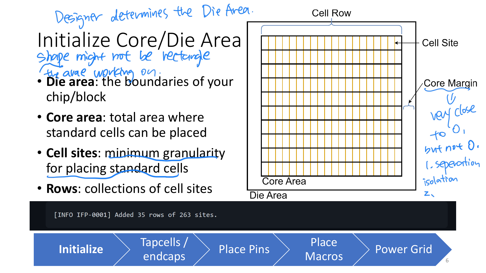

# PD Workflow

This is a living walkthrough of the `soc_design` physical design flow.

Goal:
- document the flow from clean RTL through synthesis, PNR, and signoff
- explain each stage in plain language
- record the exact commands we typed while learning the flow interactively

Scope of this walkthrough:
- this walkthrough is meant to cover the full path to the earlier clean milestone
- that means:
  - RTL / simulation-ready design
  - DC synthesis
  - Innovus implementation
  - signoff export / merge / fill flow
  - Calibre DRC
  - Calibre LVS
- the intent is not to stop at a mapped netlist
- the intent is to understand how the project reached full clean signoff from RTL to final signoff database

Current status:
- synthesis walkthrough is complete through non-topo `compile_ultra`
- fresh Innovus bring-up is complete
- current learning checkpoint:
  - floorplan created
  - top-level signal pins placed on the top edge
  - SRAM macro placed and fixed
  - SRAM route blockage added around the macro
  - `cutRow` applied after macro placement
  - endcaps and well taps now insert cleanly in the fresh walkthrough flow
  - current early-floorplan reports:
    - `verify_endcap.rpt` -> no problem
    - `verify_welltap.rpt` -> `0` violations

Checkpoint policy for this study flow:
- do not delete the canonical clean milestone artifacts
- do not delete useful implementation/signoff checkpoints while we are still walking the flow
- old disposable scratch artifacts can be cleaned later, but only after:
  - the important lessons are documented
  - the canonical clean package is preserved
  - the walkthrough no longer depends on those checkpoints

Canonical clean milestone to preserve:
- `signoff/calibre_axi_uartcordic_currentrtl_v48clean_20260416`

## 1. Synthesis (DC)

### 1.1 Starting Point

Assumption:
- RTL is written
- RTL simulation in VCS has already passed

Next objective:
- generate a mapped gate-level netlist that uses real library cells and macros

Why synthesis is needed:
- VCS proves RTL functionality
- Innovus cannot place-and-route abstract RTL directly
- DC must convert RTL into a technology-mapped netlist first

Main synthesis inputs:
- design RTL files
- standard-cell timing library (`.db`)
- SRAM timing library (`.db`)
- timing constraints such as target clock period

Main synthesis outputs:
- mapped gate-level netlist
- SDC constraints for downstream tools
- timing / area / QoR reports

### 1.2 DC Interactive Walkthrough

Tool launch:

```bash
cd /home/fy2243/soc_design
dcnxt_shell -topo -gui
```

Notes:
- `-topo` means topographical mode
- DC runs in physically-aware synthesis mode
- this gives better wireload / placement estimation than purely logic-only synthesis

#### Step 1: Set Project Root

Command:

```tcl
set proj_root [file normalize [pwd]]
```

What it means:
- `pwd` gets the current working directory
- `file normalize` converts it to a clean absolute path
- `proj_root` becomes the project root used by later file paths

Observed output:

```tcl
/home/fy2243/soc_design
```

#### Step 2: Set Top Module

Command:

```tcl
set top_module "soc_top"
```

What it means:
- tells our flow which RTL module should later be used as the design root
- this only stores the name in a variable
- DC does not use it until `elaborate $top_module`

Why `soc_top`:
- the chip-level RTL root in this project is `soc_top`

#### Step 3: Set Target Clock Period

Command:

```tcl
set clock_period 10.0
```

What it means:
- stores the intended clock period in nanoseconds
- this will later be used in `create_clock`

#### Step 4: Define RTL File List

Command:

```tcl
set rtl_files [list \
    "$proj_root/rtl/soc_top.sv" \
    "$proj_root/rtl/mem_router_native.sv" \
    "$proj_root/rtl/native_periph_bridge.sv" \
    "$proj_root/rtl/axil_interconnect_1x2.sv" \
    "$proj_root/rtl/axil_uart.sv" \
    "$proj_root/rtl/axil_cordic_accel.sv" \
    "$proj_root/rtl/cordic_accel_ctrl.sv" \
    "$proj_root/rtl/sram.sv" \
    "$proj_root/rtl/cordic_core_atan2.sv" \
    "$proj_root/rtl/cordic_core_sincos.sv" \
    "$proj_root/third_party/picorv32/picorv32.v" \
]
```

What it means:
- tells DC which synthesizable design files belong to the chip
- this is the synthesis file list, not the simulation file list
- testbench files are not included here

Tcl notes:
- `list` builds one Tcl list
- `\` continues the command onto the next line
- `$proj_root` expands to `/home/fy2243/soc_design`

Observed result:
- DC echoed the resolved file paths back as one list

### 1.3 Library Concepts Clarified

#### Standard-cell `.db`

Example path from the synthesis script:

```tcl
/ip/tsmc/tsmc16adfp/.../N16ADFP_StdCelltt0p8v25c.db
```

Meaning:
- Synopsys compiled timing library for TSMC standard cells
- provided by the technology / library collateral
- used by DC for mapping logic into real gates

#### SRAM `.db`

Example path from the synthesis script:

```tcl
/ip/tsmc/tsmc16adfp/.../N16ADFP_SRAM_tt0p8v0p8v25c_100a.db
```

Meaning:
- Synopsys compiled timing library for SRAM macros
- provided by the SRAM IP / memory collateral
- used by DC so explicit SRAM macro instances can link to real macro cells

#### What `.db` Means

In this flow, a `.db` file is:
- a Synopsys compiled technology library
- the tool-readable form of timing / library data

The Tcl script does not create these libraries.
It only points DC at the installed library files.

### 1.4 SRAM Naming Clarification

Example SRAM macro ref name:

```tcl
TS1N16ADFPCLLLVTA512X45M4SWSHOD
```

Meaning:
- library cell name of the hard SRAM macro
- not invented by DC
- comes from the vendor SRAM library naming
- explicitly instantiated in the RTL synthesis wrapper

Where it appears:
- wrapper instantiation in [sram.sv](/home/fy2243/soc_design/rtl/sram.sv#L77)

Example hierarchy path:

```tcl
u_sram/u_sram_macro
```

Meaning:
- `u_sram` is the wrapper instance in `soc_top`
- `u_sram_macro` is the hard macro instance inside the wrapper
- together they form the hierarchical design path

Where it comes from:
- top-level wrapper instance in [soc_top.sv](/home/fy2243/soc_design/rtl/soc_top.sv#L202)
- hard macro instance in [sram.sv](/home/fy2243/soc_design/rtl/sram.sv#L77)

Important distinction:
- `u_sram/u_sram_macro` = design instance path
- `TS1N16ADFPCLLLVTA512X45M4SWSHOD` = library ref / cell type

### 1.5 DC Library Setup and Bring-Up

Next interactive step in DC:
- define the standard-cell library path
- then define the SRAM library path
- then set `target_library` and `link_library`

#### Why more than one `.db`?

In this flow we do not use only one `.db` file.
We use at least:
- one standard-cell `.db`
- one SRAM macro `.db`

Reason:
- standard-cell `.db` provides the regular logic cells DC can map RTL logic into
- SRAM `.db` provides the hard memory macro cells that already exist as fixed library macros

So the sequence is:

```tcl
set std_db  "..."
set sram_db "..."
```

Then later:

```tcl
set_app_var target_library [list $std_db $sram_db]
set_app_var link_library   [concat "* " $std_db $sram_db $synthetic_library]
```

#### What is a `.db` file?

A Synopsys `.db` file is a compiled library database.

Practical meaning:
- it contains library cells known to DC
- each cell has names, pins, timing arcs, drive/load data, and other attributes
- DC uses it to understand what real implementation cells exist

For example:
- the standard-cell `.db` contains cells like buffers, inverters, NANDs, flip-flops
- the SRAM `.db` contains macro cells like `TS1N16ADFPCLLLVTA512X45M4SWSHOD`

So after RTL is read, DC does not invent cells on its own.
It must map the design onto cells that exist in the loaded `.db` libraries.

#### Step 5: Set Standard-Cell Library Path

Command:

```tcl
set std_db "/ip/tsmc/tsmc16adfp/source/DAFP0203001_2_X/Executable_Package/Collaterals/IP/stdcell/N16ADFP_StdCell/NLDM/N16ADFP_StdCelltt0p8v25c.db"
```

What it means:
- stores the filesystem path of the standard-cell Synopsys `.db`
- this is the library DC will later use for normal logic mapping

Observed result:
- DC echoed the same path back

#### Step 6: Set SRAM Library Path

Command:

```tcl
set sram_db "/ip/tsmc/tsmc16adfp/source/DAFP0203001_2_X/Executable_Package/Collaterals/IP/sram/N16ADFP_SRAM/NLDM/N16ADFP_SRAM_tt0p8v0p8v25c_100a.db"
```

What it means:
- stores the filesystem path of the SRAM macro Synopsys `.db`
- this library contains the hard SRAM macro cells used by the design

#### Step 7: Set `target_library`

Command:

```tcl
set_app_var target_library [list $std_db $sram_db]
```

What it means:
- `set_app_var` sets a DC application variable, not just a normal Tcl variable
- `target_library` is a built-in DC setting
- this tells DC which real implementation libraries it may map the RTL into

Practical effect:
- standard logic may map into cells from `std_db`
- hard SRAM references may remain bound to cells from `sram_db`

Observed result:
- DC echoed the resolved library list back

Important distinction:
- `proj_root` is just our own Tcl variable
- `target_library` is a DC-recognized synthesis control setting

#### Step 8: Set `synthetic_library`

Command:

```tcl
set_app_var synthetic_library "dw_foundation.sldb"
```

What it means:
- tells DC to use the standard Synopsys DesignWare synthetic library
- this provides higher-level synthesis-time building blocks that DC understands

Useful mental model:
- not a hard macro like SRAM
- not the final physical implementation library
- more like a synthesis helper library for arithmetic / structured logic

Observed result:
- DC echoed `dw_foundation.sldb`

#### Step 9: Set `link_library`

Command:

```tcl
set_app_var link_library [concat "* " $std_db $sram_db $synthetic_library]
```

What it means:
- tells DC where it may search when resolving references during elaboration and link
- includes:
  - `*` for the current in-memory design / WORK area
  - the standard-cell library
  - the SRAM macro library
  - the DesignWare synthetic library

Useful distinction:
- `target_library` = what DC may map into
- `link_library` = where DC may look things up

Tcl note:
- `concat` joins those items into the form DC expects

Observed result:
- DC echoed the expanded list; the GUI console may wrap long paths across lines

#### Step 10: Set `search_path`

Command:

```tcl
set_app_var search_path [list $proj_root/rtl $proj_root/third_party/picorv32]
```

What it means:
- tells DC which directories it may search when resolving file references by name
- this is supportive environment setup
- in this flow, `rtl_files` already uses full paths, so `search_path` is not the primary file-selection mechanism

Useful distinction:
- `rtl_files` = exact file list to read
- `search_path` = fallback directories DC may search if needed

Observed result:
- DC echoed the two resolved directories

#### Step 11: Define DC Work Library

Command:

```tcl
define_design_lib WORK -path ./WORK
```

What it means:
- creates the Synopsys WORK design library for this session
- gives DC a place to store analyzed design data

Observed result:
- DC returned `1`, meaning the command succeeded

#### Step 12: Analyze RTL

Command:

```tcl
analyze -format sverilog -define SYNTHESIS $rtl_files
```

What it means:
- reads and compiles the RTL source files into the DC WORK library
- `-format sverilog` tells DC these are SystemVerilog / Verilog sources
- `-define SYNTHESIS` enables the `SYNTHESIS` preprocessor branch in the RTL

Important effect in this design:
- in `sram.sv`, the `SYNTHESIS` branch instantiates the hard TSMC SRAM macro instead of the behavioral simulation memory

Observed result:
- PRESTO compiled all listed source files successfully
- DC then loaded the standard-cell `.db`, SRAM `.db`, and DesignWare synthetic library
- command returned `1`

#### Step 13: Elaborate the Top Design

Command:

```tcl
elaborate $top_module
```

What it means:
- builds the actual instantiated design hierarchy rooted at `soc_top`
- this is where DC turns analyzed module definitions into one concrete design tree
- parameterized modules are specialized during this step

Observed result:
- DC elaborated `soc_top` successfully
- the current design became `soc_top`
- parameterized child modules were built, including:
  - `picorv32`
  - `mem_router_native`
  - `sram`
  - `axil_interconnect_1x2`
  - `axil_uart`
  - `axil_cordic_accel`
  - `cordic_accel_ctrl`
  - `cordic_core_atan2`
  - `cordic_core_sincos`

Important warning interpretation from this step:
- many warnings came from third-party `picorv32.v`
- the common categories seen here are usually non-fatal for synthesis:
  - `VER-318` signed/unsigned conversion or assignment
  - `VER-61` unreachable statements after parameter pruning / constant propagation
  - `VER-281` initial blocks ignored in synthesis
  - `ELAB-985` empty always block after optimization

What would be more serious:
- unresolved module/cell references
- missing libraries
- elaboration failure
- unexpected multiply-driven nets or major latch inference in our own RTL

Bottom line for this run:
- elaboration succeeded
- no blocking warning was observed in the posted log

#### Step 14: Set the Current Design

Command:

```tcl
current_design $top_module
```

What it means:
- explicitly selects `soc_top` as the active design context in DC
- does not rebuild the hierarchy
- mainly confirms which design later commands should operate on

Observed result:
- DC reported `Current design is 'soc_top'.`

#### Step 15: Link the Design

Command:

```tcl
link
```

What it means:
- resolves and binds references in the current design using `link_library`
- this is where DC confirms that referenced modules/cells/macros can be found in:
  - the in-memory WORK design set
  - the standard-cell library
  - the SRAM library
  - the DesignWare synthetic library

Observed result:
- DC linked `soc_top` successfully
- it showed the exact designs and libraries used for the link
- command returned `1`

Why this matters:
- after `analyze` and `elaborate`, the design hierarchy exists
- after `link`, DC has validated that the needed references are resolvable in the configured search space

#### Step 16: Report Hierarchy

Command:

```tcl
report_hierarchy
```

What it means:
- prints the instantiated design tree currently known to DC
- useful sanity check before applying timing constraints and starting synthesis

Key observations from this run:
- top design is `soc_top`
- expected major blocks are present:
  - `picorv32`
  - `mem_router_native`
  - `native_periph_bridge`
  - `axil_interconnect_1x2`
  - `axil_uart`
  - `axil_cordic_accel`
  - `sram`
- the SRAM macro is already visible as:
  - `TS1N16ADFPCLLLVTA512X45M4SWSHOD`

Why `gtech` appears:
- `GTECH_*` cells are Synopsys generic technology-independent primitives
- at this point the design is still unmapped
- generic logic has not yet been converted into real standard cells

Meaning of:

```tcl
Information: This design contains unmapped logic. (RPT-7)
```

- expected at this stage
- not an error
- this will change after `compile_ultra`, when generic logic maps into real library cells

### 1.6 DC Constraints and Checks

#### Step 17: Create the Primary Clock

Command:

```tcl
create_clock -name clk -period $clock_period [get_ports clk]
```

What it means:
- creates the main timing clock on top-level port `clk`
- tells DC the design is expected to run with a `10.0 ns` period in this walkthrough

Why this is required:
- without a clock, DC cannot do meaningful sequential timing optimization
- this is the reference point for later input/output timing constraints

Observed result:
- DC returned `1`

#### Step 18: Set Input Delay

Command:

```tcl
set_input_delay [expr $clock_period * 0.2] -clock clk [remove_from_collection [all_inputs] [get_ports clk]]
```

What it means:
- applies an arrival-time assumption to all non-clock input ports
- in this flow, the assumption is `20%` of the cycle after the `clk` reference edge

Why this exists:
- top-level inputs do not arrive magically at time zero
- synthesis needs an external timing assumption for how late inputs can show up relative to the chip clock
- without this, timing optimization can become unrealistically optimistic

Important note:
- the `20%` number here is a simple heuristic for this tutorial flow
- in a production block or chip, these values normally come from an interface spec or top-level timing budget

Observed result:
- DC returned `1`

#### Step 19: Set Output Delay

Command:

```tcl
set_output_delay [expr $clock_period * 0.2] -clock clk [all_outputs]
```

What it means:
- applies a simple output timing budget to all top-level outputs
- reserves `20%` of the cycle for downstream usage after signals leave this block

Practical timing intuition:
- `set_input_delay` models time consumed before data reaches this block
- `set_output_delay` models time that must remain after data leaves this block

Observed result:
- DC returned `1`

#### Step 20: Set Output Load

Command:

```tcl
set_load 0.01 [all_outputs]
```

What it means:
- applies a simple capacitive load assumption to all top-level outputs
- in practice this is a blanket estimate of the downstream load each output must drive

Observed result:
- DC returned `1`

#### Step 21: Set Driving Cell for Inputs

Command:

```tcl
set_driving_cell -lib_cell BUFFD1BWP16P90LVT [all_inputs]
```

What it means:
- tells DC to assume top-level inputs are driven by the library cell `BUFFD1BWP16P90LVT`
- this gives DC an external driver model for input slew / transition estimation

Observed result:
- DC returned `1`
- warnings were reported on `clk`, `rst_n`, and `uart_rx`:

```tcl
Warning: Design rule attributes from the driving cell will be set on the port '...'. (UID-401)
```

Warning interpretation:
- not fatal
- DC is simply warning that the selected driving cell's electrical/design-rule attributes are being copied onto those input ports
- this happened because the command was applied to `[all_inputs]`

Practical note:
- in more careful flows, clocks and sometimes resets are often handled separately instead of being included in the blanket `set_driving_cell [all_inputs]`
- for this tutorial flow, the warning does not block progress

#### Step 22: Run `check_timing`

Command:

```tcl
check_timing
```

What it means:
- performs a timing-environment sanity check before synthesis
- verifies that the design has a usable timing setup before `compile_ultra`

Observed result:
- DC checked out the `DesignWare` license and instantiated internal DW components for timing analysis
- command returned `1`

Notable messages from this run:

```tcl
Warning: Design 'soc_top' contains 11 high-fanout nets. A fanout number of 1000 will be used for delay calculations involving these nets. (TIM-134)
Warning: There are 100 end-points which are not constrained for maximum delay.
```

Interpretation:
- high-fanout warning:
  - common before optimization
  - not a blocker by itself
  - DC is using a simplified fanout assumption for delay estimation on those nets

- unconstrained-endpoints warning:
  - important to notice, but not fatal for this tutorial run
  - it means the current SDC is still simple and does not fully constrain every endpoint in the design
  - this is common in minimal top-level tutorial flows
  - in a production flow, this warning would usually be investigated and reduced

Bottom line:
- `check_timing` succeeded
- the timing environment is good enough to continue with the simple walkthrough
- but the warning reminds us this is not yet a fully polished signoff-grade constraint set

#### Step 23: Run `check_design`

Command:

```tcl
check_design
```

What it means:
- performs a structural / lint-style sanity check on the elaborated and constrained design
- this is broader than `check_timing`
- it looks for suspicious structural patterns before synthesis

Observed result:
- command returned `1`
- no fatal structural error was reported

Main warning categories seen in this run:

#### `LINT-29` input port connected directly to output port

Meaning:
- a module input is passed straight through to one or more module outputs
- common in adapters, interconnects, and simple routing glue logic

Examples from this design:
- `axil_interconnect_1x2`
- `picorv32_axi_adapter`

Interpretation:
- not automatically a bug
- expected in pass-through interface logic

#### `LINT-31` output port connected directly to output port

Meaning:
- multiple output ports are driven from the same internal source or constant relationship
- often shows up in bridge / routing logic with duplicated outputs

Interpretation:
- not automatically wrong
- common in simple steering / replication logic

#### `LINT-32` submodule pin tied to constant 0 or 1

Meaning:
- a submodule pin is intentionally tied off

Examples from this design:
- many optional `picorv32` ports such as `pcpi_*` and `irq[*]`

Interpretation:
- expected in this top-level integration
- not a blocker

#### `LINT-33` same net connected to many pins on one submodule

Meaning:
- one constant net is reused to tie off many pins

Interpretation:
- expected if many unused inputs are all tied to logic 0
- not a synthesis blocker

#### `LINT-52` output port tied directly to constant

Meaning:
- a module output is constant in this configuration

Interpretation:
- usually benign
- often caused by disabled features or fixed protocol fields

Bottom line for this run:
- `check_design` passed in the practical sense
- warnings are lint-style and mostly reflect:
  - interface pass-through logic
  - optional feature tie-offs
  - constant protocol fields
- nothing in the posted output suggests a structural issue severe enough to stop the tutorial flow

#### Step 24: Save Pre-Compile Checkpoint

Command:

```tcl
write -format ddc -hierarchy -output precompile.ddc
```

What it means:
- saves a Synopsys DDC checkpoint before synthesis optimization
- useful recovery point if the GUI session dies or if we want to restart from the elaborated/constrained design state

Observed result:
- DC wrote `precompile.ddc`
- command returned `1`

Why this is useful:
- preserves the setup work already done:
  - analyzed RTL
  - elaborated hierarchy
  - linked design
  - applied constraints
- avoids having to replay all setup commands after a disconnect

### 1.7 DC Compile, Topo Notes, and Recovery

#### Step 25: Attempt `compile_ultra`

Command:

```tcl
compile_ultra -no_autoungroup
```

Expected intent:
- perform the main synthesis optimization
- convert generic logic into a technology-mapped gate implementation
- preserve hierarchy more than the default `compile_ultra` flow by disabling auto-ungroup

Observed result in this walkthrough:

```tcl
Error: DC-Topographical Failed to link physical library. (OPT-1428)
```

Interpretation:
- the failure is not caused by the earlier lint warnings
- the failure is caused by running DC in `-topo` mode without the required physical-library setup

Important project note:
- this repository already documents the issue in [README.md](/home/fy2243/soc_design/README.md#L127)
- summary:
  - topo mode will halt unless the required physical RC / physical-view collateral is configured
  - for this project walkthrough, non-topo synthesis is the practical recovery path unless full topographical setup is added

Practical lesson:
- logical synthesis setup is not enough for topographical synthesis
- topographical mode needs additional physical tech/view collateral beyond the logical `.db` libraries

#### Constraint Scope in This Tutorial Flow

So far the walkthrough has introduced the basic timing constraints:
- `create_clock`
- `set_input_delay`
- `set_output_delay`

The full synthesis script also adds simple electrical-environment constraints:
- `set_load 0.01 [all_outputs]`
- `set_driving_cell -lib_cell BUFFD1BWP16P90LVT [all_inputs]`

What these mean:
- `set_load`
  - tells DC what output capacitance to assume on top-level outputs
- `set_driving_cell`
  - tells DC what kind of external driver is assumed to be driving top-level inputs

What this flow leaves at default:
- operating condition is left to the tool/library default
- max fanout / max capacitance / max transition are not manually overridden here
- no false-path, multicycle, generated-clock, or clock-group constraints are added in this simple tutorial setup

So this flow is intentionally simple:
- enough constraints to make synthesis meaningful
- not a full production-quality SDC for every interface and exception case

#### Topographical Mode: What We Actually Verified

Question:
- Do we really have any `-topo` collateral on this machine?
- If we skip `-topo`, does that make the earlier clean DRC/LVS result untrustworthy?

Verified repo guidance:
- [README.md](/home/fy2243/soc_design/README.md#L89) says the project currently relies on non-topo synthesis because the delivered flow lacks complete topo collateral hookup.
- [run_currentrtl_pd.sh](/home/fy2243/soc_design/run_currentrtl_pd.sh#L26) defaults synthesis to plain `dcnxt_shell`, not `dcnxt_shell -topo`.
- [soc_top.sdc](/home/fy2243/soc_design/tcl_scripts/soc_top.sdc#L1) is labeled as matching non-topo synthesis.

Verified installed collateral:
- Standard-cell physical NDM exists:
  - `/ip/tsmc/tsmc16adfp/source/DAFP0203001_2_X/Executable_Package/Collaterals/IP/stdcell/N16ADFP_StdCell/NDM/N16ADFP_StdCell_physicalonly.ndm`
- RC collateral exists:
  - `/ip/tsmc/tsmc16adfp/tech/RC/N16ADFP_STARRC/N16ADFP_STARRC_worst.nxtgrd`
  - `/ip/tsmc/tsmc16adfp/tech/RC/N16ADFP_STARRC/N16ADFP_STARRC_best.nxtgrd`
  - QRC tech files also exist under `N16ADFP_QRC`
- SRAM logical `.db` exists, and SRAM LEF/GDS exist
- But no SRAM `.ndm` was found in the installed SRAM collateral tree

Verified repo topo setup:
- [common_setup.tcl](/home/fy2243/soc_design/tcl_scripts/rm_setup/common_setup.tcl#L19) only names the standard-cell NDM as the reference physical library
- [dc_setup.tcl](/home/fy2243/soc_design/tcl_scripts/rm_setup/dc_setup.tcl#L27) leaves `set_tlu_plus_files` commented out

Controlled topo probe result:
- A throwaway batch run was executed in `dcnxt_shell -topo`
- It successfully entered NDM/topo mode and linked:
  - `N16ADFP_StdCell_physicalonly.ndm`
- `compile_ultra -no_autoungroup` then failed with:
  - missing SRAM physical matches:
    - `TS1N16ADFPCLLLVTA512X45M4SWSHOD` and other SRAM macros were marked `dont_use`
    - warning: no corresponding physical cell description
  - missing RC layer attributes:
    - `Warning: No TLUPlus file identified. (DCT-034)`
    - `Error: Layer 'M1' is missing the 'resistance' attribute. (PSYN-100)`
    - `Error: Layer 'M1' is missing the 'capacitance' attribute. (PSYN-100)`
    - similar errors repeated for all routing layers
    - final failure:
      - `Error: Routing layers sanity check failed. (OPT-1430)`

Conclusion:
- Yes, some topo collateral exists on this machine
- No, the current project setup is not sufficient to support a clean topographical `compile_ultra`
- The blockers are:
  - no usable SRAM physical match in the current topo library stack
  - no active TLU+/RC hookup in the current setup

Practical wording:
- We are hard-blocked from using `-topo` **in the current project setup**
- We are not necessarily hard-blocked forever by physics or by DC itself
- To unblock topo, we would need additional collateral hookup/integration work:
  - valid RC/TLU+ hookup in DC topo setup
  - usable physical representation for the SRAM macros in the topo flow
  - likely extra tech/library integration work beyond the current repository scripts

Important trustworthiness point:
- Using non-topo DC synthesis does **not** make the earlier zero-DRC / clean-LVS result untrustworthy
- The clean signoff result is trusted because:
  - DC produced a logical mapped netlist
  - Innovus performed the actual physical implementation
  - Calibre verified final DRC and LVS on the real implemented layout
- So final signoff trust comes from the Innovus + Calibre stages, not from whether DC used topo mode

### 1.8 Archived STA and Hold Investigation

#### STA Status of the Earlier Clean Milestone

Question:
- Did we actually run STA for the earlier clean design, or only DRC/LVS?

What is directly verified:
- The archived clean signoff package
  - `/home/fy2243/soc_design/signoff/calibre_axi_uartcordic_currentrtl_v48clean_20260416`
  contains:
  - DRC outputs
  - LVS outputs
  - no timing reports
- The clean package therefore proves:
  - DRC clean
  - LVS clean
- It does **not by itself** prove:
  - archived signoff STA closure

What the flow scripts support:
- DC synthesis script writes a synthesis timing report:
  - [syn_complete_with_tech.tcl](/home/fy2243/soc_design/syn_complete_with_tech.tcl#L149)
- Innovus example flow runs internal timing analysis during implementation:
  - [innovus_flow.tcl](/home/fy2243/soc_design/tcl_scripts/innovus_flow.tcl#L16)
  - [innovus_flow.tcl](/home/fy2243/soc_design/tcl_scripts/innovus_flow.tcl#L24)
  - [innovus_flow.tcl](/home/fy2243/soc_design/tcl_scripts/innovus_flow.tcl#L32)
- An older full-flow script also contains an explicit post-route STA section:
  - [complete_flow_cordic_drc_clean.tcl](/home/fy2243/soc_design/tcl_scripts/complete_flow_cordic_drc_clean.tcl#L315)

What I could not verify from the archived currentrtl artifacts:
- I did not find preserved timing report files for the clean `currentrtl` signoff package
- I did not find evidence of a separate signoff STA tool run such as PrimeTime or Tempus reports archived alongside the clean DRC/LVS package

Practical conclusion:
- For the earlier `v48clean` milestone, what is concretely proven and archived is:
  - DRC clean
  - LVS clean
- STA may have been evaluated during implementation experiments, but I cannot honestly claim the clean milestone package includes archived signoff STA closure evidence unless we generate or locate those reports explicitly

#### STA Tool Readiness and Runtime

Question:
- Do we have the tools needed to run STA now?
- How long should STA take?

What is confirmed installed:
- PrimeTime shell exists:
  - `/eda/synopsys/prime/T-2022.03-SP5-1/bin/pt_shell`
- Innovus exists:
  - `/eda/cadence/INNOVUS211/bin/innovus`

What the project already has for STA:
- MMMC/QRC setup file:
  - [innovus_mmmc_legacy_qrc.tcl](/home/fy2243/soc_design/tcl_scripts/innovus_mmmc_legacy_qrc.tcl#L1)
- QRC tech file wired there:
  - `/ip/tsmc/tsmc16adfp/tech/RC/N16ADFP_QRC/worst/qrcTechFile`
- Final `currentrtl` Innovus checkpoints already contain:
  - MMMC views
  - SDC snapshot
  - extracted RC data inside the checkpoint database
  - example:
    - `/home/fy2243/soc_design/pd/innovus_axi_uartcordic_currentrtl_20260416_r1/with_sram_postdrc.enc.dat/viewDefinition.tcl`
    - `/home/fy2243/soc_design/pd/innovus_axi_uartcordic_currentrtl_20260416_r1/with_sram_cts.enc.dat/extraction/extractionUnitRCData_rc_typ.gz`

Practical readiness answer:
- For **implementation STA inside Innovus**:
  - yes, we have what we need right now
  - this is the fastest path to get setup/hold numbers
- For **standalone signoff STA in PrimeTime**:
  - the tool exists
  - timing libs and constraints exist
  - but we would still need the usual export handoff from Innovus (for example parasitics/netlist in a PT-friendly form) if not already generated

Runtime expectation on this design:
- Innovus post-route timing update from the final checkpoint:
  - typically about **2 to 10 minutes**
- If RC extraction needs to be refreshed first:
  - typically about **5 to 15 minutes**
- PrimeTime standalone run after export:
  - typically about **10 to 30 minutes**

Important caution:
- “Having the tools to run STA” is not the same as “the design will pass STA”
- The tools are available to measure closure
- Whether we actually clear setup/hold still depends on the design’s final slack numbers

Recommended run order:
- Run **Innovus post-route STA first**
  - fastest way to get setup/hold numbers from the existing final checkpoint
  - uses the implementation database directly
- Then run **PrimeTime**
  - better as a stricter standalone signoff-style timing check after the implementation result is understood
  - useful to confirm timing with an external STA engine rather than relying only on Innovus internal timing

#### Actual STA Run Results on the Archived `currentrtl` Checkpoint

Run date:
- 2026-04-17

Implementation database used:
- `/home/fy2243/soc_design/pd/innovus_axi_uartcordic_currentrtl_20260416_r1/with_sram_postdrc.enc.dat`

Generated Innovus STA artifacts:
- `/home/fy2243/soc_design/sta/currentrtl_20260416_r1/innovus/summary.txt`
- `/home/fy2243/soc_design/sta/currentrtl_20260416_r1/innovus/timeDesign_setup/soc_top_postRoute.summary.gz`
- `/home/fy2243/soc_design/sta/currentrtl_20260416_r1/innovus/timeDesign_hold/soc_top_postRoute_hold.summary.gz`
- `/home/fy2243/soc_design/sta/currentrtl_20260416_r1/innovus/setup_worst20.rpt`
- `/home/fy2243/soc_design/sta/currentrtl_20260416_r1/innovus/hold_worst20.rpt`
- `/home/fy2243/soc_design/sta/currentrtl_20260416_r1/innovus/soc_top_postroute.v`
- `/home/fy2243/soc_design/sta/currentrtl_20260416_r1/innovus/soc_top_postroute.spef`
- `/home/fy2243/soc_design/sta/currentrtl_20260416_r1/innovus/soc_top_postroute.sdf`

Innovus post-route timing result:
- Setup WNS = `7.444 ns`
- Setup TNS = `0.000 ns`
- Hold WNS = `-0.044 ns`
- Hold TNS = `-1.893 ns`

Innovus interpretation:
- setup is clean with large positive slack at the archived 10 ns clock
- hold is **not** clean
- the worst hold paths are short CPU-to-SRAM interface paths into `u_sram/u_sram_macro`

Example worst Innovus hold path:
- beginpoint: `u_cpu/mem_addr_reg_10_/Q`
- endpoint: `u_sram/u_sram_macro/A[8]`
- slack: `-0.044 ns`

Generated PrimeTime STA artifacts:
- `/home/fy2243/soc_design/sta/currentrtl_20260416_r1/primetime/summary.txt`
- `/home/fy2243/soc_design/sta/currentrtl_20260416_r1/primetime/global_timing.rpt`
- `/home/fy2243/soc_design/sta/currentrtl_20260416_r1/primetime/check_timing.rpt`
- `/home/fy2243/soc_design/sta/currentrtl_20260416_r1/primetime/setup_worst20.rpt`
- `/home/fy2243/soc_design/sta/currentrtl_20260416_r1/primetime/hold_worst20.rpt`

PrimeTime timing result on the exported post-route netlist + SPEF:
- Setup WNS = `7.359498 ns`
- Setup TNS = `0.0 ns`
- Hold WNS = `-0.155249 ns`
- Hold TNS = `-205.026414 ns`
- Hold violating paths = `4996`

PrimeTime interpretation:
- setup is also clean in PrimeTime
- hold is significantly worse than the Innovus internal result
- the worst PrimeTime hold paths are again short CPU-to-SRAM paths

Example worst PrimeTime hold path:
- startpoint: `u_cpu/mem_wdata_reg_27_`
- endpoint: `u_sram/u_sram_macro/D[27]`
- slack: `-0.16 ns`

Important caveat on the PrimeTime run:
- `check_timing` reported:
  - `3` ports with parasitics but no driving cell
  - `68` endpoints unconstrained for max delay
  - `68` register clock pins with no clock
- So this PrimeTime run is a valid routed-netlist timing probe, but not yet a polished signoff-quality PT environment

Practical conclusion from the actual STA runs:
- The archived `currentrtl` implementation is:
  - **DRC clean**
  - **LVS clean**
  - **setup-clean at 10 ns**
  - **not hold-clean**
- Therefore the earlier clean physical signoff milestone should not be described as “timing closed” unless hold is repaired and re-verified

#### Hold Debug and Repair Work on 2026-04-18

Meaning of the common `x / x` STA summary format:
- first number = **WNS** = **Worst Negative Slack**
- second number = **TNS** = **Total Negative Slack**
- example:
  - `7.444 / 0.000` means the worst path still has `+7.444 ns` margin and there are no failing paths
  - `-0.044 / -1.893` means the worst path misses timing by `44 ps`, and the sum of all negative slacks is `-1.893 ns`

Root-cause debug result for the archived hold failure:
- the original dominant hold violations were on **very short CPU-to-SRAM interface paths**
- representative failing paths from the archived routed checkpoint:
  - `u_cpu/mem_addr_reg_10_/Q -> u_sram/u_sram_macro/A[8]`
  - `u_cpu/mem_wdata_reg_26_/Q -> u_sram/u_sram_macro/D[26]`
- this is classic minimum-delay failure:
  - launch flop too close to capture point
  - not enough wire/buffer delay between them

First routed hold-fix ECO:
- Innovus script:
  - `/home/fy2243/soc_design/tcl_scripts/postroute_holdfix_currentrtl_20260418.tcl`
- checkpoint in:
  - `/home/fy2243/soc_design/pd/innovus_axi_uartcordic_currentrtl_20260416_r1/with_sram_postdrc.enc.dat`
- checkpoint out:
  - `/home/fy2243/soc_design/pd/holdfix_currentrtl_20260418/with_sram_holdfix.enc.dat`
- Innovus post-route result after ECO:
  - setup WNS/TNS = `7.444 / 0.000`
  - hold WNS/TNS = `0.019 / 0.000`
- interpretation:
  - Innovus hold is fixed cleanly
  - setup margin is preserved

PrimeTime check on the first hold-fix handoff:
- PrimeTime script:
  - `/home/fy2243/soc_design/tcl_scripts/pt_sta_currentrtl_holdfix_20260418.tcl`
- exported routed handoff:
  - `/home/fy2243/soc_design/sta/currentrtl_20260418_holdfix/innovus/soc_top_postroute_holdfix.v`
  - `/home/fy2243/soc_design/sta/currentrtl_20260418_holdfix/innovus/soc_top_postroute_holdfix.spef`
- PrimeTime result:
  - setup WNS/TNS = `7.359329 / 0.0`
  - hold WNS/TNS = `-0.092342 / -201.556998`
  - hold violating paths = `4996`
- interpretation:
  - clear improvement in worst hold slack versus the archived PT run
  - but still not yet acceptable as a standalone PT result

Second routed hold-fix ECO:
- Innovus script:
  - `/home/fy2243/soc_design/tcl_scripts/postroute_holdfix_currentrtl_20260418_r2.tcl`
- checkpoint in:
  - `/home/fy2243/soc_design/pd/holdfix_currentrtl_20260418/with_sram_holdfix.enc.dat`
- checkpoint out:
  - `/home/fy2243/soc_design/pd/holdfix_currentrtl_20260418_r2/with_sram_holdfix_r2.enc.dat`
- Innovus post-route result after second ECO:
  - setup WNS/TNS = `7.414 / 0.000`
  - hold WNS/TNS = `0.039 / 0.000`
  - routed DRC violations = `0`
- interpretation:
  - still Innovus-clean for both setup and hold
  - slightly more hold margin than the first ECO

PrimeTime check on the second hold-fix handoff:
- PrimeTime script:
  - `/home/fy2243/soc_design/tcl_scripts/pt_sta_currentrtl_holdfix_20260418_r2.tcl`
- exported routed handoff:
  - `/home/fy2243/soc_design/sta/currentrtl_20260418_holdfix_r2/innovus/soc_top_postroute_holdfix_r2.v`
  - `/home/fy2243/soc_design/sta/currentrtl_20260418_holdfix_r2/innovus/soc_top_postroute_holdfix_r2.spef`
- PrimeTime result:
  - setup WNS/TNS = `7.332678 / 0.0`
  - hold WNS/TNS = `-0.074464 / -1.721699`
  - hold violating paths = `59`
- interpretation:
  - the dominant CPU-to-SRAM hold problem is effectively fixed
  - PrimeTime now only shows a small residual tail of local short reg-to-reg paths
  - worst residual paths moved into internal blocks like:
    - `u_cordic_accel/u_cordic_ctrl/u_core_atan2/v_pipe_reg_* -> v_pipe_reg_*`
    - `u_cordic_accel/u_cordic_ctrl/u_core_sincos/z_pipe_reg_* -> z_pipe_reg_*`
    - small local UART/CPU register-to-register paths

Engineering conclusion after the fix work:
- the original archived hold failure was real and was dominated by the CPU-to-SRAM interface
- a routed hold ECO repaired that dominant issue
- the best current repaired candidate is:
  - `/home/fy2243/soc_design/pd/holdfix_currentrtl_20260418_r2/with_sram_holdfix_r2.enc.dat`
- current best repaired timing evidence:
  - Innovus: **setup clean, hold clean**
  - PrimeTime: **setup clean, hold greatly improved but still short by about `74 ps` on `59` paths**
- therefore:
  - the hold problem is **debugged and materially repaired**
  - but the design is **not yet fully PrimeTime hold-closed**

Required re-signoff status for the repaired candidate:
- yes, **DRC must be rerun** on the `r2` implementation before calling it signoff-clean
- yes, **LVS must be rerun** on the `r2` implementation before calling it signoff-clean
- reason:
  - the routed database changed
  - old Calibre clean results only apply to the old implementation database, not automatically to the ECO-fixed one
- current confidence level:
  - Innovus internal routed DRC after `r2` reported `0` violations
  - that is a good sanity check, but it is **not** a substitute for final Calibre DRC/LVS

Third ECO attempt:
- script prepared:
  - `/home/fy2243/soc_design/tcl_scripts/postroute_holdfix_currentrtl_20260418_r3.tcl`
- goal:
  - push extra min-delay margin to try to eliminate the remaining PT tail
- status:
  - intentionally stopped during execution
- reason:
  - it was becoming much more invasive
  - routed density was already climbing above `43%`
  - this was no longer a clean minimal fix compared with the `r2` result

#### Non-topo DC compile restore and rerun

Problem encountered while restoring `precompile.ddc` in a fresh non-topo DC session:
- `read_ddc /home/fy2243/soc_design/precompile.ddc` initially reported missing library errors like:
  - `UID-131` for `N16ADFP_StdCelltt0p8v25c`
  - `DDB-81` for missing `driving_cell`
- root cause:
  - fresh DC session did not yet have the stdcell/SRAM libraries loaded

Correct restore rule:
- in a fresh DC session, set:
  - `target_library`
  - `synthetic_library`
  - `link_library`
- **before** calling `read_ddc`

After restoring the checkpoint cleanly in non-topo DC:
- `compile_ultra -no_autoungroup` completed successfully
- representative end-of-compile observations:
  - worst setup slack remained `0.00` in the compile summary table
  - one high-fanout warning:
    - `u_cordic_accel/u_cordic_ctrl/u_core_sincos/clk` with `5108` loads
  - power warning:
    - `PWR-428 Design has unannotated black box outputs`
- interpretation:
  - compile itself succeeded
  - hierarchy-preserving synthesis in non-topo mode is the correct path for this flow
  - warnings are worth noting but are not compile blockers

Standard post-compile report stage:
- after `compile_ultra`, the normal next step is:
  - `report_timing`
  - `report_area`
  - `report_power`
  - `report_qor`
  - `report_constraint -all_violators`
- purpose:
  - inspect what synthesis produced before handing the design to Innovus

How to read the reports, in recommended order:
- `qor.rpt`
  - fastest high-level summary
  - check:
    - setup WNS/TNS
    - hold WNS/TNS
    - violating path counts
    - total area and cell counts
- `constraints_violators.rpt`
  - direct list of what still fails
  - if anything is wrong, this usually tells you where to look first
- `timing.rpt`
  - detailed path-by-path timing report
  - use it to understand:
    - startpoint
    - endpoint
    - arrival time
    - required time
    - slack
- `area.rpt`
  - total area plus hierarchy contribution
  - use it to answer:
    - which block is largest
    - how much area is macro versus standard-cell logic
- `power.rpt`
  - rough pre-PNR power estimate
  - useful for trends, not final signoff

### 1.9 Reading the Synthesis Reports

#### Interactive reading of the synthesis reports from `mapped_with_tech`

Files examined:
- `/home/fy2243/soc_design/mapped_with_tech/qor.rpt`
- `/home/fy2243/soc_design/mapped_with_tech/constraints_violators.rpt`
- `/home/fy2243/soc_design/mapped_with_tech/area.rpt`
- `/home/fy2243/soc_design/mapped_with_tech/power.rpt`
- `/home/fy2243/soc_design/mapped_with_tech/timing.rpt`

What `qor` means:
- `qor` = **Quality of Results**
- it is the synthesis summary report:
  - timing
  - area
  - cell counts
  - design-rule status
  - compile runtime

Why `qor.rpt` is read first:
- it is the fastest triage report
- before reading detailed timing paths, it answers:
  - did setup pass?
  - did hold fail?
  - is area roughly reasonable?
  - are there design-rule violations?

Current `qor.rpt` interpretation for the non-topo `compile_ultra -no_autoungroup` run:
- setup summary:
  - `Critical Path Slack = 6.57`
  - `Total Negative Slack = 0.00`
  - `No. of Violating Paths = 0`
- hold summary:
  - `Worst Hold Violation = -0.05`
  - `Total Hold Violation = -2.33`
  - `No. of Hold Violations = 75`
- conclusion:
  - synthesis setup is clean
  - synthesis hold is not clean, but the violation is small and localized

Cell-count/area takeaways from `qor.rpt`:
- `Leaf Cell Count = 19868`
- `Combinational Cell Count = 14692`
- `Sequential Cell Count = 5176`
- `Macro Count = 1`
- `Design Area = 17062.601522`
- practical conclusion:
  - the design is fully mapped
  - there is one SRAM macro
  - total synthesized cell area is about `17062.6`

Setup versus hold takeaway discussed during review:
- setup checks the **maximum-delay** path
- hold checks the **minimum-delay** path
- more combinational depth usually hurts setup because:
  - longer logic chain -> larger data delay -> less margin before the next capture edge
- hold is often fixed later in physical design because it depends strongly on:
  - real routing delay
  - CTS/skew
  - inserted delay cells/buffers
- therefore:
  - setup should already look good after synthesis
  - small localized hold violations at synthesis can often be fixed later in PNR

Implication of large positive setup slack:
- large positive setup slack means the current clock period has timing headroom
- in principle, that means a shorter period / higher frequency may be possible
- but this is only a synthesis-stage estimate
- final frequency claims must still be validated after PNR and post-route STA

What `constraints_violators.rpt` is:
- this is the **action list** of currently failing constraints
- unlike `qor.rpt`, which summarizes, `constraints_violators.rpt` lists the actual failing endpoints

How to read `constraints_violators.rpt`:
- report section:
  - `min_delay/hold ('clk' group)`
- columns:
  - `Endpoint`
    - where the failing timed path ends
  - `Required Path Delay`
    - minimum delay required for hold to pass
  - `Actual Path Delay`
    - delay currently seen by synthesis
  - `Slack`
    - negative means hold failure

Example interpretation:
- line:
  - `u_sram/u_sram_macro/A[6]     0.09     0.04 r     -0.05`
- meaning:
  - this SRAM address-pin endpoint needs at least `0.09 ns`
  - the synthesized path currently has only `0.04 ns`
  - hold misses by `0.05 ns`

Current `constraints_violators.rpt` pattern:
- almost all violating endpoints are on the SRAM macro interface:
  - `u_sram/u_sram_macro/A[*]`
  - `u_sram/u_sram_macro/D[*]`
  - `u_sram/u_sram_macro/BWEB[*]`
  - `WEB`
  - `CEB`
- practical conclusion:
  - the synthesis hold problem is not random
  - it is concentrated on the CPU-to-SRAM boundary

Why this mattered later:
- this synthesis-stage pattern correctly predicted the post-route hold issue
- later routed hold ECO work confirmed that the dominant hold problem was the CPU-to-SRAM interface

How `timing.rpt` should be interpreted in this stage:
- the generated `timing.rpt` was a **setup/max-delay** report
- use it to learn the path format:
  - startpoint
  - endpoint
  - arrival time
  - required time
  - slack
- if detailed hold paths are needed from DC, generate a dedicated min-delay report, for example:
  - `report_timing -delay_type min -max_paths 10 -transition_time -nets -attributes -nosplit > mapped_with_tech/hold_timing.rpt`

Skim-level takeaways for the other synthesis reports:
- `area.rpt`
  - use to see which hierarchy blocks dominate area
  - in earlier mapped runs, `u_cordic_accel`, `u_cpu`, and the SRAM block were the largest contributors
- `power.rpt`
  - use only as a rough pre-PNR estimate
  - useful for trend comparison, not final signoff power

## 2. Innovus Implementation

### 2.1 Innovus Bring-Up

Fresh start / Innovus setup:
- `WORK/` is only DC scratch (`*.syn`, `*.pvl`, `*.mr`); it is not the Innovus handoff
- the synthesis handoff lives in `mapped_with_tech/`
- required logical handoff to Innovus:
  - `mapped_with_tech/soc_top.v`
  - `mapped_with_tech/soc_top.sdc`
- optional DC-only checkpoint:
  - `mapped_with_tech/soc_top.ddc`
- synthesis reports (`qor.rpt`, `timing.rpt`, `area.rpt`, `power.rpt`, `constraints_violators.rpt`) are for review only; Innovus does not read them

Fresh-start cleanup performed on April 18, 2026:
- old default working areas were archived to:
  - `/home/fy2243/soc_design/obsolete_20260418_fresh_walkthrough`
- archived defaults:
  - `WORK/`
  - `mapped_with_tech/`
  - `precompile.ddc`
  - `pd/innovus/`
- fresh empty directories were recreated at:
  - `WORK/`
  - `mapped_with_tech/`
  - `pd/innovus/`
- stale active file removed:
  - `tcl_scripts/soc_top.sdc`
- old default PNR checkpoints removed from the archive:
  - `*.enc`
  - `*.enc.dat`

Current active setup after cleanup:
- fresh synthesis handoff was regenerated in `mapped_with_tech/`
- active MMMC file now consumes:
  - `mapped_with_tech/soc_top.sdc`
- active SRAM-aware PNR script:
  - `/home/fy2243/soc_design/tcl_scripts/complete_flow_with_qrc_with_sram.tcl`
- new pedagogical walkthrough script:
  - `/home/fy2243/soc_design/tcl_scripts/complete_flow.tcl`
  - this is the walkthrough script we build deliberately
  - current scope: setup/import only
  - it now does:
    - path setup
    - `init_design`
    - global net connections
    - save initial import checkpoint

MMMC path pitfall encountered during fresh Innovus bring-up:
- Innovus processes the MMMC file from a temporary location during `init_design`
- therefore `info script` inside the MMMC file resolved under `/tmp`, which incorrectly pointed the SDC path to `/tmp/mapped_with_tech/soc_top.sdc`
- fix:
  - in `innovus_mmmc_legacy_qrc.tcl`, anchor the SDC to `[pwd]/mapped_with_tech/soc_top.sdc`
  - launch Innovus from `/home/fy2243/soc_design`

Required non-project collateral still comes from the PDK:
- tech/stdcell/SRAM LEF
- stdcell/SRAM timing `.lib`
- QRC tech file

Launch command:
- `cd /home/fy2243/soc_design`
- for the step-by-step walkthrough:
  - `/eda/cadence/INNOVUS211/bin/innovus -overwrite -files tcl_scripts/complete_flow.tcl`
- for the established full SRAM-aware flow:
  - `/eda/cadence/INNOVUS211/bin/innovus -overwrite -files tcl_scripts/complete_flow_with_qrc_with_sram.tcl`

### 2.2 Workflow Method

Walkthrough policy:
- goal is both:
  - learn the physical-design flow step by step
  - understand how the known-good run reached clean signoff
- therefore, for each major step we should do three things:
  - explain the generic purpose of the step
  - compare the current interactive choice to the known-good flow
  - decide whether the simplification is harmless or whether we should align to the known-good setting now
- if a choice is likely to affect downstream DRC/LVS/timing behavior, prefer the known-good setting and log why
- if a choice is only pedagogical and low-risk, it is acceptable to use a simpler version first

Failure-driven learning rule:
- for each major stage, do not just record the nominal command sequence
- also record:
  - what could go wrong at this stage
  - what symptom/error would reveal it
  - how to debug it
  - how the known-good run avoided or fixed it
- practical format to follow for each step:
  - purpose
  - common failure modes
  - what happened in this project
  - fix or mitigation

Examples already encountered in this project:
- DC topo compile:
  - failure: missing physical/topo setup
  - symptom: `OPT-1428` / physical library link failure
  - resolution: use non-topo synthesis for the proven clean flow
- DC checkpoint restore:
  - failure: reading DDC before restoring libraries
  - symptom: missing library / driving cell warnings
  - resolution: set `target_library` / `link_library` before `read_ddc`
- Innovus MMMC import:
  - failure: SDC path resolved under `/tmp`
  - symptom: cannot open SDC during `init_design`
  - resolution: anchor the MMMC SDC path to `[pwd]/mapped_with_tech/soc_top.sdc`
- macro placement:
  - risk: macro location and halo differ from the known-good run
  - likely downstream effect: congestion / PDN / DRC behavior changes
  - resolution: compare current placement strategy against the known-good flow before power planning

Iterative workflow principle for this project:
- do not treat the flow as a one-pass checklist
- for each stage, choose an initial strategy intentionally
- if later stages fail, come back to the earlier decision, diagnose whether it contributed, and revise it
- use the known-good run as the control/reference so we can answer:
  - what changed
  - what failure appeared
  - what adjustment actually fixed it
- this is the main value of the walkthrough: not just repeating steps, but understanding cause-and-effect across stages

How to use this at the macro-placement stage:
- generic purpose:
  - pick a macro location that leaves enough room for routing, PDN, and standard-cell placement
- common strategies:
  - lower-left or edge-anchored placement
  - center-ish placement
  - placement near the logic that talks to the macro most
  - conservative placement with extra spacing from boundaries
- common failure modes if the choice is poor:
  - local congestion near macro edges
  - difficult power-ring / stripe access
  - DRC hotspots around macro corners or near boundary interactions
  - long detours or routing blockage pressure for connected logic
- project-specific guidance:
  - because we already have a known-good run, macro placement should be compared against that reference before we lock in PDN assumptions
  - if later DRC/LVS/timing problems cluster around the SRAM region, macro placement becomes a primary suspect to revisit

Same rule for later stages:
- power planning:
  - if shorts, opens, or PG-access hotspots show up later, revisit ring/stripe choices
- placement:
  - if congestion or timing clustering appears, revisit utilization / macro halo / placement constraints
- CTS:
  - if hold explodes or clock quality is poor, revisit CTS strategy and earlier placement assumptions
- routing / DRC:
  - if violations localize to a region, revisit the upstream physical decisions that created that geometry

### 2.3 Early-Stage Innovus Decisions

Early-stage decisions and common practice:

#### 2.3.1 Global VDD/VSS Connection
- purpose:
  - make the logical netlist and the physical library agree on which nets are power, ground, tie-high, and tie-low
- common practice:
  - connect `VDD` / `VSS` globally first
  - also connect macro-specific PG pins such as `VDDM`, `VPP`, `VBB` when the macro/library requires them
  - connect `tiehi` / `tielo` globally as well
- what can go wrong:
  - macro PG pins left floating
  - tie cells logically disconnected
  - later LVS/PG-connectivity confusion
- choice in this project:
  - use explicit global connections for `VDD`, `VSS`, `VDDM`, `VPP`, `VBB`, `tiehi`, `tielo`
  - this is closer to the known-good flow than a minimal `VDD/VSS`-only hookup
  - known-good reference commands:
    - `globalNetConnect VDD -type pgpin -pin VDD -all -override`
    - `globalNetConnect VDD -type pgpin -pin VDDM -all -override`
    - `globalNetConnect VDD -type pgpin -pin VPP -all -override`
    - `globalNetConnect VSS -type pgpin -pin VSS -all -override`
    - `globalNetConnect VSS -type pgpin -pin VBB -all -override`
    - `globalNetConnect VDD -type tiehi -all -override`
    - `globalNetConnect VSS -type tielo -all -override`

#### 2.3.2 Floorplan
- purpose:
  - define the physical canvas for the SoC core area
  - set utilization, aspect ratio, and margins
- reference slide:
  - source:
    - `slides/ECE9433_lecture_7_floorplan_printed.pdf`
    - rendered from PDF page 4, which is slide number 6 in the deck
  - image:
    - 
- common practice:
  - start conservative if the design is small or DRC cleanliness matters
  - lower utilization leaves more routing room and lowers congestion risk
  - square-ish aspect ratio is a safe default when there is no strong package/block constraint
- what can go wrong:
  - too high utilization -> congestion, routing failure, DRC hotspots, weak timing flexibility
  - too little margin -> poor edge access for pins, PG, or macro routing
  - awkward aspect ratio -> long routes and imbalanced congestion
- choice in this project:
  - `floorPlan -site core -r 1.0 0.30 50 50 50 50`
  - this is intentionally conservative and matches the known-good baseline style
  - interpretation:
    - aspect ratio `1.0` keeps the core roughly square
    - utilization `0.30` is deliberately low to buy routing headroom
    - `50 50 50 50` margins leave room for edge access and later PDN work
  - utilization clarification:
    - the `30%` target applies to the gray core row area, not the whole die
    - practical intuition: about `30%` of the core row area is intended to be occupied by standard-cell area
    - the remaining `~70%` is not a painted reserved region; it is whitespace/headroom inside the same core area
    - that headroom is used for routing demand, inserted buffers, CTS cells, hold-fix cells, legalization, and congestion relief
    - the outer margin between core and die is mainly for boundary access, PDN structures, and routing escape, not the main replacement for low core utilization
  - nearby floorplan-stage tasks:
    - many flows also treat tapcells / endcaps and coarse pin planning as part of early floorplanning
    - the slide ordering is reasonable: initialize area, then boundary/support cells, then pin planning, then macros, then PDN
    - in this project, macro placement is still the next practical step because row cutting and macro-aware keepout need to happen before boundary-cell details become final
    - the known-good flow also adds top-level signal pins early, immediately after floorplan creation

#### 2.3.3 Pin Placement
- purpose:
  - assign physical locations to the top-level block IO ports
- what this is:
  - placement of the external interface pins of `soc_top`
  - examples in this project:
    - `clk`
    - `rst_n`
    - `trap`
    - `uart_rx`
    - `uart_tx`
- what this is not:
  - not placement of internal standard-cell pins
  - not placement of SRAM macro pins
  - not placement of every endpoint in the design
- common practice:
  - place top-level pins early enough that floorplan and macro decisions can respect boundary access
  - keep related pins grouped sensibly
  - choose a side/layer that is easy to route from the core
- what can go wrong:
  - poor boundary pin access
  - long detours from the core to the block edge
  - local congestion if many pins are stacked awkwardly on one side
- choice in this project:
  - the known-good flow places five top-level signal pins early, immediately after floorplan
  - interactive command sequence used:
    - `set signal_pins {clk rst_n trap uart_rx uart_tx}`
    - `setPinAssignMode -pinEditInBatch true`
    - `editPin -pin $signal_pins -side TOP -layer M8 -spreadType CENTER -spacing 40 -pinWidth 0.40 -pinDepth 0.40 -snap TRACK -fixedPin -fixOverlap`
    - `setPinAssignMode -pinEditInBatch false`
  - observed result:
    - Innovus reported `Successfully spread [5] pins.`
    - the pins appear as small boundary markers on the top edge
  - interpretation:
    - these are physical shapes for the top-level ports only
    - internal library pins still come from the imported cells/macros and are not manually placed with `editPin`

#### 2.3.4 Macro Placement
- purpose:
  - decide where the large SRAM sits before PDN and standard-cell placement
- common practice:
  - place hard macros early and fix them
  - keep them away from extreme edge/corner pressure unless there is a clear reason
  - leave routing room around pins and corners
  - consider proximity to the logic that talks to the macro most
- what can go wrong:
  - congestion near macro edges
  - PG routing difficulty
  - DRC hotspots at macro corners or near boundaries
  - longer-than-necessary interconnect to the connected logic
- choice in this project:
  - current interactive run uses a simple lower-left placement:
    - `placeInstance u_sram/u_sram_macro 50 50 R0`
    - `setInstancePlacementStatus -name u_sram/u_sram_macro -status fixed`
  - the known-good scripted flow uses lower-left anchoring with explicit inward margins (`12um` x/y), not pure edge hugging
  - known-good intent:
    - compute core bounds
    - enforce `macro_margin_x = 12.0`
    - enforce `macro_margin_y = 12.0`
    - place SRAM at `core_llx + 12`, `core_lly + 12`
  - if later issues cluster around the SRAM region, this placement choice should be revisited first
  - why SRAM macros still make routing hard:
    - a hard macro is not just a flat blocked rectangle; it has its own internal geometry, pin-access rules, and routing obstructions from the LEF
    - for this SRAM macro, representative LEF facts are:
      - signal pin access is on `M1/M2/M3`
      - power pin access is on `M4`
      - LEF `OBS` blocks:
        - `M1/M2/M3` across the full macro footprint
        - `M4` partially across many internal obstruction rectangles
    - important consequence:
      - upper layers are not automatically "free sky" above the macro
      - even if a signal flies over the macro on a higher layer, it still must legally come down to the macro edge on the macro's allowed pin-access layers
    - practical routing pain points:
      - boundary pin access congestion around the macro perimeter
      - via-stack landing pressure outside the macro body
      - PG straps and special routing competing with signal access near the macro
      - LEF obstructions and route blockages reducing effective routing capacity above/around the macro
    - clean mental model:
      - the macro is like a sealed building with exposed doors only at legal pin-access shapes
      - general routing goes around it or over allowed layers above it
      - termination into the macro happens only through those legal access regions, which is why macro edges become hotspots

#### 2.3.5 Halo / Keepout Around the Macro
- purpose:
  - reserve space around the macro so standard-cell placement and routing do not crowd the block edge
- important distinction:
  - a placement halo and a route blockage are not the same thing
  - placement halo:
    - keeps standard cells away from the macro edge
    - current interactive command:
      - `addHaloToBlock 10 10 10 10 u_sram/u_sram_macro`
  - route blockage:
    - blocks routing on selected metal layers near the macro
    - known-good command:
      - `createRouteBlk -name sram_sig_halo -layer {M5 M6} -box {...} -exceptpgnet`
  - they solve different problems:
    - halo -> cell-placement crowding
    - route blockage -> signal-routing crowding on chosen layers
- common practice:
  - at least some keepout is normal for SRAM-like macros
  - simple placement halos are common for early exploration
  - more mature flows often use route blockages on selected upper layers rather than only a generic placement halo
- what can go wrong:
  - no halo -> congestion, pin-access pain, DRC around macro boundaries
  - too large halo -> wastes area and may hurt placement density
  - wrong kind of blockage -> blocks useful PG routing or fails to block the layers that actually cause problems
- choice in this project:
  - current interactive run uses a generic `addHaloToBlock`
    - `addHaloToBlock 10 10 10 10 u_sram/u_sram_macro`
  - the known-good flow used a more targeted SRAM signal-route blockage on `M5/M6` with PG exempt, which is more specific than a generic halo
    - `createRouteBlk -name sram_sig_halo -layer {M5 M6} -box {...} -exceptpgnet`
  - practical conclusion:
    - we do not need to believe that "both are always mandatory"
    - but in this project the route blockage is the more important reference behavior, and should be added if we want to stay close to the clean flow
  - how to interpret the `M5/M6` blockage:
    - it is conservative, but not arbitrary
    - it is a flow-level routing-control choice added on top of the macro LEF
    - intent:
      - keep upper-layer signal through-routing from crowding the SRAM boundary
      - preserve cleaner edge access for real SRAM connections
      - still allow PG routing because of `-exceptpgnet`
    - so it is better understood as a targeted congestion/DRC guardrail, not just a generic "safety margin"
  - if later route/DRC issues appear around the SRAM, replacing the generic halo with the known-good blockage strategy is the first corrective move

#### 2.3.6 cutRow
- purpose:
  - split or remove standard-cell rows wherever the SRAM macro and its keepout now make placement illegal
- why it exists:
  - after floorplan, Innovus creates one regular row field
  - after macro placement and keepout creation, that row field is no longer physically valid everywhere
  - `cutRow` updates the row geometry so later endcaps, tapcells, and standard-cell placement operate on the real row fragments
- what can go wrong if skipped:
  - endcaps/tapcells may be inserted assuming rows continue through blocked regions
  - placement rows remain visually/legally inconsistent with the macro footprint
  - later physical-support-cell insertion and placement legalization become messy
- choice in this project:
  - the known-good SRAM-aware flow runs a plain:
    - `cutRow`
  - and it does so after SRAM blockage creation, before endcap/tapcell insertion
  - this matches the intended sequence for the current walkthrough

#### 2.3.7 Endcaps / Well Taps: Cause and Fix
- what failed in the earlier runs:
  - earlier `verifyWellTap` reports were not globally bad; they were concentrated row-edge misses after `cutRow`
  - the saved run history shows a progression of:
    - `6` violations -> `4` violations -> `2` violations -> `0` violations
  - representative failing report:
    - `pd/innovus_axi_uartcordic_currentrtl_20260416_r1/verify_welltap.rpt`
  - failure pattern:
    - missing well-tap coverage on the bottom/top boundary row fragments
    - especially on the right-side cut-row strips after the SRAM and floorplan geometry changed the legal row segments
- root cause:
  - after `cutRow`, the row geometry was fragmented correctly, but some specific boundary-row sites still ended up covered by filler/boundary-row pieces instead of real tap support
  - one additional regular tap slot near the bottom-right strip was also missing
  - result:
    - `verifyWellTap` reported "No tap found before reaching the row end or block edge"
    - this was a row-edge support-cell coverage problem, not a generic tap density problem across the whole core
- how the earlier violations were reduced:
  - `6 -> 4`:
    - partial boundary cleanup removed some missing-strip issues, but not the full row-edge pattern
  - `4 -> 2`:
    - targeted ECO scripts replaced selected boundary-row filler segments with explicit boundary tap cells
    - see:
      - `tcl_scripts/targeted_boundary_tap_eco.tcl`
      - `tcl_scripts/targeted_boundary_tap_eco_20p90.tcl`
  - `2 -> 0`:
    - the clean walkthrough flow baked the boundary-aware insertion strategy directly into the initial boundary-cell stage instead of relying on a later ECO
- exact solution that mattered:
  - use boundary-aware endcap setup:
    - `setEndCapMode ... -boundary_tap true`
  - tell Innovus the actual boundary tap masters and regular tap master:
    - `set_well_tap_mode -bottom_tap_cell ... -top_tap_cell ... -cell ...`
  - insert boundary support first:
    - `addEndCap`
  - then insert regular taps across the cut rows:
    - `addWellTap -checkerBoard`
  - before verification, restore the same boundary-aware tap mode used during insertion so `verifyWellTap` evaluates the correct support-cell interpretation
- what the targeted ECO did in plain language:
  - swapped a few specific boundary-row filler pieces for explicit boundary tap cells on the bottom and top rows
  - added one missing regular well tap in the bottom-right strip
  - reran PG connectivity and routing repair afterward
- current clean behavior in the walkthrough flow:
  - the fresh run under `pd/innovus/` now produces:
    - `verify_endcap.rpt` -> no problem
    - `verify_welltap.rpt` -> `Found 0 violations in total`
- rerun hygiene lesson:
  - early-flow scripts that contain `init_design` should be rerun from a fresh Innovus session
  - stale GUI/editor tabs can show old report contents even after the corresponding file has been deleted or replaced
  - practical rule for this walkthrough:
    - restart Innovus for import / floorplan / boundary-cell changes
    - regenerate reports in a clean output directory before trusting any violation count

### 2.4 Power Planning

To be filled as the walkthrough progresses:
- power rings
- stripes
- special routing (`sroute`)
- common PG failure modes and the fixes we actually used

### 2.5 Placement, CTS, and Routing

To be filled as the walkthrough progresses:
- standard-cell placement
- CTS
- routing
- post-route cleanup and what went wrong along the way

## 3. PrimeTime and Calibre Signoff

To be filled more cleanly as the walkthrough matures:
- PrimeTime / STA closure
- Calibre DRC
- Calibre LVS
- what was proven clean versus what still required ECO work
